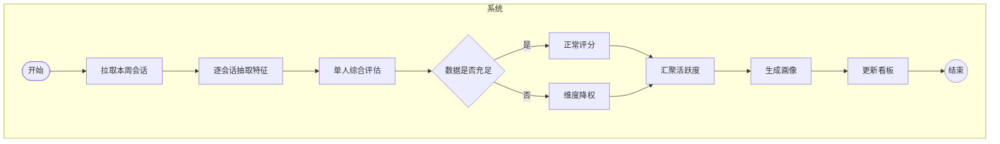
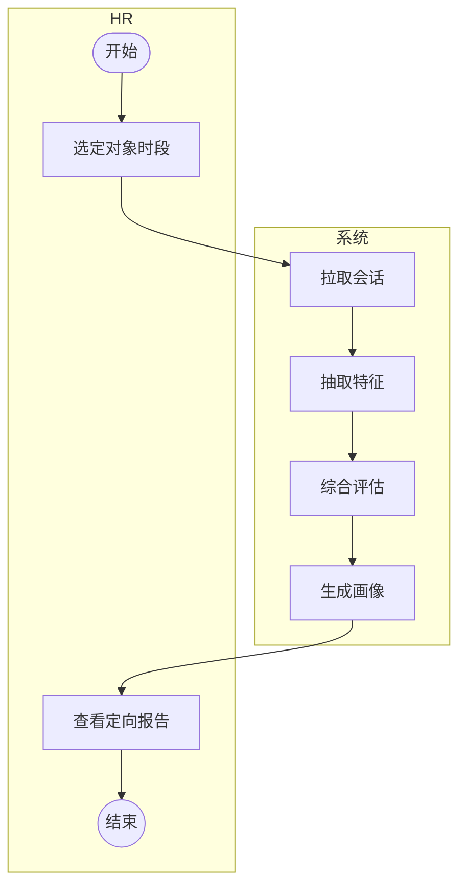
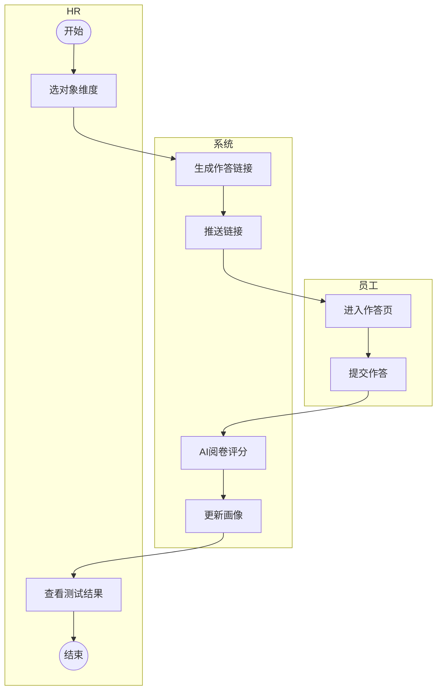
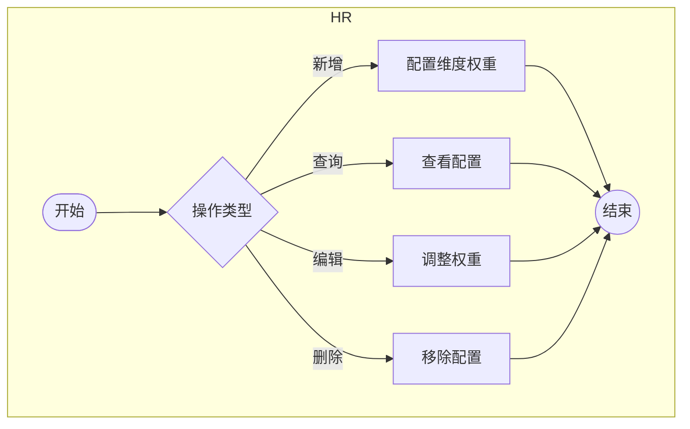
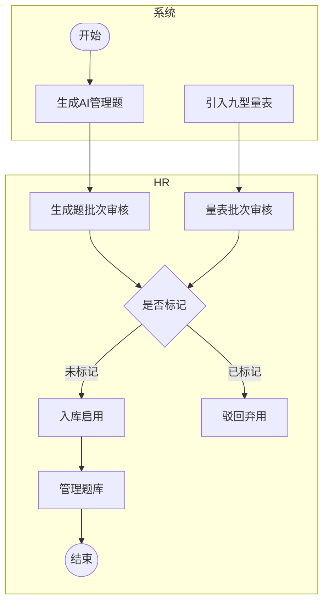
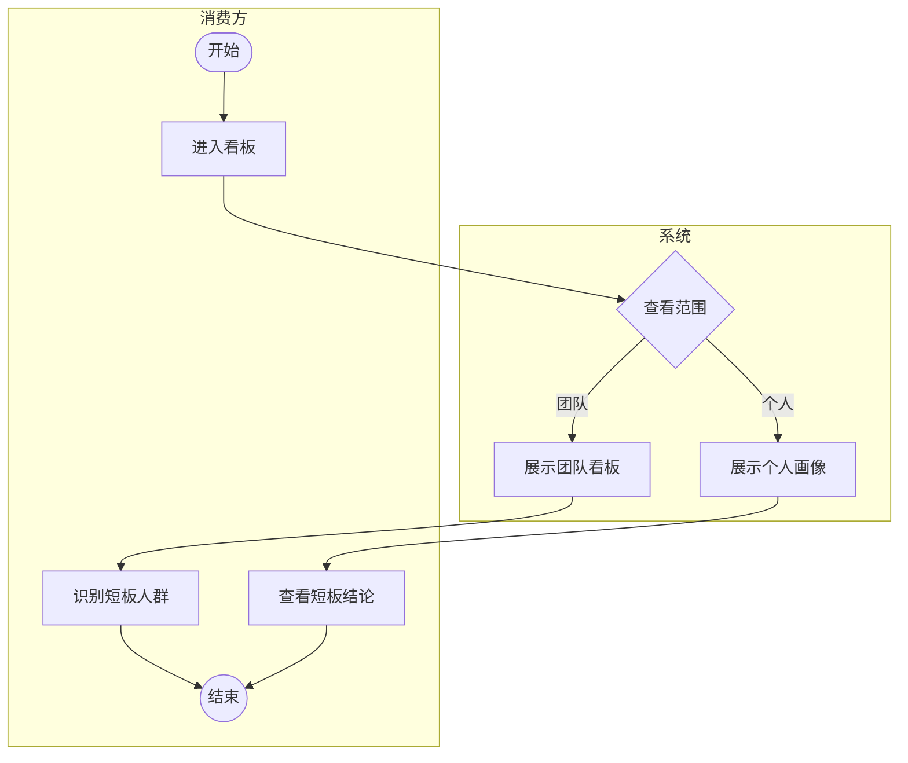
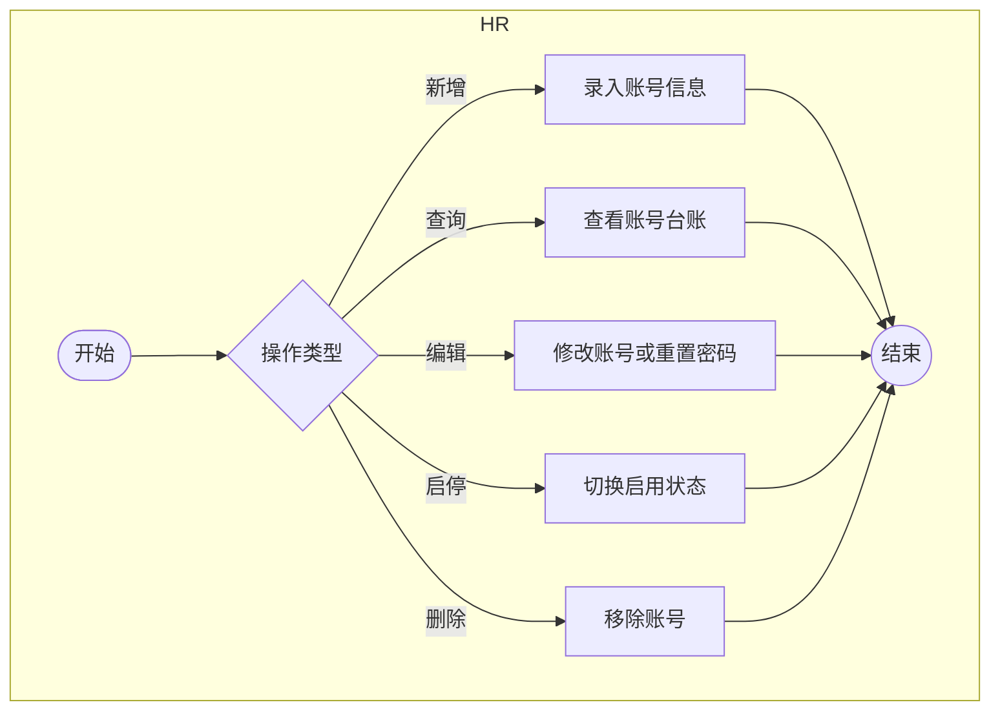

# 02 流程图

> 依据 00_业务需求 与 01_角色，识别八条核心流程。评估主线分对话分析（系统批量、HR 定向两路）与主动测试两线，配置类与用户管理按 CRUD 独立成图，结果查看归并为单一消费流程。人员信息与对话日志来自 sili-smart-api 的同步与外部沉淀，属于外部基础数据，流程中只消费不管理。跨流程的失败重试、超时、定时等待等异常与定时环节按规范剥离，不进入流程图。

## 流程分析

### 流程1：对话分析批量评估流程

系统按 HR 配置的周期自动触发，覆盖全员，是能力评估的主通道。

### 流程2：对话分析定向评估流程

HR 按需选定某人与某时段手动触发，复用同一套评分引擎。

### 流程3：主动测试评估流程

覆盖 AI 管理能力场景题与九型人格两个测评，由 HR 单次定向发起，员工经一次性链接作答，系统 AI 阅卷。

### 流程4：维度与权重配置管理

CRUD 流程，HR 维护能力模型的维度构成与聚合权重。

### 流程5：题库管理

题库分两路来源，共用同一审核界面与标记驳回操作，按来源分批审核、不混批。AI 管理能力题由 LLM 动态生成、选项写在作答要求文本中，生成后单独成批；九型人格引入标准量表作固定题库，引入时单独成批。HR 在统一审核界面批量过目，只标记不合适的题，被标记的驳回弃用、未标记的默认入库启用。

### 流程6：评估周期与系统配置管理

CRUD 流程，HR 维护评估周期、触发时点与大模型配置等系统参数（未使用判定跟随跑批周期，活跃度分级轮次在维度与权重页配置）。

### 流程7：评估结果查看流程

运营人员作为结果消费方查看团队看板与个人画像，消费评估结果。

### 流程8：用户管理流程

CRUD 流程，HR 在用户管理页维护可登录平台的账号台账（账号、姓名、密码、启停、最近登录），不设角色。

