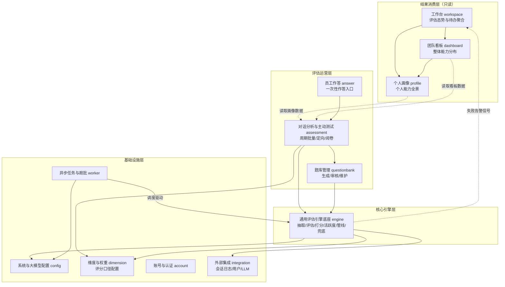

# sili-smart-hr 系统架构文档

## 文档信息

| 项目 | 内容 |
|------|------|
| 文档版本 | v1.3 |
| 创建日期 | 2026-08-08 |
| 最后更新 | 2026-08-09 |
| 文档状态 | 初版生成，待评审 |
| 信息来源 | 产品愿景与设计共识、业务需求基线、PRD v1.1、功能列表、UI 原型 |
| 设计深度 | 标准设计（基础技术框架、模块划分与依赖关系、外部系统关联、运行时约定） |

> 本文档不包含数据库设计。评分记录、维度配置、题库、画像、看板等数据结构由后续接口数据设计技能负责。

---

## 1. 基础技术框架

### 1.1 技术栈选择

sili-smart-hr 是面向企业内部的综合人才测评平台，核心是把兄弟系统 sili-smart-api 沉淀的 AI 对话日志周期性转化为能力评分，叠加主动测试形成人才画像。系统以对话分析为主评估通道，依赖大量 LLM 调用与定时跑批。

#### 后端技术框架

后端选型按可复用程度分两层。Gin、GORM、JWT 为通用基座；Asynq、Wire、Viper、slog 为本系统按现代 Go 工程实践引入。

- **框架**：Gin
- **语言**：Go 1.25
- **ORM**：GORM（多数据库，SQLite/MySQL/PostgreSQL 按 SQL_DSN 切换，迁移由 migrateDB 编排 AutoMigrate 加手写幂等迁移，方言用 DatabaseType 加 Using/QuoteIdent/BoolLit）
- **任务调度**：Asynq（现代 Go 选型，基于 Redis 的异步任务与定时调度）
- **配置管理**：Viper（现代 Go 选型）
- **日志**：slog（现代 Go 选型，Go 标准库结构化日志）
- **认证**：JWT 无状态会话
- **依赖注入**：Wire（现代 Go 选型，编译时依赖注入）
- **核心依赖**：github.com/hibiken/asynq、github.com/redis/go-redis/v9、gorm.io/driver/postgres、gorm.io/driver/mysql、github.com/glebarez/sqlite、golang.org/x/crypto（bcrypt 密码哈希）。go-redis 锁定 v9 与 Asynq 依赖版本一致，GORM 多 driver 按 SQL_DSN 前缀切库，glebarez/sqlite 为纯 Go 实现可静态编译。

#### 前端技术框架

- **框架**：React 19 + TypeScript
- **构建工具**：Rsbuild
- **路由**：TanStack Router（文件路由）
- **数据请求**：TanStack Query 加 axios（axios 作 HTTP 客户端）
- **状态管理**：Zustand
- **样式**：Tailwind CSS 4
- **UI 组件**：shadcn/ui 加 @base-ui/react
- **图表**：Recharts（React 原生 SVG 声明式图表）
- **表格**：TanStack Table
- **表单**：React Hook Form 加 Zod
- **国际化**：i18next 加 react-i18next（中英双语）
- **浏览器兼容**：现代浏览器（Chrome、Edge、Firefox 近两年版本），不背老浏览器包袱

#### 数据库选择

- **主数据库（自有业务数据）**：SQLite/MySQL/PostgreSQL 三选一，按 SQL_DSN 切换（切库与迁移机制见 4.6），存储评分记录、个人画像、团队看板、维度与权重配置、题库、主动测试记录、账号台账、操作日志。生产推荐 PostgreSQL 或 MySQL，SQLite 因库级写锁仅用于开发测试
- **对话日志来源（外部只读）**：ClickHouse，归属 sili-smart-api，本系统经集成密钥只读消费，不在本侧建表

本系统与对话日志库的关系是只读消费，对话原文不落本系统的主数据库。原文仅在评估引擎的会话特征抽取阶段临时读入内存喂给 LLM，抽取完成产出脱敏特征档案后即丢弃，主数据库只持久化评分、脱敏理由与特征档案。这一隐私架构在 2.2 节引擎底座模块中具体说明。

#### 中间件和基础设施

| 组件 | 推荐技术 | 用途 | 可选性 |
|------|----------|------|--------|
| 缓存与队列底层 | Redis | Asynq 任务队列底层存储，兼顾热点配置缓存 | 必选 |
| 异步任务与定时调度 | Asynq | 周期跑批调度、worker 任务并发控制、失败重试、降级编排 | 必选 |
| 反向代理 | Nginx | 前端静态资源、后端接口代理、作答页独立路由 | 必选 |
| 容器化 | Docker | 前后端与中间件统一容器化部署 | 必选 |

#### 新增技术选型理由

愿景已定的技术栈之外，本系统新增 Redis 与 Asynq 两个组件，理由集中在跑批场景的工程刚需。

- **Asynq 异步队列**：周期批量评估需在周日 23 点后跑完全公司本周累计会话，单次跑批涉及成百上千次会话特征抽取与每人一次的跨会话综合评估，全程为 LLM 调用密集型。Asynq 原生提供定时任务注册、worker 并发度控制、指数退避重试、优先级队列与 Web 监控面板，恰好覆盖跑批触发、限流节流、失败重试降级、运行时观测四类需求，避免自研调度与状态机。
- **Redis**：作为 Asynq 的底层存储引入，同时承载大模型配置、维度权重等评估运行前必须就绪的热点配置缓存，降低跑批期内的配置读取开销。

---

## 2. 模块划分和模块间依赖关系

### 2.1 系统模块分层架构

后端采用经典的四层结构，横向叠加评估引擎、外部集成、异步任务三个辅助层。层间依赖单向向下，避免循环。

```
API 层（Gin Handler + 中间件）
        ↓ 同步调用
Service 层（业务逻辑）
        ↓ 接口依赖
Repository 层（GORM 数据访问）
        ↓
Domain 层（领域模型与实体）

横向辅助层：
Engine 层（通用评估引擎底座）    —— 被 Service 层调用，承载 LLM 重计算
Integration 层（外部系统对接）   —— 被 Engine 与 Service 层调用
Worker 层（Asynq 异步任务）      —— 调度 Engine 执行跑批，不直接对外
```

**分层职责**：

- **API 层**：接收 HTTP 请求，参数校验，鉴权，调用 Service 层，返回统一响应结构。承载 JWT 认证、操作日志记录、Recovery 等中间件。
- **Service 层**：承载业务逻辑，按业务域划分。协调 Repository 读写自有数据，调用 Engine 完成评估计算，编排事务边界。
- **Repository 层**：封装 GORM 数据访问，屏蔽底层 SQL 细节，提供领域对象粒度的增删改查。
- **Domain 层**：定义领域实体、值对象与枚举，纯数据结构无外部依赖。
- **Engine 层**：通用评估引擎底座，是系统的技术心脏，集中承载所有 LLM 重计算与跑批管线，无独立前端页面。
- **Integration 层**：封装对 sili-smart-api 与平台自配大模型的 HTTP 调用，屏蔽鉴权、重试、增量拼接等细节。
- **Worker 层**：Asynq 异步任务处理器与定时调度器，触发并驱动 Engine 执行周期跑批，不直接暴露 HTTP 接口。

### 2.2 业务模块划分

后端业务域按 PRD 的功能模块与 Feature 划分，从基础设施向上到结果消费，共分四组。通用评估引擎底座单列为核心引擎层，对应 PRD 的 Feature 4。

| 模块 | 职责范围 | 对应 PRD 模块 / Feature | 依赖模块 |
|------|----------|------------------------|----------|
| **account 账号与认证** | 登录认证、平台账号台账维护、操作日志审计 | 用户管理、系统基础 / Feature 1 | config |
| **config 系统与大模型配置** | 评估周期与触发配置、大模型清单与排他启用、密钥轮换、sili-smart-ap日志集成密钥维护 | 系统配置 / Feature 2 | 无 |
| **dimension 维度与权重配置** | 能力维度构成、评分提示词、聚合权重、活跃度分级阈值维护 | 维度与权重配置 / Feature 3 | 无 |
| **engine 通用评估引擎底座** | 会话日志拉取编排、会话级特征抽取、跨会话综合评估、多维打分与聚合、使用活跃度统计、跑批管线、失败重试与降级 | 技术底座 / Feature 4 | config、dimension、integration |
| **integration 外部集成** | sili-smart-api 会话日志客户端、用户信息客户端、LLM 调用客户端 | 跨模块共享 | 无 |
| **worker 异步任务与跑批** | 定时跑批注册、特征抽取任务、综合评估任务、阅卷任务、LLM 调用经底座并发限制 | 技术底座支撑 / Feature 4 | engine、config |
| **assessment 评估运营** | 对话分析周期批量与手动定向、主动测试发起与追踪、AI 阅卷、画像与看板数据写入 | 对话分析评估、主动测试评估、异常处置 / Feature 5、7 | engine、dimension、questionbank、config |
| **answer 员工作答** | 一次性作答链接校验、作答页数据、作答提交接收 | 员工作答、对外接口 / Feature 7 | assessment |
| **questionbank 题库管理** | LLM 生成 AI 管理能力场景题、九型标准量表引入、批量标记驳回审核、题库生命周期维护 | 题库管理 / Feature 6 | engine、config |
| **profile 个人画像** | 人员检索、多维画像查询、短板结论与培训方向、历史趋势、降权标注呈现 | 个人画像、对外接口 / Feature 8 | repository（画像数据） |
| **dashboard 团队看板** | 全公司整体能力分布、短板与未使用人群识别、团队级培训方向、能力逐期趋势 | 团队看板 / Feature 9 | repository（看板数据） |
| **workspace 工作台** | 本期评估态势聚合、需关注人群入口、跑批失败超阈告警与测试逾期待处理项 | 工作台 / Feature 10 | assessment、profile、dashboard |

**模块说明**：

**engine 通用评估引擎底座**是整个系统的技术心脏，集中承载所有依赖大模型的重计算，对应 PRD 把无独立页面的核心能力单独成技术 Feature 的拆分原则。它内部按评估流水线分为六个子域：extractor 逐个会话读入原始对话全文，调用 LLM 压缩成会话特征档案，包括统计数字、内容摘要、用户指令片段与行为特征，此阶段不评分；evaluator 读取单人在本周期内的全部特征档案，一次性调用 LLM 同时评完 AI 使用能力底层 4 维与上层 4 维，给出周期分；scorer 负责多维打分、维度分到模块分到总览分的聚合，以及对话数据不足时的降权；activity 做使用活跃度的纯规则统计，不调 LLM，统计范围跟随跑批周期；pipeline 编排整个周期跑批的执行顺序；fallback 承载抽取失败的固定次数重试、重试耗尽后的降级保留统计、失败比例超阈的告警信号。每个分数可追溯到支撑它的会话特征档案，服务于评分可解释诉求。

隐私架构在 engine 内落地：对话原文仅在 extractor 阶段临时读入内存喂给 LLM，抽取完成后原文即丢弃，持久化的是脱敏后的特征档案与评分理由，PostgreSQL 不存对话原文。

**worker 异步任务层**用 Asynq 承载跑批。scheduler 按 config 中的周期与触发时点（默认每周日 23 点后）注册定时任务，触发后由 task 中的处理器驱动 engine 执行：会话拉取、逐会话特征抽取（worker 并发度控制任务并行度，LLM 请求经 LLM 调用底座全局并发限制）、单人跨会话综合评估、活跃度统计、画像生成与看板更新。手动定向分析、主动测试阅卷作为按需触发的异步任务，复用同一套处理器。

**assessment 评估运营**是对话分析与主动测试两条主线在后端的承载。对话分析的周期批量评估由 worker 触发 engine 完成，手动定向分析由运营人员经评测运营中心触发同一引擎。主动测试的发起、作答链接生成、阅卷、追踪、取消与重发在此模块。阅卷结果与对话分析结果并列汇入画像。AI 管理能力与对话分析上层 4 维物理隔离，数据源不同，避免重复计分。

**异常处置**横切在 engine、assessment、workspace 三处：自动重试与降级落在 engine 的 fallback，失败比例超阈的告警信号被 workspace 的工作台待处理项消费，定向补跑复用 assessment 的手动定向分析入口。这对应 PRD 决策 16 不单设失败列表页的口径。

**profile、dashboard、workspace 三个消费模块**对上游数据是只读关系。它们不调用 assessment 的服务，而是经 repository 直接读取跑批写入 PostgreSQL 的画像、看板与态势数据。这是数据依赖而非服务调用，消费层不修改评估结果。

### 2.3 模块间依赖关系图



**依赖关系说明**：

依赖方向自上而下单向流动，无循环。结果消费层的 profile、dashboard、workspace 经 repository 读取评估运营层写入的画像与看板数据，是数据依赖（图中虚线），不反向调用 assessment 服务。核心引擎层 engine 是被依赖的焦点，对话分析、主动测试阅卷、题库生成都调用它完成 LLM 重计算，engine 自身只向下依赖 config 的模型与周期配置、dimension 的评分口径、integration 的外部调用。worker 调度驱动 engine 执行跑批，是唯一的上行驱动源，engine 产出的失败告警信号反向流入 workspace 呈现。account、config、dimension、integration 四个为基础模块，无业务前置依赖。config 与 dimension 同属配置域，前者管系统与大模型配置，后者管维度评分口径与权重，engine 与 assessment 经只读配置接口消费，依赖模式对称。dimension 归入基础设施层后，engine 对其依赖与对 config 一致，均为核心引擎层向下消费基础设施层配置，消除原分层中 engine 反向依赖评估运营层的张力。

### 2.4 模块间通信方式

| 场景 | 通信方式 | 说明 |
|------|----------|------|
| 运营人员前端操作到后端 | 同步 HTTP（Gin RESTful） | 前端经 TanStack Query 调用后端 API，JWT 鉴权 |
| 周期批量评估跑批 | 异步任务（Asynq 定时触发） | scheduler 周日 23 点触发，worker 驱动 engine 逐会话抽取与综合评估 |
| 手动定向分析与主动测试阅卷 | 异步任务（Asynq 按需触发） | 运营人员经评测运营中心发起，提交为 Asynq 任务复用同一处理器 |
| Service 层调用 Engine | 进程内同步函数调用（Go 接口） | 同一进程内直接调用，无网络开销 |
| Engine 调用外部系统 | 同步 HTTP（Integration 客户端） | 调用 sili-smart-api 会话日志与用户接口、平台自配 LLM 的 /v1 |
| 失败告警信号传递 | 数据库状态标记 | fallback 写入失败比例，workspace 聚合读取，无独立消息通道 |
| 员工作答页提交 | 同步 HTTP（作答提交接口） | 员工一次性作答页调用对外接口提交答卷 |

### 2.5 项目工程结构

单仓双目录（hr-backend/ 与 hr-frontend/ 同属 sili-smart-hr），目录结构只展示到文件夹层级。

**后端工程结构（Go）**：

```
hr-backend/
├── cmd/
│   └── server/                      # 服务启动入口（单进程内嵌：同时启动 Gin HTTP 与 Asynq worker/scheduler）
├── internal/
│   ├── api/                         # HTTP 接口层
│   │   ├── handler/                 # 请求处理器（按业务域分包）
│   │   ├── middleware/              # 中间件（认证、操作日志、Recovery、CORS）
│   │   └── router/                  # 路由注册
│   ├── service/                     # 业务逻辑层（按业务域分包）
│   ├── repository/                  # 数据访问层（GORM）
│   ├── domain/                      # 领域模型与实体（GORM 模型 struct）
│   ├── model/                       # 数据库连接与方言（chooseDB 切库 + DatabaseType 方言）与迁移（migrateDB 编排 AutoMigrate 加幂等迁移）
│   ├── engine/                      # 通用评估引擎底座
│   │   ├── extractor/               # 会话级特征抽取
│   │   ├── evaluator/               # 跨会话综合评估
│   │   ├── scorer/                  # 多维打分与聚合
│   │   ├── activity/                # 使用活跃度统计
│   │   ├── pipeline/                # 跑批管线编排
│   │   └── fallback/                # 失败重试与降级
│   ├── integration/                 # 外部系统对接
│   │   ├── conversationlog/         # 会话日志客户端
│   │   ├── userapi/                 # 用户信息客户端
│   │   └── llm/                     # LLM 调用客户端
│   ├── worker/                      # Asynq 异步任务与定时跑批
│   │   ├── scheduler/               # 定时任务注册
│   │   └── task/                    # 任务处理器
│   ├── config/                      # 配置管理
│   └── pkg/                         # 内部通用工具（response/errcode/jwt 等，仅本项目复用）
├── configs/                         # 配置文件（config.yaml）
└── openapi/                         # 对外接口定义（OpenAPI）
```

**前端工程结构（React 19）**：

```
hr-frontend/
└── src/
    ├── features/                    # 业务域聚合（按域自包含）
    │   ├── account/                 # 账号与认证
    │   │   ├── api.ts               # 域接口请求
    │   │   ├── types.ts             # 域类型定义
    │   │   ├── constants.ts         # 域常量
    │   │   ├── index.tsx            # 域页面入口
    │   │   ├── components/          # 域专属组件
    │   │   ├── hooks/               # 域专属 Hooks
    │   │   └── lib/                 # 域专属工具
    │   ├── config/                  # 系统与大模型配置
    │   ├── dimension/               # 维度与权重配置
    │   ├── assessment/              # 评估运营（对话分析/主动测试）
    │   ├── questionbank/            # 题库管理
    │   ├── profile/                 # 个人画像
    │   ├── dashboard/               # 团队看板
    │   ├── workspace/               # 工作台
    │   └── answer/                  # 员工作答（独立布局）
    ├── routes/                      # 路由编排（TanStack Router 文件路由）
    │   ├── __root.tsx
    │   ├── login.tsx                # 登录页（未鉴权）
    │   ├── _authenticated/          # 主平台鉴权布局
    │   │   ├── route.tsx
    │   │   ├── workspace/
    │   │   ├── assessment/
    │   │   ├── questionbank/
    │   │   ├── profile/
    │   │   ├── dashboard/
    │   │   ├── dimension/
    │   │   ├── config/
    │   │   └── account/
    │   └── answer/                  # 作答页独立路由（一次性令牌）
    │       └── $token.tsx
    ├── components/                  # 全局通用组件（shadcn 基件）
    ├── hooks/                       # 全局通用 Hooks
    ├── stores/                      # 全局状态（Zustand，auth store 持久化 token 与 account）
    ├── lib/                         # 全局工具（http-client、query-client、format、contracts 等）
    ├── i18n/                        # 国际化（i18next，语言资源与配置）
    │   ├── config.ts                # i18next 配置
    │   ├── languages.ts             # 语言列表
    │   └── locales/                 # 语言资源（zh.json、en.json）
    └── styles/                      # 样式（Tailwind）
```

**说明**：后端按 API、Service、Repository、Domain 四层组织，engine、integration、worker 作为横切能力层独立成包，业务域在 service 与 handler 内按目录划分。通用工具收入 internal/pkg，仅供本项目复用，规避顶层 pkg 名实不符的惯例误用；数据库建表用 GORM AutoMigrate（模型 struct 自动生成建表 DDL），支持 SQLite/MySQL/PostgreSQL 按 SQL_DSN 切库；对外接口定义置于 openapi，与 internal/api 的 HTTP handler 层区分，消除同名歧义。API 服务与 Asynq worker 加 scheduler 单进程内嵌于 cmd/server，同一二进制同时承载在线 HTTP 接口与周期跑批，简化部署与配置；跑批期的 LLM 并发受 LLM 调用底座全局在飞上限约束（默认 4，超出排队），与 API 共享进程但并发可控。前端结构对齐 feature 聚合模式，每个业务域在 features 下自包含 api、types、constants、页面入口 index.tsx 与 components、hooks、lib，跨域复用的通用组件与工具上提到顶层 components 与 lib，跨域共享的契约类型（人员、维度定义、统一响应结构等）收入 lib/contracts，集中维护以避免在各 feature 的 types.ts 重复定义造成漂移。每个 feature 仅经 index.ts 导出公开 API，内部 components、hooks、lib 仅限本 feature 使用，跨 feature 引用只走公开导出，以此约束 feature 间的耦合边界。国际化层置于顶层 i18n，采用 i18next 与 react-i18next，语言资源按 locale 文件组织，首期承载中文与英文。routes 采用 TanStack Router 文件路由，仅做路由编排，页面实现下沉到对应 feature 的 index.tsx。主平台页面归入 _authenticated 鉴权布局路由，员工作答页作为独立 feature 与独立路由挂载，承载一次性作答提交，鉴权采用一次性令牌，与主平台 JWT 体系隔离。

---

## 3. 本系统与外部系统的关联

本系统在数据价值链上处于 sili-smart-api 的下游，是数据消费方。外部交互分两类：本系统调用 sili-smart-api 与平台自配大模型的接口，本系统向员工作答页与预留的外部消费系统提供接口。两者松耦合，依赖集成密钥与模型可用性。

### 3.1 本系统调用外部系统的接口（集成外部服务）

#### 3.1.1 sili-smart-api 会话日志集成

会话日志是 AI 使用能力底层 4 维与上层 4 维评分的唯一信号来源，存于 ClickHouse，归属 sili-smart-api，本系统经集成密钥只读消费。

| 接口名称 | 用途 | 交互方式 | 数据流向 | 集成方式 |
|----------|------|----------|----------|----------|
| **会话列表接口 /api/conversation-log** | 按周期或时段拉取指定用户的会话列表 | 同步 HTTP GET | sili-smart-api → 本系统 | Bearer 鉴权（CONVERSATION_LOG_INTEGRATION_KEY） |
| **会话详情接口** | 取单会话完整 messages，拼回增量存储的全量对话 | 同步 HTTP GET | sili-smart-api → 本系统 | Bearer 鉴权 |

**使用场景**：

- **周期批量评估**：跑批启动时按本周期累计范围拉取全员会话列表，逐会话取详情拼回完整 messages 供特征抽取。
- **手动定向分析**：运营人员选定某人与某时段后，拉取该范围会话。
- **使用活跃度统计**：从会话的 user_id、created_at、session_key 做纯规则统计，不取详情正文。

**数据约束**：conversation_turns 采用增量存储，首轮存全量、后续轮存增量，分析时必须用详情接口把完整 messages 拼回；ClickHouse 中 id 恒为 0，业务标识以 request_id 为准；会话以 session_key 组织。工具可见度有限，通常只记录是否使用工具及调用次数，工具定义、调用参数与 system prompt 是否留存需在实现阶段向 sili-smart-api 侧核实。

**错误处理和重试机制**：

- 超时时间：单次列表与详情请求 30 秒
- 重试次数：网络层失败 3 次，指数退避（初始 10 秒，倍增）
- 失败降级：拉取失败的会话标记为待重试，重试耗尽后该会话特征缺失，跨会话评估时跳过，当期照常推进

#### 3.1.2 平台自配大模型集成

底层维度全量评分、会话特征抽取、跨会话综合评估、AI 管理能力题生成与阅卷、九型人格型别判定，统一走平台在大模型配置页排他启用的模型，经 LLM 调用底座按服务商归属协议调用。底座只提供流式对话补全：OpenAI 兼容系（DeepSeek、OpenAI、智谱 GLM）走 /v1/chat/completions，Anthropic 走原生 Messages 协议。同一时刻仅一个模型启用，平台所有 AI 能力统一调用该模型。

| 接口名称 | 用途 | 交互方式 | 数据流向 | 集成方式 |
|----------|------|----------|----------|----------|
| **对话补全 /v1/chat/completions（OpenAI 兼容系）/v1/messages（Anthropic 系）** | 会话特征抽取、跨会话综合评估、AI 管理题生成与阅卷、九型判定 | 流式 HTTP POST（SSE） | 本系统 → 大模型 | API Key 鉴权（模型配置页维护） |

**使用场景**：

- **会话级特征抽取**：逐会话调用，原文喂入，产出特征档案。
- **跨会话综合评估**：每人周期一次，读取全部特征档案一次性评完底层 4 维与上层 4 维。
- **题库生成**：LLM 生成 AI 管理能力场景题，含情境简述与作答要求，选项写在作答要求文本中。
- **主动测试阅卷**：结合员工作答的对话过程，由 LLM 评估产出测试分数。

**错误处理和重试机制**：

LLM 调用是成本与稳定性双重敏感环节，跑批期内的限流、超时与上下文超限是主要失败原因，机制围绕节流与兜底设计。

- 并发限制：LLM 调用底座全局同时在飞请求不超过 4，超出的按到达顺序进入队列排队（QueueSize 默认 1024，满时返回 ErrQueueFull），避免触发 429。worker 并发度只控制任务处理并行度，不再直接决定 LLM 并发。
- 重试次数：单次调用失败 3 次，指数退避（初始 30 秒，倍增）。
- 降级：重试耗尽后会话标记为特征缺失，仅保留统计数字，跨会话评估跳过该会话，当期评估照常推进。
- 失败比例告警阈值：单周期会话抽取失败率建议达到 10% 触发工作台待处理告警，由运营决定是否触发补跑，补跑复用手动定向分析入口。
- 成本控制：跨会话评估严格收敛到每人周期一次，会话量小的周期可合并抽取与综合评估为一次调用。

上述重试次数、并发上限与告警阈值为初版经验值，随跑批数据积累迭代调整。

### 3.2 本系统提供给外部的接口（对外暴露服务接口）

本系统作为提供方向外部开放两个 HTTP 接口，均不属于 sili-smart-api 的下游消费，而是面向员工作答页与预留的外部消费系统。

**使用场景**：

- **作答提交接口**：员工作答页在员工提交答卷时调用，接收一次性作答数据回流平台，交由主动测试评估模块接续 AI 阅卷。该接口对接员工作答页，不进入主平台登录态，鉴权采用一次性作答令牌。

**注意**：作答提交接口的鉴权与主平台 JWT 体系隔离，使用与一次性作答链接绑定的短时令牌，提交后令牌即失效。画像数据接口首期为预留，待外部消费系统明确后再补认证授权与版本管理。

### 3.3 接口清单

| 外部系统 | 交互方式 | 集成方式 | 错误处理 |
|----------|----------|----------|----------|
| **sili-smart-api 会话日志（ClickHouse）** | 同步 HTTP（本系统调用） | Bearer 集成密钥 | 超时重试 3 次，失败降级保留统计 |
| **sili-smart-api 用户信息** | 同步 HTTP（本系统调用） | Bearer 集成密钥 | 本地缓存兜底 |
| **平台自配大模型** | 同步 HTTP（本系统调用） | API Key | 并发节流，重试 3 次，降级跳过，超阈告警 |
| **员工作答页** | 同步 HTTP（外部调用本系统） | 一次性作答令牌 | 提交失败可重试，令牌提交后失效 |

---

## 4. 运行时架构

本章承载跨模块的运行时约定。

### 4.1 配置管理

配置用 Viper 承载。configs/config.yaml 放非敏感配置，敏感项一律走环境变量：SQL_DSN 决定连库与切库（见 4.6），JWT_SECRET 决定签名密钥，SQL_MAX_IDLE_CONNS、SQL_MAX_OPEN_CONNS、SQL_MAX_LIFETIME 控制连接池。开发默认 JWT 密钥已随源码公开、可被 forge，生产（非 SQLite）启动时若未由 JWT_SECRET 覆盖，main.go 直接拒绝启动。

```yaml
server:
  port: 8080
cors:
  allowed_origins:
    - "http://localhost:3000"   # rsbuild dev 默认端口；生产走同域 Nginx 反代免跨域，或在此追加部署域
redis:
  addr: localhost:6379
jwt:
  secret: "sili-smart-hr-dev-jwt-secret-7f3a9e2b1c4d6e8a"  # 开发默认值；生产必须由 JWT_SECRET 环境变量覆盖
  ttl: 24h
asynq:
  concurrency: 10
log:
  level: info
# 数据库连接串不在 yaml，由 SQL_DSN 环境变量提供（见 4.6）。
```

Redis 是 Asynq 硬依赖。Asynq server 与 scheduler 以 Redis 为底层存储，任务的注册、触发与消费都经过 Redis。这一点与数据库不同：SQL_DSN 未配置时数据库可回退 SQLite 免起库，Redis 没有免起方案，Redis 不可达时进程在 Asynq 初始化处启动失败。本地开发必须先起 Redis（docker-compose 的 redis 服务或本地 redis-server），后端才能 ping 通启动。

### 4.2 启动与依赖注入

cmd/server 在一个二进制里同时拉起 Gin HTTP server、Asynq worker server 与 Asynq scheduler。Wire 用单一 injector（InitializeApp）生成整个依赖图：config → db → redis → asynq → repository → service → handler → router，main 拿到聚合的 App 结构驱动各组件生命周期。改了 provider 集合后用 `go generate ./...` 再生 wire_gen.go。

启动顺序为加载配置、Wire 注入、起 HTTP、起 Asynq server（消费任务）、起 scheduler（注册定时任务）。优雅关闭捕获信号，先停 HTTP，再停 asynq server 与 scheduler，最后关 DB 与 Redis。

### 4.3 统一响应与错误码

统一响应结构为 {code, message, data}，code=0 成功，非 0 为业务错误码（集中在 internal/pkg/errcode）。分页结构 {list, total, page, page_size} 作 data 透传。data 与 list 用 any 透传，类型由各 handler 在返回处具体化，前端契约同构（unknown，消费时再断言）。

```go
type Response struct {
    Code    int    `json:"code"`
    Message string `json:"message"`
    Data    any    `json:"data,omitempty"`
}
type Page struct {
    List     any   `json:"list"`
    Total    int64 `json:"total"`
    Page     int   `json:"page"`
    PageSize int   `json:"page_size"`
}
```

handler 把 `*service.Error` 映射成 HTTP 状态：鉴权失败返回 401，其余业务错误返回 200 带 code。Service 层用接口定义依赖（如 AccountRepository、AccountService），便于测试时注入 fake。

### 4.4 跨域处理

dev 走 rsbuild devServer.proxy 把 /api 与 /health 转发到后端，同源免跨域。生产走 Nginx 同域反代。后端另配最小手写 CORS 中间件兜底联调与生产，不引外部依赖：放通 config.cors.allowed_origins，回填 Access-Control-Allow-Origin 与 Access-Control-Allow-Headers（含 Authorization），对 OPTIONS 预检请求回 204 并 abort，不走后续中间件。前端 baseURL 用相对 /api，不硬编码后端地址。

### 4.5 account 鉴权链路

前端约定：axios httpClient 的响应拦截器统一解包，消费方拿到的就是 data 载荷；code 非 0 抛 ApiError，401 或 HTTP 200 加 code 1003 都触发登出（清 token、清 query 缓存、跳 /login）。鉴权态用 Zustand persist 落 localStorage（key 为 sili-smart-hr-auth），_authenticated 布局路由在 beforeLoad 里本地校验 token 过期。

**POST /api/login**：请求 {username, password}，成功返回 {code:0, data:{token, account:{id, username, name}}}。

登录走反枚举设计：账号不存在、密码错误、账号禁用三条路径都返回 InvalidCredentials（code 1001），并各执行一次等效 bcrypt 比对收敛时序侧信道。errcode 里定义了 AccountDisabled（1002）但登录路径刻意不返回它，前端登录页也只识别凭证错误与通用错误两类。逻辑为 repository 按 username 查 account，bcrypt 校验密码，签 JWT（claims 含 account_id、username、exp，TTL 来自配置），更新 last_login_at，返回 token 与脱敏账号。

**GET /api/me**（受保护，闭合鉴权链路）：经 JWT 中间件从 gin.Context 取 account_id 查当前账号，返回脱敏账号（json:"-" 保证不含 password_hash）。token 缺失或无效由 JWT 中间件统一返回 401，code 1003。

JWT 中间件从 Authorization: Bearer 取 token，解析校验签名与过期，注入 account_id 到 gin.Context，失败返 401 code 1003。

路由组织：全局中间件 cors、recovery、logger 作用于全部路由；公开路由 GET /health、POST /api/login、GET/POST /api/setup/* 与 GET /api/system/status 不挂 JWT；受保护路由组（GET /api/me 及后续业务接口）挂 JWT 中间件。系统无预置账号，SQLite 与 PostgreSQL/MySQL 首启 accounts 与 system_initializations 均空，首个管理员账号经 /setup 向导创建并写入初始化记录锁定状态。

### 4.6 数据库管理约定

连接与方言在 internal/model/db.go 的 chooseDB：按 SQL_DSN 前缀选 dialector，未配置或 local 前缀走 SQLite（默认 data/sili-smart-hr.db），postgres:// 或 postgresql:// 前缀走 PostgreSQL，其余走 MySQL。PostgreSQL 连接关 PreferSimpleProtocol 规避长连接 stale prepared plan，MySQL DSN 自动补 parseTime 以扫描 time.Time。方言在启动时锁定为 model.DatabaseType，业务用 model.Using(model.DBPostgres) 判断、model.QuoteIdent 包裹保留字列名（PostgreSQL 双引号、SQLite 与 MySQL 反引号）、model.BoolLit 取布尔字面量（PostgreSQL true/false、SQLite 与 MySQL 1/0）。业务代码优先用 GORM 链式 API，仅手写原生 SQL 时用这些工具。MySQL 与 PostgreSQL 设连接池（由 SQL_MAX_* 环境变量控制），SQLite 不设。

建表与迁移由 internal/model/migrate.go 的 migrateDB 编排：AutoMigrate 对全部 domain 模型建表加列加索引为主，类型变更与数据回填补手写幂等迁移（先 Migrator 探测再按方言 ALTER，无版本号、每次启动重跑，参考兄弟系统 sili-smart-api）。表结构变更走三段式：改列类型必须在 AutoMigrate 之前，跨方言改类型用 migrateColumnType 模板，数据回填用幂等 UPDATE 放 AutoMigrate 之后。

字段约定从源头规避多库方言坑：模型 tag 用 GORM 通用类型（varchar/text/int/bigint），不写库特定类型（jsonb/timestamptz/bigserial）；时间用 time.Time 配 autoCreateTime/autoUpdateTime，不写 DATETIME/TIMESTAMP 字面量；半结构化数据（特征档案、评分理由）用 TEXT 列存序列化字符串，不用 JSON 类型列；保留字列名（group/key/order 等）用 QuoteIdent 包裹；布尔字段在模型层用 bool 但不加 default tag，避免 MySQL 与 PG 布尔默认值规范化差异让 AutoMigrate 每次启动判定需要 ALTER 形成抖动，新建账号由业务层显式置 true；外键约束不开，关联靠业务字段。account 模型（无工号，遵循系统无工号约束）作多库兼容 tag 示范：

```go
type Account struct {
    ID           int64      `gorm:"primaryKey;autoIncrement" json:"id"`
    Username     string     `gorm:"type:varchar(64);uniqueIndex;not null" json:"username"`
    PasswordHash string     `gorm:"type:varchar(255);not null" json:"-"`
    Name         string     `gorm:"type:varchar(64);not null" json:"name"`
    Enabled      bool       `json:"enabled"` // 启用/禁用；不加 default tag 规避 MySQL/PG 布尔默认值规范化导致 AutoMigrate 抖动，新建账号由业务层显式置 true
    LastLoginAt  *time.Time `gorm:"index" json:"last_login_at"`
    CreatedAt    time.Time  `gorm:"autoCreateTime" json:"created_at"`
    UpdatedAt    time.Time  `gorm:"autoUpdateTime" json:"updated_at"`
}
```

字段对齐用户管理台账口径（账号、姓名、密码、启停、最近登录）。部署约束：生产推荐 PostgreSQL 或 MySQL。SQLite 仅用于开发测试，原因是 Asynq 周期跑批的并发写入与 SQLite 库级写锁冲突，多实例部署也不支持。docker-compose 提供 PostgreSQL（或 MySQL）加 Redis 供生产联调；本地开发的数据库可用 SQLite 免起库，但 Redis 被 Asynq 强依赖、无免起方案，必须单独启动。

---

## 5. 附录

### 5.1 变更记录

| 版本 | 日期 | 变更内容 | 作者 |
|------|------|---------|------|
| v1.0 | 2026-08-08 | 初版生成，标准设计深度，覆盖基础技术框架、模块划分与依赖关系、外部系统关联 | jero3 架构设计 |
| v1.2 | 2026-08-09 | 数据库从固定 PostgreSQL 改为多库可切换（按 SQL_DSN 切库、GORM AutoMigrate、方言分支兼容）；前端去 ai-elements，改 shadcn/ui 加 @base-ui/react 按需自建 | 架构维护 |
| v1.3 | 2026-08-09 | 合并脚手架生成规格（scaffold-spec）入第 4 章，补充配置管理、启动注入、统一响应、跨域处理、account 鉴权链路与数据库管理约定；原 scaffold-spec.md 不再单独维护 | 架构维护 |
| v1.4 | 2026-08-14 | 对齐 LLM 调用底座技术规格（P2_TECH_001）：LLM 调用统一走底座且只提供流式返回，OpenAI 兼容系与 Anthropic 系分协议适配；全局在飞并发上限改为 4 加 FIFO 排队，并发节流归因从 worker 并发度移到底座 | 架构维护 |

---

**文档版本**：v1.4
**创建日期**：2026-08-08
**最后更新**：2026-08-14
