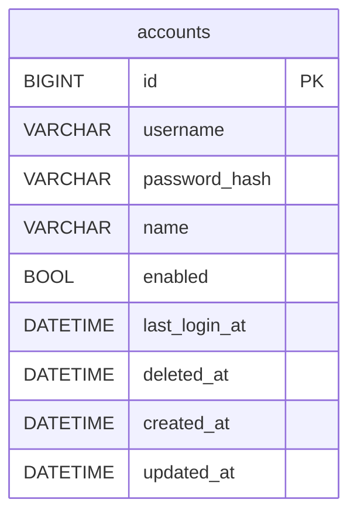

# 登录与用户管理 数据库模型设计

## 文档信息

- 所属 Feature：P1_ACC_001_FEAT_登录与用户管理
- 规则依据：[AGENTS_DATABASE_API_RULE.md](../../../AGENTS_DATABASE_API_RULE.md)（技术实现 SSOT）
- 业务依据：[01_功能需求规格说明书.md](01_功能需求规格说明书.md)（业务需求 SSOT）
- 架构依据：[context/03_architecture/architecture.md](../../03_architecture/architecture.md) §4.6 数据库管理约定

字段、长度、状态以 specs 为准；主键、公共字段、类型约束、命名以规则文件为准。本项目为关系型多库（SQLite/MySQL/PostgreSQL），不涉及 MongoDB 与时序库，字段说明仅列 MySQL 与 PostgreSQL 两列。

---

## 基础信息

**业务域：** account（账号与认证）

**数据库类型：** 关系型，多库可切换（SQLite 开发 / MySQL / PostgreSQL 生产，按 `SQL_DSN` 切换）。实际建表与索引由 GORM AutoMigrate 按当前 dialector 翻译生成，下文 DDL 仅供阅读与人工建表参考，类型以 GORM 通用 tag 翻译为准。

**表命名：** 沿用 GORM 默认 NamingPolicy，`Account` → `accounts`，不挂模块前缀，与已落地表保持一致（规则文件 §1.9）。

**模型实现位置：** [hr-backend/internal/domain/account.go](../../../hr-backend/internal/domain/account.go)，新业务域模型须在 [model/migrate.go](../../../hr-backend/internal/model/migrate.go) 的 `allModels()` 登记才参与 AutoMigrate。

---

## ER 图

账号体系自包含，与业务评估场景无数据依赖（specs §7.2），accounts 单实体，无业务外键关联。



无关联表、无字典表、无审计表、无历史表。本 Feature 不引入这些表类型（specs 无审计与历史需求，规则文件 §1.8 不引入字典表）。

---

## 表结构定义

### 1. 核心业务表：accounts

**表名：** `accounts`

**用途：** 平台账号台账，承载登录认证与用户管理全量字段。账号表无存量数据需要保留，开发态直接删表重建，AutoMigrate 按目标模型一次性建表，不写任何增量迁移逻辑。对齐 specs §6 软删除终态与 §4.2.4 规则4 账号名可复用。

**模型定义（[domain/account.go](../../../hr-backend/internal/domain/account.go)）：**

```go
type Account struct {
    ID           int64          `gorm:"primaryKey" json:"id,string"` // 雪花 ID，应用层生成去自增；json string 化规避前端 JS 数字精度坑
    Username     string         `gorm:"type:varchar(64);index;not null" json:"username"`
    PasswordHash string         `gorm:"type:varchar(255);not null" json:"-"`
    Name         string         `gorm:"type:varchar(64);not null" json:"name"`
    Enabled      bool           `json:"enabled"`
    LastLoginAt  *time.Time     `gorm:"index" json:"last_login_at"`
    DeletedAt    gorm.DeletedAt `gorm:"index" json:"-"`
    CreatedAt    time.Time      `gorm:"autoCreateTime" json:"created_at"`
    UpdatedAt    time.Time      `gorm:"autoUpdateTime" json:"updated_at"`
}
```

ID 主键为雪花（应用层生成，去自增，见规则文件 §1.2）。`Username` 用普通 `index`，唯一性收敛到业务层（排除软删除记录的查询校验）；`DeletedAt gorm.DeletedAt` 承载软删除，查询自动过滤。

---

**DDL 语句（参考建表，实际由 GORM AutoMigrate 生成）：**

##### MySQL DDL

```sql
CREATE TABLE `accounts` (
  `id` BIGINT NOT NULL COMMENT '主键ID（雪花ID，应用层生成，去自增）',
  `username` VARCHAR(64) NOT NULL COMMENT '登录账号，保存后不可改',
  `password_hash` VARCHAR(255) NOT NULL COMMENT '密码 bcrypt 哈希，不回显',
  `name` VARCHAR(64) NOT NULL COMMENT '真实姓名',
  `enabled` TINYINT(1) NOT NULL COMMENT '启用状态，控制可否登录',
  `last_login_at` DATETIME NULL COMMENT '最近登录成功时间',
  `deleted_at` DATETIME NULL COMMENT '软删除时间，NULL 表示未删除',
  `created_at` DATETIME NOT NULL COMMENT '创建时间',
  `updated_at` DATETIME NOT NULL COMMENT '更新时间',
  PRIMARY KEY (`id`),
  INDEX `idx_accounts_username` (`username`),
  INDEX `idx_accounts_last_login_at` (`last_login_at`),
  INDEX `idx_accounts_deleted_at` (`deleted_at`)
) ENGINE=InnoDB DEFAULT CHARSET=utf8mb4 COLLATE=utf8mb4_0900_ai_ci COMMENT='平台账号台账';
```

##### PostgreSQL DDL

```sql
CREATE TABLE "accounts" (
  "id" BIGINT NOT NULL,
  "username" VARCHAR(64) NOT NULL,
  "password_hash" VARCHAR(255) NOT NULL,
  "name" VARCHAR(64) NOT NULL,
  "enabled" BOOLEAN NOT NULL,
  "last_login_at" TIMESTAMP NULL,
  "deleted_at" TIMESTAMP NULL,
  "created_at" TIMESTAMP NOT NULL,
  "updated_at" TIMESTAMP NOT NULL,
  CONSTRAINT "accounts_pkey" PRIMARY KEY ("id")
);

CREATE INDEX "idx_accounts_username" ON "accounts"("username");
CREATE INDEX "idx_accounts_last_login_at" ON "accounts"("last_login_at");
CREATE INDEX "idx_accounts_deleted_at" ON "accounts"("deleted_at");

COMMENT ON TABLE "accounts" IS '平台账号台账';
COMMENT ON COLUMN "accounts"."id" IS '主键ID';
COMMENT ON COLUMN "accounts"."username" IS '登录账号，保存后不可改';
COMMENT ON COLUMN "accounts"."password_hash" IS '密码 bcrypt 哈希，不回显';
COMMENT ON COLUMN "accounts"."name" IS '真实姓名';
COMMENT ON COLUMN "accounts"."enabled" IS '启用状态，控制可否登录';
COMMENT ON COLUMN "accounts"."last_login_at" IS '最近登录成功时间';
COMMENT ON COLUMN "accounts"."deleted_at" IS '软删除时间，NULL 表示未删除';
COMMENT ON COLUMN "accounts"."created_at" IS '创建时间';
COMMENT ON COLUMN "accounts"."updated_at" IS '更新时间';
```

> SQLite 不单列 DDL，开发态由 GORM AutoMigrate 直接生成，类型亲和按 GORM 通用 tag 翻译（INTEGER 存 int64、TEXT 存字符串与时间）。

---

**字段说明：**

| 字段名 | 类型（MySQL）| 类型（PostgreSQL）| 必填 | 默认值 | 说明 |
|--------|------|------|--------|--------|------|
| id | BIGINT | BIGINT | 是 | 应用层生成 | 主键ID，雪花算法生成（int64，去自增，json string 化传输，规则文件 §1.2） |
| username | VARCHAR(64) | VARCHAR(64) | 是 | - | 登录账号，specs 上限 30 位字母数字下划线，列宽留余量；保存后不可改；唯一性业务层校验排除软删除 [长度来源：specs §4.3.2] |
| password_hash | VARCHAR(255) | VARCHAR(255) | 是 | - | 密码 bcrypt 哈希，固定 60 字符，列宽留余量；`json:"-"` 任何序列化路径不回显 |
| name | VARCHAR(64) | VARCHAR(64) | 是 | - | 真实姓名，specs 上限 20 字符，列宽留余量 [长度来源：specs §4.3.2] |
| enabled | TINYINT(1) | BOOLEAN | 是 | - | 启用状态，控制可否登录；不加 default tag，新建账号由业务层显式置 true（规则文件 §1.5） |
| last_login_at | DATETIME | TIMESTAMP | 否 | NULL | 最近登录成功时间，登录成功时更新；可空，空前端显示「-」 |
| deleted_at | DATETIME | TIMESTAMP | 否 | NULL | 软删除时间，GORM `DeletedAt` 承载；NULL 表示未删除，Delete 时自动赋值，查询自动过滤 |
| created_at | DATETIME | TIMESTAMP | 是 | CURRENT_TIMESTAMP | 创建时间，GORM `autoCreateTime` 自动维护 |
| updated_at | DATETIME | TIMESTAMP | 是 | CURRENT_TIMESTAMP | 更新时间，GORM `autoUpdateTime` 自动维护 |

无 `creator`/`updater`/`tenant_id`（规则文件 §1.3，项目无多租户与审计人追踪）。无工号字段（系统无工号约束，specs §4.2.2 注）。

---

**索引说明：**

| 索引名 | 类型 | 字段 | 用途 |
|--------|------|------|------|
| PRIMARY | PRIMARY KEY | id | 主键索引 |
| idx_accounts_username | INDEX | username | 登录查询与列表模糊匹配加速；普通索引，唯一性由业务层校验（排除软删除） |
| idx_accounts_last_login_at | INDEX | last_login_at | 最近登录时间查询（现有） |
| idx_accounts_deleted_at | INDEX | deleted_at | GORM 软删除自动过滤加速 |

**username 唯一性策略说明：** `username` 只建普通 `index`，不在 DB 层加唯一约束。原因：specs §6.1 要求软删除后账号名可复用，DB 单列唯一约束会因软删除记录占用 username 阻碍同名重建；GORM `DeletedAt` 的 `deleted_at` 未删除时为 NULL，标准 SQL 中 NULL 不参与唯一性判定，多库一致地无法在 DB 层既保证「未删除唯一」又允许「软删除可复用」。唯一性收敛到业务层查询 `WHERE username = ? AND deleted_at IS NULL`（规则文件 §1.10）。

---

**业务规则：**

- 账号全局唯一（排除软删除记录），重复新增返回 1005 UsernameExists（specs §4.2.4 规则1）。
- 至少保留一个启用账号，停用、删除、编辑降停最后一个启用账号时被拦截，返回 1006 LastEnabledAccount（specs §4.2.4 规则2、§6.2）。
- 删除为软删除，赋值 `deleted_at`，列表查询自动过滤，账号名可复用（specs §4.2.4 规则4、§6.1）。
- 密码以 bcrypt 哈希存储，不可逆，`password_hash` 永不回显（specs §4.1.4 规则3）。
- 启停即时生效，停用账号登录走凭证错误路径（specs §4.2.4 规则3）。

---

## Redis 键设计

RSA 动态密钥的私钥以 keyId 关联缓存，复用 Asynq 已有的 Redis 实例（specs §4.1.4 规则2、§5 归属边界）。私钥不落库不落盘，仅内存态短期存在。

**键格式：** `sili-smart-hr:auth:rsa:{keyId}`

| 配置项 | 值 | 说明 |
|-------|------|------|
| 前缀 | `sili-smart-hr:auth:rsa:` | 冒号分层，与 localStorage key `sili-smart-hr-auth` 语义对齐 |
| keyId | 32 字符随机 hex（16 字节熵） | 公钥接口生成密钥对时产出，足够防猜测 |
| value | RSA 私钥 PEM 字符串（PKCS#8） | 解密时取出加载为 `*rsa.PrivateKey` |
| TTL | 300 秒（5 分钟） | specs §4.1.4 规则2，与公钥 `expiresIn` 一致 |
| 写时机 | `GET /api/auth/public-key` 生成密钥对后 `SET key value EX 300` | 公钥返回前端，私钥入 Redis |
| 读时机 | 登录、新增、编辑改密、重置密码接口解密时 | 取出私钥解密 passwordCipher |
| 删除策略 | 解密成功即删，一次性 | Redis 6.2+ 用 `GETDEL`；低版本用 Lua 脚本或 `GET`+`DEL` 事务保证原子 |
| 失效路径 | TTL 到期自动清除 / 解密成功主动删除 / 解密失败也删除（防残留） | 私钥生命周期最长 5 分钟 |

**缓存更新策略：** Cache-Aside 退化版，一次性键，无更新无回源。每个 keyId 对应一次提交，过期则前端重新获取公钥（specs §4.1.5）。

---

## 索引策略

主键索引 `PRIMARY (id)` 承载按 ID 查（编辑、删除、启停、重置的目标定位）。`idx_accounts_username` 支撑登录按账号查与列表模糊匹配。`idx_accounts_deleted_at` 支撑 GORM 软删除自动过滤（每条查询自动追加 `deleted_at IS NULL`）。`idx_accounts_last_login_at` 为现有索引，支撑按最近登录排序的潜在查询。

无分表分库需求。账号体量为平台内部运营账号（数十量级），单表足矣，不分片不分区。生产推荐 PostgreSQL 或 MySQL，SQLite 仅开发测试（库级写锁与多实例部署限制）。

---

## 建表方式

账号表无存量数据需要保留，直接删表重建，不写任何增量迁移逻辑。开发态删掉 SQLite 库文件 `data/sili-smart-hr.db` 后重启，AutoMigrate 按上面的目标模型一次性建表，含 `idx_accounts_username`、`idx_accounts_last_login_at`、`idx_accounts_deleted_at` 三个索引；首启重新播种初始管理员（admin / hzwlsoft.com）。`domain.Account` 在 [model/migrate.go](../../../hr-backend/internal/model/migrate.go) 的 `allModels()` 登记即参与建表。

切 PostgreSQL/MySQL 生产库时，同样按目标模型建表，无需照顾旧结构（项目尚处脚手架阶段，无生产数据）。

---

## 一致性说明

接口响应字段与表字段对应关系（见 [03_api_interface.md](03_api_interface.md)）：

| 接口响应字段 | 表字段 | 说明 |
|------------|--------|------|
| id | id | 账号 ID |
| username | username | 登录账号 |
| name | name | 真实姓名 |
| enabled | enabled | 启用状态 |
| last_login_at | last_login_at | 最近登录时间，可空 |
| token | - | JWT，登录签发，非持久化字段 |
| password_hash | password_hash | `json:"-"`，永不返回 |
| created_at / updated_at / deleted_at | 同名 | 台账不展示，接口不返回 |

命名规范一致：接口 JSON 字段 snake_case，与表字段一一对应（`last_login_at`、`password_hash`），前端 httpClient 解包后直接消费。

---

## 字典数据

本 Feature 无字典字段。`enabled` 为布尔字段，状态枚举（启用/停用/已删除）由 `enabled` 加 `deleted_at` 组合表达（specs §6.1），不引入字典表，不生成字典 INSERT 语句（规则文件 §1.8）。

---

**文档版本：** v1.0
**创建日期：** 2026-08-10
**作者：** lixuetao
