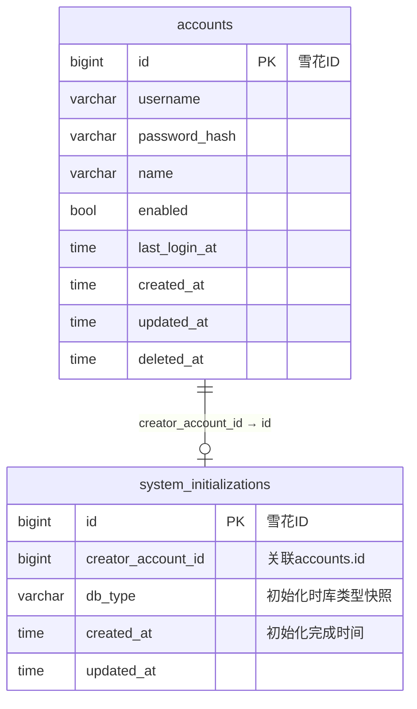

# 系统初始化 数据库模型设计

## 文档信息

| 项目 | 内容 |
|------|------|
| 所属 Feature | P1_SYS_001_FEAT_系统初始化 |
| 上游 SSOT | [01_功能需求规格说明书.md](01_功能需求规格说明书.md) |
| 规则依据 | [AGENTS_DATABASE_API_RULE.md](../../../AGENTS_DATABASE_API_RULE.md) |
| 架构依据 | [context/03_architecture/architecture.md](../../03_architecture/architecture.md) 第 4 章 |
| 设计日期 | 2026-08-11 |

> 字段定义、业务规则以功能需求规格说明书（specs）为准；技术实现层面（主键、类型约束、命名、传输）以 AGENTS_DATABASE_API_RULE.md 为准。表结构变更须在 [model/migrate.go](../../../hr-backend/internal/model/migrate.go) 的 `allModels()` 登记参与 AutoMigrate。

---

## 1. 设计总览

### 1.1 持久化范围

本 feature 的数据持久化需求极小，仅新增一张系统级单行表 `system_initializations` 承载初始化状态锁定。其余数据分两类不落库：

一是复用 account 域既有 `accounts` 表承接首个账号写入，本 feature 不改动 accounts 表结构，仅在向导提交时经 account 账号创建能力写入一行（specs 7.1 数据依赖 + 流程依赖）。

二是运行状态摘要与组件健康测试的产出均为运行时实时探测值，不持久化。数据库类型取自 `SQL_DSN` 选库结果，系统版本取自构建期注入信息，启动时间取自进程启动记录，数据库、Redis、大模型、会话日志集成的连通性均为每次请求实时探测。这部分数据落在进程内存与外部依赖探测，不进主库。

### 1.2 模块前缀与表命名

遵循规则文件 1.9，沿用 GORM 默认 NamingPolicy 实体复数化，不强制模块前缀。系统初始化属 SYS 域，但表名取语义化复数实体名 `system_initializations`，与已落地的 `accounts` 命名风格一致。Go 实体名 `SystemInitialization`。

### 1.3 多库兼容策略

遵循架构文档 4.6 与规则文件 1.5 的字段约定：模型 tag 用 GORM 通用类型（`varchar`/`bigint`），不写库特定类型；时间用 `time.Time` 配 `autoCreateTime`/`autoUpdateTime`；雪花 ID 主键应用层生成；外键约束不开，关联靠业务字段。三库（SQLite/MySQL/PostgreSQL）由 GORM 按当前 dialector 翻译列类型，无需手写方言分支。

---

## 2. ER 关系

```
┌─────────────────────────┐         ┌─────────────────────────────┐
│ accounts (复用，不改结构) │◀────────│ system_initializations       │
│                         │ 业务字段 │ (本 feature 新增，系统级单行) │
│ id (bigint, 雪花)  ◀─────┼─关联────│ creator_account_id (bigint)  │
│ username                │  无外键  │                             │
│ password_hash           │ 约束    │                             │
│ name / enabled / ...    │         │                             │
└─────────────────────────┘         └─────────────────────────────┘
```

关系说明：`system_initializations.creator_account_id` 取值来自 `accounts.id`（向导创建的首个账号的雪花主键），按规则文件 1.5 不开外键约束，关联完整性由应用层在事务内保证（账号创建与初始化记录写入同事务，specs 5.2.4）。两张表为 1:1 关系（系统级单行记录关联唯一首个账号）。



---

## 3. 表结构定义

### 3.1 system_initializations（系统初始化记录表）

**用途：** 承载系统就绪状态的系统级单行数据。存在即判定已初始化（specs 规则1），写入即单向终态锁定（specs 规则2、6.2）。由首次初始化提交服务在向导提交成功时写入，关联本次创建的首个账号。此后不更新业务字段、不删除，仅 GORM `updated_at` 在极端运维场景被动刷新。

**GORM 模型（domain/system_initialization.go，表结构 SSOT）：**

```go
// SystemInitialization 是系统初始化记录，系统级单行数据。
// 存在即判定已初始化（specs 规则1），写入即单向终态（specs 规则2）。
// 不设软删除：初始化记录不可删，重置只能重建库（specs 6.2）。
type SystemInitialization struct {
    ID                int64     `gorm:"primaryKey" json:"id,string"`            // 雪花 ID（应用层生成），string 化规避前端 JS 精度坑
    CreatorAccountID  int64     `gorm:"index;not null" json:"creator_account_id,string"` // 关联首个账号 ID，取自 accounts.id 雪花主键，同样超 2^53 必须 string 化
    DBType            string    `gorm:"type:varchar(32);not null" json:"db_type"`        // 初始化时数据库类型快照：sqlite / mysql / postgres
    CreatedAt         time.Time `gorm:"autoCreateTime" json:"created_at"`        // 初始化完成时间
    UpdatedAt         time.Time `gorm:"autoUpdateTime" json:"updated_at"`        // 记录变更时间，单向终态下通常与 created_at 一致
}
```

**字段说明：**

| 字段名 | 类型（MySQL） | 类型（PostgreSQL） | 类型（SQLite） | 必填 | 默认值 | 说明 |
|--------|------|------|------|--------|--------|------|
| id | BIGINT | BIGINT | INTEGER | 是 | - | 主键 ID，雪花 ID 应用层生成，GORM 全局 Create 回调透明赋值；超 2^53 故 JSON string 化下发前端 [长度来源：默认值] |
| creator_account_id | BIGINT | BIGINT | INTEGER | 是 | - | 关联首个账号的雪花主键，取值来自 accounts.id；不开外键约束，关联完整性由提交事务保证；超 2^53 故 JSON string 化 [长度来源：默认值] |
| db_type | VARCHAR(32) | VARCHAR(32) | TEXT | 是 | - | 初始化提交时记录的数据库类型快照，值域 sqlite / mysql / postgres，由 model.DatabaseType 提供；仅作初始化时环境审计，运行状态摘要展示的是当前实时库类型 [长度来源：默认值] |
| created_at | DATETIME | timestamp with time zone | TEXT | 是 | - | GORM autoCreateTime 赋值，记录初始化完成时间；与 specs 中向导提交成功的时刻对应 |
| updated_at | DATETIME | timestamp with time zone | TEXT | 是 | - | GORM autoUpdateTime 刷新；单向终态记录无业务更新路径，通常恒等于 created_at |

**索引说明：**

| 索引名 | 类型 | 字段 | 用途 |
|--------|------|------|------|
| 主键索引（PRIMARY） | PRIMARY | id | 雪花主键唯一标识 |
| idx_system_initializations_creator_account_id | INDEX | creator_account_id | 按首个账号反查初始化记录，便于运维定位初始化者 |

**业务规则与使用场景：**

单行约束由业务层在初始化提交事务内控制。提交服务先查 `system_initializations` 是否存在记录，存在即判定已初始化、拒绝重复提交并返回错误码 1101（specs 规则5、5.2.4）；不存在才进入账号创建与记录写入。数据库层不额外设单行约束（如固定值唯一列），因为单行语义由"记录存在即已初始化"的判定逻辑天然保证，加冗余约束属过度设计。

记录写入与首个账号创建在同一事务内（specs 5.2.4），任一失败整体回滚，避免出现账号已建但状态未锁定或状态已锁定但账号缺失的半状态。事务边界由初始化提交 service 编排，复用 account 域底层账号写入能力但将其纳入本事务。

记录一旦写入即单向终态，全系统无更新业务字段、无删除、无重新初始化的路径（specs 6.2）。重置只能重建库，重建后 `system_initializations` 为空，回到未初始化态，向导入口重新开放。

`db_type` 是初始化时刻的库类型快照，与运行状态摘要服务（5.3）返回的实时库类型是两个口径：前者冻结首次初始化时的环境，后者反映当前 `SQL_DSN` 选库结果，二者可能因部署后切库而不一致，摘要展示以实时值为准。

---

## 4. 复用既有表说明

### 4.1 accounts（account 域，本 feature 不改结构）

向导创建的首个账号写入 accounts 表，复用 P1_ACC_001 已落地的账号模型与创建能力，本 feature 不新增字段、不改类型。复用要点：

字段映射（specs 4.1.2 首个账号表单 → accounts 列）：

| 向导表单字段 | accounts 列 | 写入规则 |
|------------|------------|---------|
| 账号 | username | varchar(64)，校验复用 account 规则 `^[A-Za-z0-9_]{3,30}$`（specs 4.1.2 声明完整校验以 P1_ACC_001 为准） |
| 姓名 | name | varchar(64)，校验复用 account 规则 utf8.RuneCountInString ≤ 20（同上） |
| 密码 | password_hash | 前端 RSA-OAEP 加密传输 passwordCipher + keyId，后端解密明文经 bcrypt(DefaultCost) 哈希后写入；密码强度复用 account 规则 ≥8 位且字母+数字（见 03 文档口径说明） |
| （业务层置值） | enabled | 业务层显式置 true，遵循布尔字段不加 default tag 约束（specs 规则4） |
| （GORM 维护） | last_login_at | 首次创建为 NULL，首次登录后由登录链路刷新 |
| （GORM 维护） | created_at / updated_at / deleted_at | autoCreateTime / autoUpdateTime / 软删除索引，首个账号不预置软删除 |

账号唯一性由 account 域既有逻辑保证：`username` 列为普通 INDEX（非 UNIQUE，规则文件 1.10），唯一性收敛到业务层校验时排除软删除记录。首个账号在库空状态下提交，必然唯一。

---

## 5. 不持久化数据说明

以下数据为运行时实时探测或进程内存值，不落主库，避免与 specs 5.1/5.3/5.4 的"实时探测"语义冲突：

| 数据项 | 来源 | 生命周期 | 说明 |
|-------|------|---------|------|
| initialized 标志 | 查 system_initializations 是否存在记录 | 每次请求查库 | 单行查询走主键或 LIMIT 1，开销可忽略，不缓存 |
| 数据库连通 | 实时 ping（轻量 SELECT） | 每次探测 | 不缓存，反映当前连通性 |
| 缓存（Redis）连通 | 实时 ping | 每次探测 | 不缓存 |
| JWT 密钥状态 | config 探测（比对默认公开常量） | 进程级常量 | 取自 config.IsDefaultJWTSecret，进程启动锁定 |
| 数据库类型（实时） | model.DatabaseType | 进程级常量 | 启动期 chooseDB 锁定，进程级不可变 |
| 系统版本 | 构建期 ldflags 注入或常量 | 进程级常量 | 二进制版本号，构建期确定 |
| 进程启动时间 | main 启动时记录的 time.Time | 进程生命周期 | 内存变量，进程重启刷新 |
| 大模型可达 | 探测当前启用模型（一次最小请求） | 每次探测 | 依赖 config 模块，未落地前返回"未配置" |
| 会话日志集成可达 | 探测集成密钥（一次鉴权请求） | 每次探测 | 依赖 config 模块，未落地前返回"未配置" |

进程级常量（启动时间、系统版本、数据库类型、JWT 密钥状态）建议封装在 model 或 config 包的导出变量，由 main 在启动序列赋值，供状态摘要服务读取。这属实现细节，不纳入数据库设计。

---

## 6. Redis 键约定

本 feature 不新增 Redis 持久化业务键。初始化状态判定走数据库单行查询，不缓存到 Redis，避免缓存与库不一致带来的状态误判（specs 强调初始化记录为判定 SSOT）。

复用既有 Redis 键场景仅一处：首次初始化提交的密码字段走 RSA-OAEP 加密，复用 account 域既有 `GET /api/auth/public-key` 接口获取公钥与 keyId，私钥以 keyId 关联存 Redis（规则文件 2.5，TTL 5 分钟，解密成功即删）。该 Redis 键命名与生命周期已由 rsakey.Manager 落地，本 feature 直接复用，不新增键空间。

---

## 7. 迁移与种子影响

### 7.1 新表登记

`system_initializations` 模型须在 [model/migrate.go](../../../hr-backend/internal/model/migrate.go) 的 `allModels()` 登记参与 AutoMigrate。GORM 自动建表加列加索引，三库通用，无需手写方言迁移（字段均为通用类型，无类型变更与数据回填需求）。无 A 段类型迁移钩子、无 C 段数据回填。

### 7.2 移除 account SQLite 自动播种（前置变更项）

本 feature 上线的硬前置：移除 [model/migrate.go](../../../hr-backend/internal/model/migrate.go) 中 account 的 SQLite 自动播种逻辑（admin / hzwlsoft.com），由初始化向导统一承接首个账号创建（specs 7.2 前置变更项）。

影响范围：

其一，生产口径。PostgreSQL/MySQL 本就不播种，无影响。SQLite 开发态原本每次重建库自动播种 admin，移除后首访需走向导创建账号，不再有默认凭据。这是 specs 明确接受的开发态影响。

其二，实施方式。该改动是对 P1_ACC_001 已交付代码的变更，specs 7.2 建议二选一：由需求变更技能对 P1_ACC_001 发起 RFC 单独记录，或在本 feature 开发实施计划内作为前置任务一并落地。决策留待开发计划阶段，本设计文档仅固化其作为硬前置的地位。

其三，向后兼容。已用旧逻辑播种过 admin 的存量 SQLite 开发库，首访探针查 `system_initializations` 为空，会判定未初始化并跳转向导，向导要求创建新账号（不能与已有 admin 重名）。这是预期行为，存量开发库重建即可，不构成长期迁移负担。

---

## 8. 字典数据处理

遵循规则文件 1.8，项目不引入 system_dict_type / system_dict_data 字典表体系。本 feature 的状态与枚举（初始化状态、数据库类型、组件健康状态值、JWT 密钥状态）用 Go 侧常量与业务字段承载，字段说明不使用 `[字典：xxx]` 标注，亦不生成字典表 INSERT 语句。

枚举值域集中定义在 03_api_interface.md 的响应字段说明与组件健康状态值枚举表，Go 侧以常量集合落地，前端类型用 string 字面量联合。
