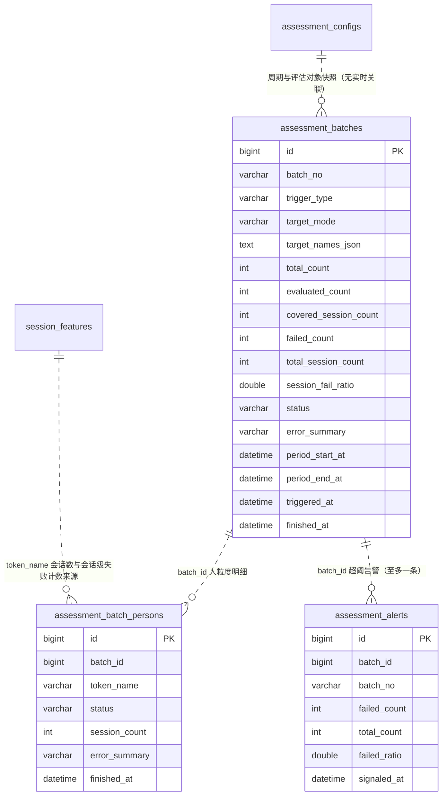

# 周期批量评估跑批编排 数据库模型设计文档

## 文档信息

| 项目 | 内容 |
|------|------|
| Feature | P2_ASM_001_FEAT_周期批量评估跑批编排 |
| 模块代号 | ASM（评估运营域） |
| 文档版本 | v1.5 |
| 创建日期 | 2026-09-11 |
| 作者 | lixuetao |
| 依据 | [01_功能需求规格说明书](01_功能需求规格说明书.md)（SSOT）、[AGENTS_DATABASE_API_RULE.md](../../../AGENTS_DATABASE_API_RULE.md)、[architecture.md](../../03_architecture/architecture.md) |

---

## 1. 设计依据与约定

### 1.1 数据库选型

按规则文件 §1.1，多库可切换（SQLite / PostgreSQL / MySQL），GORM AutoMigrate 为主建表加列加索引。模型 tag 一律用 GORM 通用类型（varchar/text/int/bigint），不写库特定类型。一处方言例外与既有先例同款：两个比例列的 tag 落 `double precision`（裸 `double` 在 PG 是非法类型名，`float` 在 MySQL 落单精度；`double precision` 在 PG/MySQL 皆合法且 SQLite 亲和收 REAL，保三库双精度），参照 `aggregate_scores.module_score` 既有处理。

三张新表在 `model/migrate.go` 的 `allModels()` 登记参与 AutoMigrate。首版建表无存量数据，不需手写迁移钩子。

### 1.2 主键策略

雪花 ID，应用层生成，模型 tag 只写 `gorm:"primaryKey"`（GORM 全局 Create 回调透明赋值）。三张表均有 HTTP 序列化路径，主键与外键 `batch_id` 按规则文件 §1.2 双层 string 化（domain 与 service DTO 各打 `json:"id,string"` / `json:"batch_id,string"`），前端类型用 string。

### 1.3 公共字段

统一含 `created_at`（autoCreateTime）与 `updated_at`（autoUpdateTime），不引入 creator/updater/tenant_id。三表均无逻辑删除需求：批次记录是评估执行的审计留痕（specs §6.2 明确一经创建即执行到底、不提供取消作废），人员明细与告警信号随批次存在，均不引入 `deleted_at`。

### 1.4 命名与类型约束

snake_case 字段命名，语义化复数表名（规则文件 §1.9）。半结构化数据（评估对象名单快照）用 TEXT 列存序列化 JSON，禁用 JSON 类型列。表关联不开外键约束，`batch_id` 为业务字段关联，关联完整性由应用层保证。本功能无布尔列（`stalled` 是查询期派生标识不落库，见 [03_api_interface.md](03_api_interface.md) §4.5）。

### 1.5 不引入字典表

规则文件 §1.8 显式排除。`trigger_type`、`target_mode`、`status` 枚举语义由 Go 侧常量加业务字段承载，字段说明不使用 `[字典：xxx]` 标注，无字典 INSERT 语句。

### 1.6 与 specs 的技术层偏差（按规则裁决）

| 项 | specs 表述 | 本设计 | 依据 |
|----|-----------|--------|------|
| 表名 | 批次记录 / 告警信号记录 | `assessment_batches` / `assessment_alerts` | 规则文件 §1.9 复数化 NamingPolicy |
| 时间列名 | 触发时间 / 评估时段 | `triggered_at` / `period_start_at` + `period_end_at` | 规则文件 §1.4 `xxx_at` 后缀语义；与 `dimension_scores` 的 period 列同构 |
| 新增实体 | 未显式列出批次人员明细 | 新增 `assessment_batch_persons` | specs §5.2.2 步骤5「回写该人终态」与 §4.3.2「批次失败人员清单」隐含要求人员级存储：批次记录只承载计数（§5.2.3 明示「进度、覆盖会话、失败计数、终态」），失败清单的姓名与原因、进度分子、单人终态枚举均需人粒度载体 |

---

## 2. ER 图



关联语义说明：三条虚线均为业务字段对齐而非外键（规则文件 §1.5 不开外键约束）。`assessment_batches` 的评估对象名单在创建时快照落 `target_names_json`，与 `assessment_configs` 的当前值无实时关联（specs §4.1.4 规则4：配置变更自下次跑批生效，进行中批次不受影响）；`assessment_batch_persons.session_count` 为批次展开时点该人窗口内会话数的快照，与 `activity_stats.session_count` 同源但口径不同（前者随批次展开确定，后者按末轮归属的活跃度口径，见 §3.2 业务规则）。

---

## 3. 表结构定义

### 3.1 批次记录表

#### 3.1.1 assessment_batches

**表名：** `assessment_batches`

**用途：** 一次对话分析评估执行的持久化载体，批次状态机的唯一持有者。一行一批次，承载评估时段、评估对象快照、进度计数、覆盖会话数、失败计数、终态与会话级失败比例。写入方：pipeline.Orchestrator（创建、展开取数、逐人推进、终态落定）；消费方：评测运营中心页（列表、统计卡、计划卡、评估对象名单）、F11 工作台（批次态势）。

---

**DDL 语句（以 GORM 模型 tag 为权威，三库由 dialector 翻译；以下 DDL 供参考，DEFAULT 子句省略与时间列精度差异以 GORM 翻译为准）：**

##### MySQL DDL

```sql
CREATE TABLE `assessment_batches` (
  `id` BIGINT NOT NULL COMMENT '主键ID（雪花ID）',
  `batch_no` VARCHAR(32) NOT NULL COMMENT '批次号，人工沟通的引用锚点',
  `trigger_type` VARCHAR(16) NOT NULL COMMENT '触发方式 scheduled/manual',
  `target_mode` VARCHAR(16) NOT NULL COMMENT '评估对象模式 all/specified',
  `target_names_json` TEXT NOT NULL COMMENT '评估对象名单快照JSON（人名数组）',
  `total_count` INT NOT NULL COMMENT '批次总人数（进度分母）',
  `evaluated_count` INT NOT NULL COMMENT '已到达终态的单人评估数（进度分子）',
  `covered_session_count` INT NOT NULL COMMENT '覆盖会话数（成功侧终态各人窗口内会话数之和）',
  `failed_count` INT NOT NULL COMMENT '失败人数',
  `total_session_count` INT NOT NULL COMMENT '批次展开拉取的会话总数（会话级失败比例分母）',
  `session_fail_ratio` DOUBLE NULL COMMENT '会话级失败比例（百分比两位小数），未终态为NULL',
  `status` VARCHAR(16) NOT NULL COMMENT '批次状态 running/success/partial_failed/failed',
  `error_summary` VARCHAR(255) NOT NULL COMMENT '批次级失败原因摘要（整批失败时），业务层置空串',
  `period_start_at` DATETIME NOT NULL COMMENT '评估时段起点（含）',
  `period_end_at` DATETIME NOT NULL COMMENT '评估时段终点（含）',
  `triggered_at` DATETIME NOT NULL COMMENT '触发时间',
  `finished_at` DATETIME NULL COMMENT '终态落定时间，进行中为NULL',
  `created_at` DATETIME NOT NULL COMMENT '创建时间',
  `updated_at` DATETIME NOT NULL COMMENT '更新时间',
  PRIMARY KEY (`id`),
  UNIQUE KEY `uk_batch_no` (`batch_no`),
  KEY `idx_status_triggered` (`status`,`triggered_at`),
  KEY `idx_triggered_at` (`triggered_at`)
) ENGINE=InnoDB DEFAULT CHARSET=utf8mb4 COLLATE=utf8mb4_0900_ai_ci COMMENT='对话分析评估批次记录';
```

##### PostgreSQL DDL

```sql
CREATE TABLE "assessment_batches" (
  id BIGINT NOT NULL,
  batch_no VARCHAR(32) NOT NULL,
  trigger_type VARCHAR(16) NOT NULL,
  target_mode VARCHAR(16) NOT NULL,
  target_names_json TEXT NOT NULL,
  total_count INTEGER NOT NULL,
  evaluated_count INTEGER NOT NULL,
  covered_session_count INTEGER NOT NULL,
  failed_count INTEGER NOT NULL,
  total_session_count INTEGER NOT NULL,
  session_fail_ratio DOUBLE PRECISION,
  status VARCHAR(16) NOT NULL,
  error_summary VARCHAR(255) NOT NULL,
  period_start_at TIMESTAMPTZ NOT NULL,
  period_end_at TIMESTAMPTZ NOT NULL,
  triggered_at TIMESTAMPTZ NOT NULL,
  finished_at TIMESTAMPTZ,
  created_at TIMESTAMPTZ NOT NULL,
  updated_at TIMESTAMPTZ NOT NULL,
  CONSTRAINT "assessment_batches_pkey" PRIMARY KEY (id)
);
CREATE UNIQUE INDEX "uk_batch_no" ON "assessment_batches"("batch_no");
CREATE INDEX "idx_status_triggered" ON "assessment_batches"("status", "triggered_at");
CREATE INDEX "idx_triggered_at" ON "assessment_batches"("triggered_at");
COMMENT ON TABLE "assessment_batches" IS '对话分析评估批次记录';
```

> SQLite 由 GORM 直接翻译，不单列 DDL。GORM 模型落位 `internal/domain/assessment_batch.go`。

---

**字段说明：**

| 字段名 | 类型（MySQL）| 类型（PostgreSQL）| 必填 | 默认值 | 说明 |
|--------|------|------|------|--------|------|
| id | BIGINT | BIGINT | 是 | - | 主键ID（雪花ID），应用层生成 [长度来源：雪花 int64] |
| batch_no | VARCHAR(32) | VARCHAR(32) | 是 | 业务层置值 | 批次号，格式 `B` + `yyyyMMddHHmm` + 3 位序号（如 `B202609132300001`，共 16 字符），触发时点派生，唯一索引兜底同秒并发撞键（撞键重取序号重试） [长度来源：规则文件 §1.6 标题类量级，32 字符留余量] |
| trigger_type | VARCHAR(16) | VARCHAR(16) | 是 | - | 触发方式：`scheduled`（周期跑批调度创建）/ `manual`（发起评测接口创建）；列表筛选维度与状态流转无关 [长度来源：枚举值最长 9 字符] |
| target_mode | VARCHAR(16) | VARCHAR(16) | 是 | - | 评估对象模式：`all`（全员，名单在**批次创建时**经人员检索接口拉取全员名单快照，见 03 文档 §1.5）/ `specified`（指定人员，名单取发起时的选择）；决定名单快照来源，两类名单均在创建时落库 [长度来源：枚举值最长 9 字符] |
| target_names_json | TEXT | TEXT | 是 | 业务层置值 | 评估对象名单快照（人名数组的 JSON 序列化）。`specified` 取发起请求的人员名单，`all` 取创建时经人员检索接口拉取的全员名单（03 文档 §1.5）；供列表摘要（前 2 个）、「重新发起」预填与总数校核。**批次创建时写入**，此后不随人员主数据变动（specs §4.1.4 规则1 的人员变动不入已展开批次） [长度来源：规则文件 §1.6 长文本 TEXT] |
| total_count | INT | INTEGER | 是 | 业务层置值 | 批次总人数（进度分母），创建时按名单快照条数写入，`specified` 与 `all` 两种模式同源，无待回填窗口（03 文档 §1.5） [长度来源：int] |
| evaluated_count | INT | INTEGER | 是 | 业务层置 0 | 已到达终态（success/reused/degraded/skipped/failed）的单人评估数，进度分子；单人终态回写时 SQL 原子自增，只增不减（specs §5.2.4 规则2） [长度来源：int] |
| covered_session_count | INT | INTEGER | 是 | 业务层置 0 | 覆盖会话数：到达成功侧终态的各人窗口内会话数之和，在该人终态时一次性累计；失败人员的会话不计入，含降级与会话（specs §5.2.4 规则3，权威口径） [长度来源：int] |
| failed_count | INT | INTEGER | 是 | 业务层置 0 | 失败人数：单人评估重试耗尽计数。非零时列表以警示色强调，作为补跑决策依据；批次终态判定与告警判定的分子（specs §8.1 失败人数占比） [长度来源：int] |
| total_session_count | INT | INTEGER | 是 | 业务层置 0 | 批次展开时拉取去重后的会话总数（含失败人员会话），仅作会话级失败比例的分母，不作列表展示口径（specs §5.2.4 规则3 明文区分两个口径） [长度来源：int] |
| session_fail_ratio | DOUBLE | DOUBLE PRECISION | 否 | NULL | 会话级失败比例（百分比口径，0 至 100，保留两位小数）：分子为批次内 `status=failed` 会话计数（承接 T4 §6.2 `extract_fail_ratio` 分子口径），分母为 `total_session_count`；批次终态时计算写入，进行中为 NULL；供 F11 工作台呈现 [长度来源：float64，规则文件 §1.6 数值] |
| status | VARCHAR(16) | VARCHAR(16) | 是 | 业务层置 running | 批次状态四态：`running` 进行中 / `success` 成功 / `partial_failed` 部分失败 / `failed` 失败；一经终态不可逆，重新评估通过新批次表达（specs §6.1/6.2） [长度来源：枚举值最长 14 字符] |
| error_summary | VARCHAR(255) | VARCHAR(255) | 是 | 业务层置空串 | 批次级失败原因摘要（批次级异常导致的整批失败：上游会话列表不可用、`batch-run` 入队失败，见 03 文档 §3.B1 与 §4.6），前端失败明细弹窗在批次级异常时展示；正常批次为空串。写库前截断至 255 字符，禁落原始堆栈（specs §4.3.2） [长度来源：规则文件 §1.6 长文本，摘要语义 255] |
| period_start_at | DATETIME | TIMESTAMP | 是 | - | 评估时段起点（含）。定时批次取周期窗口起点，手动批次取用户选定起点；接口入参 `period_start` 为 `yyyy-MM-dd`，按当日 00:00:00 写入 [长度来源：规则文件 §1.7 time.Time] |
| period_end_at | DATETIME | TIMESTAMP | 是 | - | 评估时段终点（含）。接口入参 `period_end` 为 `yyyy-MM-dd`，与列表展示同口径（两端均含止日，可等于起点表示评估单日），按当日 00:00:00 写入；装配为 T5 入参时按次日 00:00:00 转 Unix 秒，满足其 Period 半开区间语义（03 文档 §2.5） [长度来源：同上] |
| triggered_at | DATETIME | TIMESTAMP | 是 | - | 触发时间（批次发起时刻）。列表按此列倒序（specs §8.3 偏离记录第 2 条）、统计卡按此列落本期跑批间隔、停滞判定以此为起点（03 文档 §4.5） [长度来源：同上] |
| finished_at | DATETIME | TIMESTAMP | 否 | NULL | 终态落定时间，进行中为 NULL；与 `status` 同批写入 [长度来源：同上，可空指针] |
| created_at | DATETIME | TIMESTAMP | 是 | GORM 自动 | 创建时间，autoCreateTime |
| updated_at | DATETIME | TIMESTAMP | 是 | GORM 自动 | 更新时间，autoUpdateTime，计数原子自增时刷新，显式 UTC 口径（与 T4 utcNow 同） |

**索引说明：**

| 索引名 | 类型 | 字段 | 用途 |
|--------|------|------|------|
| PRIMARY | PRIMARY KEY | id | 主键索引 |
| uk_batch_no | UNIQUE | batch_no | 批次号唯一：人工引用锚点，同秒并发创建撞键由业务层重取序号重试；本表无软删除，无规则文件 §1.10 的 NULL 语义问题 |
| idx_status_triggered | INDEX | status, triggered_at | 列表状态筛选加热度排序（「进行中」筛选与停滞判定的点查路径）、tick 的同源批次阻塞判定（查 running 的定时批次） |
| idx_triggered_at | INDEX | triggered_at | 统计卡的本期跑批间隔范围查询与列表无筛选时的倒序翻页 |

**业务规则：**

- **状态机（specs §6.1/§6.2 唯一权威）**：`running` → `success`（全员终态且失败人数占比 ≤ `10.00`）/ `partial_failed`（`10.00` < 占比 < `100.00`）/ `failed`（占比 = `100.00`，或批次级异常）。占比为百分比口径（0 至 100）保留两位小数，与 `batchAlertThreshold` 同精度比较（03 文档 §4.6）。终态无出边，`RunBatch` 对非 `running` 批次幂等返回，重复消费不重复编排（03 文档 §4.4）。
- **计数原子推进**：`evaluated_count`/`covered_session_count`/`failed_count` 在单人终态回写时用 SQL 自增（`SET col = col + ?`），不做读改写；`evaluated_count = total_count` 的终态判定由调用方在回写事务外读回批次行进行，终态落定以 `WHERE status='running'` 条件更新守卫（affected==0 视为已终态幂等返回），并发双触发不重复落终态、计数不回退。
- **停滞不落库**：停滞是查询期按 `status='running'` 加 `triggered_at` 与周期长度比较派生的标识，不改写 `status`（specs §6.2 说明），故本表无停滞列。
- **会话级失败比例口径**：分母取批次展开时确定的 `total_session_count`（本功能定义），分子按同批人员与同时段从 `session_features` 统计 `status='failed'` 计数（承接 T4 口径）。两口径的差异仅来自跨边界会话（展开按上游窗口过滤，档案侧按末轮归属），属已知近似，比例可能轻微低估。
- **名单快照不可变**：`target_names_json` 与人员明细行在**批次创建时**一次性落库，此后不再刷新，配置变更与人员变动不回改已落库批次（specs §4.1.4 规则1/4）。编排展开会话列表后按 `token_name` 分组得到的会话集只用于 `EvaluatePerson` 的 sessions 入参与覆盖会话数口径，不增删名单（03 文档 §1.5）。
- **无软删除**：批次为审计留痕，物理保留供历史追溯与工作台态势消费。

---

### 3.2 批次人员明细表

#### 3.2.1 assessment_batch_persons

**表名：** `assessment_batch_persons`

**用途：** 批次内一人一行的单人评估终态载体，承载该人的终态枚举、窗口内会话数与失败原因摘要。写入方：pipeline.Orchestrator（展开时批量落 pending 行，单人终态时更新）；消费方：失败明细弹窗、进度统计、补跑对象确定。

---

**DDL 语句：**

##### MySQL DDL

```sql
CREATE TABLE `assessment_batch_persons` (
  `id` BIGINT NOT NULL COMMENT '主键ID（雪花ID）',
  `batch_id` BIGINT NOT NULL COMMENT '所属批次ID',
  `token_name` VARCHAR(64) NOT NULL COMMENT '人员归属（上游调用令牌名，即人名）',
  `status` VARCHAR(16) NOT NULL COMMENT '单人评估终态 pending/success/reused/degraded/skipped/failed',
  `session_count` INT NOT NULL COMMENT '该人评估时段内会话数（展开分组口径）',
  `error_summary` VARCHAR(255) NOT NULL COMMENT '失败原因摘要，非失败为空串',
  `finished_at` DATETIME NULL COMMENT '单人终态落定时间，未终态为NULL',
  `created_at` DATETIME NOT NULL COMMENT '创建时间',
  `updated_at` DATETIME NOT NULL COMMENT '更新时间',
  PRIMARY KEY (`id`),
  UNIQUE KEY `uk_batch_person` (`batch_id`,`token_name`),
  KEY `idx_batch_status` (`batch_id`,`status`)
) ENGINE=InnoDB DEFAULT CHARSET=utf8mb4 COLLATE=utf8mb4_0900_ai_ci COMMENT='批次人员评估明细';
```

##### PostgreSQL DDL

```sql
CREATE TABLE "assessment_batch_persons" (
  id BIGINT NOT NULL,
  batch_id BIGINT NOT NULL,
  token_name VARCHAR(64) NOT NULL,
  status VARCHAR(16) NOT NULL,
  session_count INTEGER NOT NULL,
  error_summary VARCHAR(255) NOT NULL,
  finished_at TIMESTAMPTZ,
  created_at TIMESTAMPTZ NOT NULL,
  updated_at TIMESTAMPTZ NOT NULL,
  CONSTRAINT "assessment_batch_persons_pkey" PRIMARY KEY (id)
);
CREATE UNIQUE INDEX "uk_batch_person" ON "assessment_batch_persons"("batch_id", "token_name");
CREATE INDEX "idx_batch_status" ON "assessment_batch_persons"("batch_id", "status");
COMMENT ON TABLE "assessment_batch_persons" IS '批次人员评估明细';
```

---

**字段说明：**

| 字段名 | 类型（MySQL）| 类型（PostgreSQL）| 必填 | 默认值 | 说明 |
|--------|------|------|------|--------|------|
| id | BIGINT | BIGINT | 是 | - | 主键ID（雪花ID），应用层生成 [长度来源：雪花 int64] |
| batch_id | BIGINT | BIGINT | 是 | - | 所属批次主键，取自 `assessment_batches.id`（雪花ID），超 2^53 必须 string 化下发 [长度来源：外键对齐] |
| token_name | VARCHAR(64) | VARCHAR(64) | 是 | - | 人员归属，上游调用令牌名（中文人名），与 `session_features.token_name`/`dimension_scores.token_name` 同口径；补跑时作为带入发起评测的人员标识 [长度来源：规则文件 §1.6 人员姓名，与既有表对齐] |
| status | VARCHAR(16) | VARCHAR(16) | 是 | 业务层置 pending | 单人评估终态：`pending` 未发起 / `success` 正常评分 / `reused` 幂等复用 / `degraded` LLM 段失败降级（有 failed 评分行） / `skipped` 零有效档案跳过 / `failed` 重试耗尽失败。`success`/`reused`/`degraded`/`skipped` 四态计成功侧，`failed` 计失败（specs §6.2 说明与 §5.2.2 步骤5） [长度来源：枚举值最长 8 字符] |
| session_count | INT | INTEGER | 是 | 业务层置 0 | 该人评估时段内的会话数，取批次展开分组的计数（与传给 `EvaluatePerson` 的 sessions 同源）。成功侧终态时累计入批次覆盖会话数 [长度来源：int] |
| error_summary | VARCHAR(255) | VARCHAR(255) | 是 | 业务层置空串 | 失败原因摘要，仅 `failed` 行非空，取单人评估终态的错误摘要；批次级异常导致的整批失败取批次级原因（specs §4.3.2）。写库前截断至 255 字符，只存摘要不存原始堆栈 [长度来源：规则文件 §1.6 摘要语义 255] |
| finished_at | DATETIME | TIMESTAMP | 否 | NULL | 单人终态落定时间，未终态为 NULL；失败明细清单按此列升序排列（specs §4.3.4 规则1） [长度来源：规则文件 §1.7 可空指针] |
| created_at | DATETIME | TIMESTAMP | 是 | GORM 自动 | 创建时间（展开时批量落行） |
| updated_at | DATETIME | TIMESTAMP | 是 | GORM 自动 | 更新时间，终态回写时刷新，显式 UTC 口径 |

**索引说明：**

| 索引名 | 类型 | 字段 | 用途 |
|--------|------|------|------|
| PRIMARY | PRIMARY KEY | id | 主键索引 |
| uk_batch_person | UNIQUE | batch_id, token_name | 同批次同人唯一：展开重入（任务重试）时按此键 upsert 不产生重复行；本表无软删除，无 §1.10 问题 |
| idx_batch_status | INDEX | batch_id, status | 失败明细清单（`batch_id` + `status='failed'` 点查）、进度兜底校核（按状态分组计数） |

**业务规则：**

- **写入时机**：批次创建时按名单快照批量落 N 行 `pending`（名单来源见 §3.1 `target_names_json`），`session_count` 在编排展开分组后按人回填（窗口内无会话者为 0），单人评估返回即按 `uk_batch_person` upsert 更新终态、原因摘要与 `finished_at`。
- **终态枚举与批次计数的映射**：`success`/`reused`/`degraded`/`skipped` → 批次 `evaluated_count+1` 且 `covered_session_count += session_count`；`failed` → `evaluated_count+1` 且 `failed_count+1`，不计会话数（specs §5.2.4 规则3）。映射的判定依据是 `EvaluateResult` 的 `Skipped`/`Reused` 标志与评分行是否存在 `failed`（03 文档 §4.6 表）。
- **清单一致性**：失败明细清单条数恒等于批次 `failed_count`（同一次回写内更新两个位置），顺序按 `finished_at` 升序（specs §4.3.4 规则1）。
- **会话数快照**：`session_count` 在展开时确定后不再刷新，即使后续抽取任务增删档案行也不回改（与批次覆盖会话数口径一致）。
- **无软删除**：随批次物理保留。

---

### 3.3 告警信号表

#### 3.3.1 assessment_alerts

**表名：** `assessment_alerts`

**用途：** 批次失败人数占比超阈时写入的告警信号记录，供 F11 工作台呈现。本功能只产出不消费（F11 未建）。写入方：fallback.WriteAlert（批次终态时）；消费方：F11 工作台。

---

**DDL 语句：**

##### MySQL DDL

```sql
CREATE TABLE `assessment_alerts` (
  `id` BIGINT NOT NULL COMMENT '主键ID（雪花ID）',
  `batch_id` BIGINT NOT NULL COMMENT '批次ID',
  `batch_no` VARCHAR(32) NOT NULL COMMENT '批次号（冗余，消费方免联表）',
  `failed_count` INT NOT NULL COMMENT '失败人数',
  `total_count` INT NOT NULL COMMENT '批次总人数',
  `failed_ratio` DOUBLE NOT NULL COMMENT '失败人数占比（百分比两位小数）',
  `signaled_at` DATETIME NOT NULL COMMENT '告警产生时间',
  `created_at` DATETIME NOT NULL COMMENT '创建时间',
  `updated_at` DATETIME NOT NULL COMMENT '更新时间',
  PRIMARY KEY (`id`),
  UNIQUE KEY `uk_alert_batch` (`batch_id`),
  KEY `idx_signaled_at` (`signaled_at`)
) ENGINE=InnoDB DEFAULT CHARSET=utf8mb4 COLLATE=utf8mb4_0900_ai_ci COMMENT='批次失败超阈告警信号';
```

##### PostgreSQL DDL

```sql
CREATE TABLE "assessment_alerts" (
  id BIGINT NOT NULL,
  batch_id BIGINT NOT NULL,
  batch_no VARCHAR(32) NOT NULL,
  failed_count INTEGER NOT NULL,
  total_count INTEGER NOT NULL,
  failed_ratio DOUBLE PRECISION NOT NULL,
  signaled_at TIMESTAMPTZ NOT NULL,
  created_at TIMESTAMPTZ NOT NULL,
  updated_at TIMESTAMPTZ NOT NULL,
  CONSTRAINT "assessment_alerts_pkey" PRIMARY KEY (id)
);
CREATE UNIQUE INDEX "uk_alert_batch" ON "assessment_alerts"("batch_id");
CREATE INDEX "idx_signaled_at" ON "assessment_alerts"("signaled_at");
COMMENT ON TABLE "assessment_alerts" IS '批次失败超阈告警信号';
```

---

**字段说明：**

| 字段名 | 类型（MySQL）| 类型（PostgreSQL）| 必填 | 默认值 | 说明 |
|--------|------|------|------|--------|------|
| id | BIGINT | BIGINT | 是 | - | 主键ID（雪花ID），应用层生成 [长度来源：雪花 int64] |
| batch_id | BIGINT | BIGINT | 是 | - | 批次主键，取自 `assessment_batches.id`；唯一索引保证每批次至多一条（specs §5.2.4 规则4） [长度来源：外键对齐] |
| batch_no | VARCHAR(32) | VARCHAR(32) | 是 | 业务层置值 | 批次号冗余列，工作台呈现免联表；取值与 `assessment_batches.batch_no` 同源 [长度来源：同批次表] |
| failed_count | INT | INTEGER | 是 | - | 批次失败人数（specs §5.2.2 步骤7 告警记录字段） [长度来源：int] |
| total_count | INT | INTEGER | 是 | - | 批次总人数，占比的分母快照（批次行后续不变，冗余以防消费方联表） [长度来源：int] |
| failed_ratio | DOUBLE | DOUBLE PRECISION | 是 | - | 失败人数占比（百分比口径，0 至 100，保留两位小数），与 `batchAlertThreshold`（初值 10.00）同精度比较后写入 [长度来源：float64] |
| signaled_at | DATETIME | TIMESTAMP | 是 | - | 告警产生时间（批次终态判定时刻），工作台按此列倒序取待处理项 [长度来源：规则文件 §1.7 time.Time] |
| created_at | DATETIME | TIMESTAMP | 是 | GORM 自动 | 创建时间 |
| updated_at | DATETIME | TIMESTAMP | 是 | GORM 自动 | 更新时间，幂等覆盖时刷新，显式 UTC 口径 |

**索引说明：**

| 索引名 | 类型 | 字段 | 用途 |
|--------|------|------|------|
| PRIMARY | PRIMARY KEY | id | 主键索引 |
| uk_alert_batch | UNIQUE | batch_id | 每批次至多一条（specs §5.2.4 规则4）：重复终态判定按此键 upsert 幂等覆盖；本表无软删除，无 §1.10 问题 |
| idx_signaled_at | INDEX | signaled_at | F11 工作台按时间倒序取近期告警 |

**业务规则：**

- **产出条件（specs §5.2.2 步骤7）**：批次终态时失败人数占比（`failed_count / total_count × 100`，保留两位小数）`> 10.00` 即写，含 `100.00`（整批失败）。未超阈不写任何行。
- **至多一条**：唯一索引兜底，重复判定走 upsert 覆盖，不产生重复信号。
- **写入失败不重试**：告警写入失败仅记 ERROR 日志，不影响批次终态（specs §5.3.5：兜底为最后一层，不向上抛出阻断批次）。
- **只产出不消费**：F11 未建期间无读取路径；工作台建成后经此表读取，本功能不改写消费状态（是否已读由 F11 自己承载）。
- **无软删除**：告警为历史信号，物理保留。

---

## 4. 数据初始化

三表首启为空，随跑批与手动发起增长，**无数据初始化语句**、无 seed 行。本功能无新增系统参数键：告警阈值（`10.00`，百分比口径）、单人评估重试次数（3）与并发上限（4）为 pipeline/fallback 包内常量随源码发版（specs §5.3.4 规则1 明确在线配置不在本期范围）；周期长度、触发时点、评估对象读取既有 `assessment_configs` 单例（P2_SYS_001 落地，migrateDB 已 seed）。

---

## 5. 索引策略汇总

| 表 | 索引名 | 类型 | 字段 | 用途 |
|----|--------|------|------|------|
| assessment_batches | PRIMARY | PRIMARY KEY | id | 主键 |
| assessment_batches | uk_batch_no | UNIQUE | batch_no | 批次号唯一与撞键重试兜底 |
| assessment_batches | idx_status_triggered | INDEX | status, triggered_at | 列表状态筛选、tick 同源批次阻塞判定 |
| assessment_batches | idx_triggered_at | INDEX | triggered_at | 列表倒序翻页、统计卡本期间隔范围查 |
| assessment_batch_persons | PRIMARY | PRIMARY KEY | id | 主键 |
| assessment_batch_persons | uk_batch_person | UNIQUE | batch_id, token_name | 展开重入 upsert 幂等键 |
| assessment_batch_persons | idx_batch_status | INDEX | batch_id, status | 失败明细清单、进度校核 |
| assessment_alerts | PRIMARY | PRIMARY KEY | id | 主键 |
| assessment_alerts | uk_alert_batch | UNIQUE | batch_id | 每批次至多一条 |
| assessment_alerts | idx_signaled_at | INDEX | signaled_at | 工作台按时间取告警 |

无分表分库策略。量级评估：批次主体按「周期频率 × 时间」增长，周周期下年增量约 50-100 行（含手动批次）；人员明细按「批次数 × 人数」增长，百人级规模周周期下年增量约 5 千-1 万行；告警信号按超阈批次数增长，年增量个位数。单表单库轻易承载，无分区与归档需求。

---

## 6. 缓存与性能

本功能无 Redis 缓存需求：批次列表为分页点查（`triggered_at` 倒序，索引命中），统计卡为两个范围聚合（本期跑批间隔，区间内批次数十量级），计划卡为单例配置读取加维度计数（`dimensions` 表按 `module_code`+`group_code`+`enabled` 过滤，行数在个位数量级；`target_count` 在 `all` 模式下另含一次上游人员接口全量拉取，上游不可达降级返回 0，见 03 文档 A3），三者的单次查询量都在毫秒级。

写路径集中在批次展开期：`assessment_batch_persons` 的批量插入（N 行，百人量级）与逐人终态的按唯一键 upsert（并发上限 4），争用低。批次计数用 SQL 原子自增，不引入行锁竞争之外的开销。

主要性能约束不在数据库侧，而在编排的 LLM 调用段（单人评估 30-90s 正常路径），由 4 路并发与 Asynq 任务级超时承载，见 [03_api_interface.md](03_api_interface.md) §4.4。

---

## 7. 环境变量

无新增。集成密钥（会话日志拉取）、LLM 配置、Asynq 并发度复用既有配置与环境变量；告警阈值、重试次数、并发上限为包内常量。

---

## 8. SSOT 合规与一致性

### 8.1 字段定义对齐 specs

- `assessment_batches` 列集合与 specs §5.2.3「批次记录」注释（进度、覆盖会话、失败计数、终态）及 §5.2.2 步骤1/6/7 一一对应：批次号、触发方式、评估对象快照、总人数、进度分子、覆盖会话数、失败人数、会话总数、会话级失败比例、状态、批次级失败原因、评估时段、触发时间、终态时间。
- `assessment_batch_persons` 列集合承接 specs §5.2.2 步骤5「回写该人终态」与 §4.3.2「批次失败人员清单」的姓名与失败原因摘要，终态枚举与 §5.2.2 步骤5、§6.2 说明的成功侧四态加失败一致。
- `assessment_alerts` 列集合与 specs §5.2.2 步骤7 告警信号记录（批次号、失败人数占比、失败人数、时间）一一对应，另冗余 `total_count` 供消费方免联表。
- 三处技术层偏差（表名复数、时间列 `_at` 后缀、批次人员明细表的引入）已在 §1.6 显式声明并给出依据。

### 8.2 业务规则在 DB 设计的体现

- 批次状态机与终态不可逆：§3.1 业务规则段（四态、终态无出边、`RunBatch` 幂等返回）。
- 进度只增不减与覆盖会话数口径：§3.1 的计数原子推进与会话级失败比例口径条目、§3.2 的终态映射条目（specs §5.2.4 规则2/3）。
- 每批次至多一条告警：§3.3 唯一索引与产出条件条目（specs §5.2.4 规则4）。
- 停滞不改写状态：§3.1 停滞不落库条目（specs §6.2 说明）。
- 失败清单与失败计数一致：§3.2 清单一致性条目（specs §4.3.4 规则1）。
- 隐私边界：无对话原文、档案内容、评分理由与 prompt 落表；`error_summary` 只存截断摘要（§3.2 字段说明）。

### 8.3 与接口设计的一致性

[03_api_interface.md](03_api_interface.md) 的五个查询与一个变更接口字段与本文三表列一一对应：列表（A1）读 `assessment_batches` 全列投影加 `stalled` 派生标识；统计卡（A2）按 `triggered_at` 落本期跑批间隔聚合两张表；计划卡（A3）读 `assessment_configs` 与 `dimensions`；评估对象名单（A4）读 `target_names_json` 与 `period_start_at`/`period_end_at`；失败明细（A5）读 `assessment_batch_persons` 的 `status='failed'` 行并随响应返回批次的 `period_start_at`/`period_end_at`；发起评测（B1）同步写 `assessment_batches` 与 `assessment_batch_persons` 的名单行。`period_start`/`period_end` 的接口语义与本文 `period_start_at`/`period_end_at` 同口径（均含止日，半开区间转换在评估链路装配处），`id`/`batch_id` 的 string 化在 domain 与 DTO 双层覆盖（§1.2）。

---

## 9. 不涉及的设计

- 个人画像表、团队看板表与工作台态势表（F9/F10/F11 各业务域，消费本功能批次与告警数据二次汇聚）。
- 批次的取消、作废与删除（specs §6.2 明确不提供，无软删除列）。
- 失败会话清单表与单会话重试记录（specs §4.3.4 规则1 明确清单只读；T4 §6.2 已知漏计项本期不补）。
- 告警阈值的在线配置表（specs §5.3.4 规则1 明确不在本期范围，为包内常量）。
- `session_features` / `dimension_scores` / `aggregate_scores` / `activity_stats` 的字段扩展（本功能只读消费，结构变更归各自 Feature）。

---

**文档版本：** v1.5
**最后更新：** 2026-09-12
**作者：** lixuetao

**v1.5 变更（监理扫描·模式三修复）：** §3.1 计数原子推进条目的终态判定表述按开发计划实现口径修正：终态判定由调用方在回写事务外读回批次行进行，以 FinalizeBatch 的 `WHERE status='running'` 条件更新守卫防并发双触发，原「同事务内判定」表述废弃。

**v1.3 变更（监理扫描·模式二修复）：** §3.2 status 字段「前四态计成功侧」改为显式枚举「success/reused/degraded/skipped 四态计成功侧」；§6 维度计数过滤条件补全 group_code；文档信息表版本号同步 v1.3。
