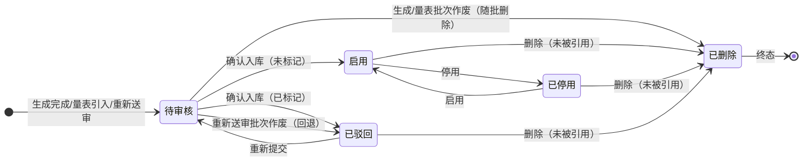

# 题库管理 功能需求规格说明书

## 文档信息

- 基线 Feature：无
- 变更组：无
- 变更根节点：无
- 历史基线链：无

---

## 1. 概述

### 1.1 功能背景

主动测试是能力评估的第二条主线，AI 管理能力测评与九型人格测评都从题库取题。题库的题目分两路进入：AI 管理能力题由 LLM 按运营人员选定的子能力维度动态生成情境题，九型人格引入标准量表作为固定题库。两路题目质量直接决定测评效度：生成题可能有场景偏见与情境失真，量表题可能存在本公司适用性问题，因此入库前需要运营人员人工把关。

本功能以原型 [question-bank-list.html](../../../06_prototype/01_原型/question-bank-list.html) 与 [question-generate-form.html](../../../06_prototype/01_原型/question-generate-form.html) 为蓝本，把题目供给的全流程（生成、引入、审核、维护）落到系统里。

### 1.2 本功能业务目标

1. 提供 AI 管理能力题的 LLM 生成入口，运营人员按子能力维度与题数定向补充题目，生成后自动形成待审核批次。
2. 提供九型标准量表的引入入口，两套候选量表一键引入并独立成批，建立固定题库。
3. 提供批量标记驳回制审核：按来源分批、不混审，运营人员逐题过目只标记不合适的题，未标记题默认通过入库，驳回题保留驳回原因供追溯。
4. 提供题库全生命周期维护：双 tab 分域查询、查看、编辑、启停、重新送审、删除，已被测试引用的题目只可停用保证历史作答可追溯。

### 1.3 功能范围

本功能覆盖 PRD 功能模块 4.9 题库管理的 4 个功能点：题目生成、量表引入、题目审核、题库维护。出题调用走 LLM 调用底座，主动测试从题库取题的规则由主动测试评估运营功能（F7）定义，员工侧对话式作答由员工作答功能（F8）承接，均不在本功能范围。

---

## 2. 角色与权限矩阵

> 系统已全量移除角色概念，平台账号统一全权。本功能不设角色区分，无行级数据隔离。操作主体有两类：运营人员（平台账号）执行量表引入、题目审核与题库维护；评估引擎（系统自动角色）执行 LLM 生成出题。

### 2.1 数据权限（行级访问控制）

| 角色 | 数据范围 | 说明 |
|------|---------|------|
| 平台账号（已登录） | 全部题目与批次 | 题库为系统级共享数据，所有平台账号可见可操作，无创建人隔离 |
| 员工（被测评对象） | 不可见 | 员工非平台用户，仅经作答页看到被指派的题目内容，无题库浏览入口 |

### 2.2 页面访问权限

| 页面名称 | 可访问角色 | 可操作角色 | 字段级权限（如有） |
|---------|----------|----------|------------------|
| 题库管理页 | 已登录平台账号 | 已登录平台账号 | 无 |
| 题目生成页 | 已登录平台账号 | 已登录平台账号 | 无 |
| 批量审核视图（页内切换） | 已登录平台账号 | 已登录平台账号 | 无 |
| 题目查看/编辑弹窗 | 已登录平台账号 | 已登录平台账号 | 量表题文本字段只读（见 4.1.4 规则 5） |
| 量表引入弹窗 | 已登录平台账号 | 已登录平台账号 | 无 |

### 2.3 接口鉴权矩阵

| 接口用途 | 方法 | 鉴权方式 | 说明 |
|---------|------|---------|------|
| 题库列表查询（分 tab） | GET | JWT | 按来源、维度、状态、关键词筛选分页 |
| 待审核批次列表 | GET | JWT | 返回待审核批次卡数据 |
| 批次题目明细 | GET | JWT | 审核视图逐题加载 |
| 批次确认入库 | POST | JWT | 一次性提交整批标记结果：未标记题入库启用，标记题置已驳回并携带驳回原因 |
| 批次作废 | POST | JWT | 二次确认后作废整批；生成/量表批次题目随批逻辑删除，重新送审批次题目回退已驳回 |
| 生成 AI 管理题 | POST | JWT | 同步等待，携带维度集合与题数 |
| 引入九型量表 | POST | JWT | 按量表标识引入标准题库 |
| 题目详情 | GET | JWT | 查看弹窗数据 |
| 题目编辑 | PUT | JWT | 限定可编辑字段 |
| 题目启停 | PUT | JWT | 切换启用/停用 |
| 题目重新送审 | POST | JWT | 已驳回题经编辑弹窗修正后重新进入待审核批次 |
| 题目删除 | DELETE | JWT | 逻辑删除，被引用题拒绝 |

承载雪花 ID 的字段（题目 ID、批次 ID、维度 ID）json 序列化带 `,string`，前端类型用 string。具体字段定义由下游「接口数据设计」技能落地。

---

## 3. 页面与功能总览

### 3.1 页面清单

| 序号 | 页面名称 | 页面形式 | 职责说明 | 包含功能 |
|-----|---------|---------|---------|---------|
| 1 | 题库管理页 | 独立页面 | 双 tab 题库台账与待审核批次中枢，承载查询、审核入口、量表引入与全部行级维护操作 | 待审核批次卡、批次作废、题库查询、题目查看/编辑、启停、重新送审、删除、量表引入 |
| 2 | 批量审核视图 | 页内视图切换（题库管理页内） | 逐题过目标记驳回，底部汇总后确认入库 | 逐题标记驳回/取消标记、全部不标、确认入库 |
| 3 | 题目生成页 | 独立页面 | 选定子能力维度与题数发起 LLM 生成，同步等待进度，完成后引导前往审核 | 维度多选、题数设定、开始生成、进度展示、前往审核 |

辅助弹窗（不单列页面）：题目查看弹窗、题目编辑弹窗、量表引入两步弹窗、删除确认弹窗。

### 3.2 页面跳转流程

```
[入口：顶栏「能力模型 → 题库管理」] → [题库管理页]
        ↓ 点击「生成 AI 管理题」              ↓ 点击「引入九型量表」
  [题目生成页]                              [量表引入弹窗]
        ↓ 生成完成点击「前往审核」                  ↓ 确认引入后点击「进入审核」
        ↓                                           ↓
  [题库管理页·批量审核视图] ←── 点击批次卡「开始审核」 ─┘
        ↓ 逐题标记后点击「确认入库」
  [题库管理页·列表态]，新入库题出现在对应 tab
        ↓ 行内点击「查看/编辑/停用/启用/重新提交/删除」
  [题目查看弹窗 / 题目编辑弹窗 / 删除确认弹窗] → 完成后留在列表态
```

**流程说明：**
1. 运营人员从顶栏进入题库管理页，页面顶部横排待审核批次卡，下方双 tab 展示 AI 管理题库与九型人格量表台账。
2. 需补充 AI 管理题时进入题目生成页，选定维度与题数后同步等待生成完成，批次自动进入待审核队列，可立即跳转审核。
3. 需启用九型测评时在列表页打开量表引入弹窗，选定候选量表确认引入，独立成批后可直接进入审核。
4. 点击批次卡「开始审核」切入批量审核视图，逐题过目只标记不合适的题，确认入库后回到列表态，未标记题以启用状态出现在对应 tab。
5. 全部行级维护操作在列表态行内完成，弹窗类操作关闭后留在列表态。

---

## 4. 页面功能详细说明

### 4.1 页面 1：题库管理页

#### 4.1.1 页面概述

**页面形式：** 独立页面，挂 `_authenticated` 顶栏「能力模型」一级菜单下的「题库管理」。

**页面职责：** 题库的唯一管理入口。页面顶部为待审核批次卡区（有批次时显示，展示批次标题、批次号、来源、题数、生成时间）；中部为查询区与双 tab（AI 管理题库、九型人格量表）列表，tab 切换时查询条件与分页独立保持；页面级按钮「生成 AI 管理题」「引入九型量表」位于列表右上工具栏。批量审核视图为本页内的视图切换：点击批次卡「开始审核」后列表区整体替换为逐题审核卡片流，顶部显示批次来源与审核重点提示，左上「返回题库」回到列表态。

#### 4.1.2 涉及字段

##### A. 查询字段（列表态，分 tab 独立）

| 字段名称 | 字段类型 | 数据来源 | 默认值 | 业务含义 |
|---------|---------|---------|--------|--------|
| 维度 | 下拉单选 | 数据库查询（当前 tab 对应域的维度清单） | 全部维度 | AI tab 为当前启用的 AI 管理子能力（随维度配置变动，见 7.2）；量表 tab 为九型 9 个型别倾向（具体型别名） |
| 状态 | 下拉单选 | 系统预设 | 全部状态 | 启用/已停用/已驳回 |
| 关键词 | 文本 | 用户输入 | 空 | 按题目编号与情境描述/题项陈述全文模糊搜索 |

##### B. 显示字段（列表态）

| 字段名称 | 字段类型 | 数据来源 | 获取时机 | 业务含义 |
|---------|---------|---------|---------|---------|
| 题目编号 | 文本 | 数据库查询 | 页面加载 | AI 题 Q-AG-四位流水，量表题 Q-Scale-四位流水；流水按位数自然增长，超四位后扩展位数，编号唯一性由系统保证 |
| 题目摘要/题项陈述 | 文本 | 数据库查询 | 页面加载 | AI 题为情境描述前 50 字符自动截取（无独立摘要字段），量表题为题项陈述原文，过长截断悬浮展示 |
| 所属维度 | 标签 | 数据库查询 | 页面加载 | AI 题为命中的 AI 管理子能力，量表题为型别倾向（九型之一） |
| 作答方式 | 标签 | 系统预设 | 页面加载 | 量表 tab 显示 Likert 5 级；AI tab 无此列 |
| 状态 | 标签 | 数据库查询 | 页面加载 | 启用/已停用/已驳回 |

##### C. 待审核批次卡字段

| 字段名称 | 字段类型 | 数据来源 | 获取时机 | 业务含义 |
|---------|---------|---------|---------|---------|
| 批次标题 | 文本 | 数据库查询 | 页面加载 | 生成批次为维度组合描述，量表批次为量表名，重新送审批次为「重新送审」 |
| 批次号 | 文本 | 数据库查询 | 页面加载 | 生成批次 #G+MMdd（如 #G0921），量表批次 #S+MMdd，重新送审批次 #R+MMdd；同日多批从第 2 批起追加 -序号（如 #G0921-2）保证唯一 |
| 来源 | 标签 | 数据库查询 | 页面加载 | AI 管理题/九型量表，决定审核重点提示文案 |
| 题数 | 数字 | 数据库查询 | 页面加载 | 本批题目总数 |
| 生成时间 | 时间 | 数据库查询 | 页面加载 | yyyy-MM-dd HH:mm:ss（通用规范 9） |

##### D. 查看弹窗字段（题目详情，只读）

| 字段名称 | 字段类型 | 数据来源 | 获取时机 | 业务含义 |
|---------|---------|---------|---------|---------|
| 题目编号/来源/维度/型别倾向/作答方式/状态 | 标签组 | 数据库查询 | 弹窗打开 | 题目元信息 |
| 入库时间 | 时间 | 数据库查询 | 弹窗打开 | yyyy-MM-dd HH:mm:ss |
| 被引用次数 | 数字 | 数据库查询 | 弹窗打开 | 该题被主动测试指派的累计次数 |
| 情境描述/题项陈述 | 文本域只读 | 数据库查询 | 弹窗打开 | AI 题为管理情境全文；量表题为题项陈述 |
| 作答要求/作答方式 | 文本域只读 | 数据库查询 | 弹窗打开 | AI 题含 A/B/C/D 选项全文；量表题为 1-5 级选择说明 |
| 考察点/计分键 | 文本域只读 | 数据库查询 | 弹窗打开 | AI 题为评分关注点；量表题为型别归属聚合规则 |
| 驳回原因 | 文本只读 | 数据库查询 | 弹窗打开 | 仅已驳回状态显示 |

##### E. 编辑弹窗字段（AI 管理题专属，启用/已停用状态的编辑与已驳回题的重新提交共用此弹窗，校验矩阵）

| 字段 | 必填 | 长度 | 格式 | 范围 | 唯一 | 示例 | 其他 |
|:--|:--|:--|:--|:--|:--|:--|:--|
| 所属维度 | √ | - | 枚举：当前启用的 AI 管理子能力（随维度配置变动，见 7.2） | - | × | 授权与分工 | 下拉单选，可改；题目原维度已停用时保留原值展示，改选限当前启用集合 |
| 情境描述 | √ | (1,1000) | 纯文本 | - | × | 你的下属小林第一次用 AI 工具辅助撰写季度规划…… | 可编辑 |
| 作答要求 | √ | (1,2000) | 纯文本，选择题选项以 A… B… 行内书写 | - | × | 请选择最符合你处理方式的选项……A. 直接替小林改写 B. …… | 可编辑 |
| 考察点 | √ | (1,500) | 纯文本 | - | × | 是否识别出可衡量性缺失、是否给出对齐节奏 | 可编辑 |

量表题不允许编辑文本与型别归属，无编辑弹窗，行内不出现「编辑」按钮。

##### F. 量表引入弹窗字段

第一步（选择量表）：

| 字段名称 | 字段类型 | 数据来源 | 获取时机 | 校验规则 | 默认值 | 业务含义 |
|---------|---------|---------|---------|---------|--------|---------|
| 量表选择 | 单选卡片 | 系统预设 | 弹窗打开 | 必选一项；已引入的量表置灰并标注「已引入」，不可再选（判定与更换口径见 4.1.4 规则 8） | Riso-Hudson 标准量表 | 候选两套：Riso-Hudson 标准量表（144 题，约 25 分钟）、Essence 精简量表（108 题，约 18 分钟） |

第二步（确认信息，只读汇总）：量表来源、题目数量、计分方式（Likert 5 级、9 型倾向聚合）、预估作答时长、审核批次说明（独立成批、不与 AI 管理题混审），底部显示将生成的批次号 #S+MMdd（同日多批规则见 4.1.2 C）。

#### 4.1.3 功能与按钮

**用户可操作功能（列表态）：**

- **生成 AI 管理题（入口）**
  - 触发按钮：生成 AI 管理题
  - 按钮级别：页面级
  - 按钮位置：列表右上工具栏
  - 触发方式：点击按钮
  - 权限要求：已登录平台账号
  - 加载状态：无（点击即路由跳转）
  - 功能说明：跳转到题目生成页（4.3），完整功能在彼处定义。

- **引入九型量表**
  - 触发按钮：引入九型量表
  - 按钮级别：页面级
  - 按钮位置：列表右上工具栏
  - 触发方式：点击按钮
  - 权限要求：已登录平台账号
  - 加载状态：按通用规范 23 显示 loading
  - 功能说明：打开量表引入两步弹窗。第一步选定候选量表，第二步确认汇总信息后点「确认引入」，系统按标准量表模板批量创建题目并形成待审核批次；「进入审核」直接切到批量审核视图，「稍后审核」留在列表态。

- **题库查询**
  - 触发按钮：查询 / 重置
  - 按钮级别：页面级
  - 按钮位置：查询区右侧
  - 触发方式：点击按钮
  - 权限要求：已登录平台账号
  - 加载状态：查询显示 loading
  - 功能说明：按当前 tab 的维度、状态、关键词组合查询；重置清空当前 tab 全部查询条件。分页按通用规范 1。

- **开始审核**
  - 触发按钮：开始审核
  - 按钮级别：卡片级（批次卡）
  - 按钮位置：待审核批次卡右下
  - 触发方式：点击按钮
  - 权限要求：已登录平台账号
  - 加载状态：无（页内视图切换）
  - 功能说明：切入批量审核视图（4.2 节同页视图，审核功能在彼处定义）。

- **作废批次**
  - 触发按钮：作废
  - 按钮级别：卡片级（批次卡）
  - 按钮位置：待审核批次卡右下（「开始审核」左侧）
  - 触发方式：点击按钮
  - 权限要求：已登录平台账号
  - 加载状态：按通用规范 23 显示 loading
  - 功能说明：二次确认后作废本批次，批次从待审核卡区消失。生成批次与量表批次内全部题目随之逻辑删除（不进入题库）；重新送审批次作废时题目回退已驳回状态并保留原驳回原因（题库既有题目不作废）。生成/量表批次用于误生成、误引入的整批撤销。

- **查看题目**
  - 触发按钮：查看
  - 按钮级别：行级
  - 按钮位置：行内操作列
  - 触发方式：点击按钮
  - 权限要求：已登录平台账号
  - 加载状态：弹窗打开显示 loading
  - 功能说明：打开题目查看弹窗（4.1.2 D），展示题目全量字段，已驳回题含驳回原因。弹窗底部「编辑」按钮转编辑弹窗（仅启用/已停用状态的 AI 题）。

- **编辑题目**
  - 触发按钮：编辑
  - 按钮级别：行级
  - 按钮位置：行内操作列（仅 AI 管理题的启用/已停用状态；已驳回题的修正并入「重新提交」流程）
  - 触发方式：点击按钮
  - 权限要求：已登录平台账号
  - 加载状态：按通用规范 23 显示 loading
  - 功能说明：打开编辑弹窗（4.1.2 E），保存按字段校验矩阵校验，通过后更新并留在列表态。

- **停用/启用题目**
  - 触发按钮：停用 / 启用
  - 按钮级别：行级
  - 按钮位置：行内操作列（仅启用/已停用状态的题目显示，按当前状态二选一；已驳回题无此按钮，见 6.3 状态转换规则）
  - 触发方式：点击按钮
  - 权限要求：已登录平台账号
  - 加载状态：按通用规范 23 显示 loading
  - 功能说明：切换题目启停状态，停用语义见 6.1 已停用状态说明。

- **重新送审**
  - 触发按钮：重新提交
  - 按钮级别：行级
  - 按钮位置：行内操作列（仅已驳回状态的 AI 管理题）
  - 触发方式：点击按钮
  - 权限要求：已登录平台账号
  - 加载状态：按通用规范 23 显示 loading
  - 功能说明：打开编辑弹窗（4.1.2 E）预载题目现有内容，运营修正后确认提交，流程见规则 6。

- **删除题目**
  - 触发按钮：删除
  - 按钮级别：行级
  - 按钮位置：行内操作列（启用/已停用/已驳回状态可删，待审核题目在批次中管理不可删）
  - 触发方式：点击按钮
  - 权限要求：已登录平台账号
  - 加载状态：按通用规范 23 显示 loading
  - 功能说明：打开删除确认弹窗（通用规范 14），确认后逻辑删除；被引用题目按规则 4 拒绝删除，提示只可停用。

**前端自动流程：**

- **批次卡加载**
  - 触发时机：页面加载时
  - 说明：查询待审核批次列表；无待审核批次时批次卡区整体隐藏，列表区上移。

#### 4.1.4 业务规则

- **规则 1：按来源分批不混审**
  - 规则描述：每个待审核批次只含一个来源（AI 管理题或九型量表）的题目，审核视图按来源展示不同的审核重点提示。
  - 触发条件：批次创建时（生成完成、量表引入、重新送审）。
  - 约束说明：AI 批次提示审情境合理性、子能力命中度与潜在偏见（性别、年龄、地域）；量表批次提示审本公司业务场景适用性与表述歧义，AI 不重写量表文本。

- **规则 2：未标记默认通过**
  - 规则描述：确认入库时，未被标记驳回的题目全部以启用状态入库，无需逐题点击通过。
  - 触发条件：审核视图点击「确认入库」。
  - 约束说明：与「全部不标（默认通过）」按钮配合，后者一键清除本批全部驳回标记。

- **规则 3：驳回原因必填且留痕**
  - 规则描述：标记驳回时必须填写驳回原因，入库后驳回题保留原因供查看弹窗追溯。
  - 触发条件：审核视图点击「标记驳回」。
  - 约束说明：驳回原因为纯文本，上限 500 字符（通用规范 3）；取消标记不保留历史原因。

- **规则 4：被引用题目保护**
  - 规则描述：被引用次数大于 0 的题目不可删除，只可停用，保证历史测试作答可追溯。
  - 触发条件：行内点击「删除」。
  - 约束说明：删除请求在后端校验拒绝，前端提示「该题已被测试引用，只可停用」。

- **规则 5：量表题文本不可编辑**
  - 规则描述：量表引入的题目为标准量表固定文本，AI 仅做型别判定，任何界面不提供量表题的情境/陈述/作答方式/计分键编辑能力，生命周期管理仅启停、删除（重新送审不适用）。
  - 触发条件：量表 tab 行内操作。
  - 约束说明：量表题行内无「编辑」与「重新提交」按钮。

- **规则 6：驳回题修正与复审一体**
  - 规则描述：已驳回 AI 题的修正并入「重新提交」流程：重新提交打开编辑弹窗（4.1.2 E）预载现有内容，运营修正后确认提交，题目状态回到待审核并归入重新送审批次（同来源存在待审核状态的重新送审批次时并入，否则新建），复审仍走批量标记驳回审核。
  - 触发条件：行内点击「重新提交」。
  - 约束说明：量表题无重新送审路径（文本不可改），驳回的量表题仅可删除（见规则 4）；重新送审批次的作废语义见 4.1.3 作废批次（题目回退已驳回，不随批删除）。

- **规则 7：批次确认后关闭**
  - 规则描述：批次一经确认入库即关闭，同批不能再改标记。
  - 触发条件：确认入库成功。
  - 约束说明：批次关闭后从待审核卡区消失，可在题库列表按状态筛查结果。驳回题后续经「重新提交」进入重新送审批次复审。

- **规则 8：量表引入唯一性与并存**
  - 规则描述：每套候选量表在题库中最多存在一份，两套量表允许同时在库各自独立成批（主动测试取用哪套由主动测试评估运营功能 F7 定义）；已引入的量表在引入弹窗中置灰并标注「已引入」，不可二次引入。
  - 触发条件：打开量表引入弹窗。
  - 约束说明：「已引入」判定为存在该量表未逻辑删除的题目（含待审核、启用、已停用、已驳回状态），批次作废或全部题目删除后释放引入位，可重新引入。需更换量表且旧套题目已被测试引用（删除被拒）时，将旧套题目全部停用（保留历史作答追溯）后引入新套，两套并行在库。

- **规则 9：操作异常反馈**
  - 规则描述：本页所有写操作（编辑保存、启停、重新提交、删除、确认入库、批次作废、量表引入）按统一策略反馈异常。
  - 触发条件：接口返回失败。
  - 约束说明：表单校验失败时字段内联报错并保留已填输入，不关闭弹窗；网络或服务异常 toast「操作失败，请稍后重试」，允许重试；并发冲突（题目已被他人删除、批次已被他人关闭/作废、量表已被他人引入）toast「数据已变更，请刷新后重试」并中止本次提交，前端刷新列表与批次卡区，量表重复引入单独提示「该量表已引入」并刷新引入弹窗置灰状态；确认入库遇批次已关闭/已作废的具体反馈见 4.2.4 规则 1。

#### 4.1.5 交互逻辑

- 空状态：题库 tab 无数据时显示空态插画与引导文案（AI tab 引导「生成 AI 管理题」，量表 tab 引导「引入九型量表」），空态内嵌对应页面级按钮。
- 双 tab 各自独立保持查询条件、页码与每页条数，切 tab 不互相清空。
- 批次卡横排展示，超出宽度横向滚动；每张卡显示批次标题、批次号、来源标签、题数与生成时间。
- 列表默认按更新时间倒序（通用规范 1），题目摘要过长截断显示省略号并悬浮展示全部（通用规范 11）。
- 行级维护操作（编辑、启停、删除）成功后 Toast 提示并留在列表态；重新提交成功后 Toast 提示去向「已提交复审，进入重新送审批次」，题目转入待审核态并从当前筛选视图消失。

---

### 4.2 页面 2：批量审核视图（题库管理页内视图切换）

#### 4.2.1 页面概述

**页面形式：** 页内视图切换（非独立路由），从列表态批次卡「开始审核」、量表引入弹窗「进入审核」或题目生成页完成态「前往审核」切入，切出经「返回题库」或确认入库后自动返回。

**页面职责：** 单批次逐题审核。顶部为批次标题、来源标签与按来源区分的审核重点提示条；主体为逐题卡片流（每卡展示题目编号、维度标签、作答方式、默认通过/已标记驳回状态、情境描述、作答要求、考察点/计分键全文）；底部固定汇总条显示本批总数、已标记驳回数、将默认入库数，右侧为「全部不标（默认通过）」与「确认入库」按钮。

#### 4.2.2 涉及字段

##### A. 审核卡片字段（只读展示 + 标记操作）

| 字段名称 | 字段类型 | 数据来源 | 获取时机 | 业务含义 |
|---------|---------|---------|---------|---------|
| 题目编号 | 文本 | 数据库查询 | 进入视图 | 同列表编号规则 |
| 维度标签 | 标签 | 数据库查询 | 进入视图 | AI 题为子能力，量表题为型别倾向（具体型别名） |
| 作答方式 | 标签 | 系统预设 | 进入视图 | 量表题 Likert 5 级，AI 题对话作答 |
| 审核状态 | 标签 | 前端状态 | 实时输入 | 默认通过 / 已标记驳回 |
| 情境描述/题项陈述 | 文本只读 | 数据库查询 | 进入视图 | 同查看弹窗 D |
| 作答要求/作答方式 | 文本只读 | 数据库查询 | 进入视图 | 同查看弹窗 D |
| 考察点/计分键 | 文本只读 | 数据库查询 | 进入视图 | 同查看弹窗 D |

##### B. 驳回原因（标记驳回时输入）

| 字段 | 必填 | 长度 | 格式 | 范围 | 唯一 | 示例 | 其他 |
|:--|:--|:--|:--|:--|:--|:--|:--|
| 驳回原因 | √ | (1,500) | 纯文本 | - | × | 情境仅绑定互联网广告销售，场景迁移性差 | 标记驳回时弹出行内输入，取消标记后清空 |

#### 4.2.3 功能与按钮

- **标记驳回 / 取消标记**
  - 触发按钮：标记驳回 / 取消标记
  - 按钮级别：卡片级
  - 按钮位置：审核卡片右下（按当前标记状态二选一显示）
  - 触发方式：点击按钮
  - 权限要求：已登录平台账号
  - 加载状态：行内即时切换，无请求
  - 功能说明：标记驳回时展开驳回原因输入框，填写后生效，卡片状态标签切换为已标记驳回；取消标记清除原因并回到默认通过。标记状态在前端保持，确认入库时一次性提交。

- **全部不标（默认通过）**
  - 触发按钮：全部不标（默认通过）
  - 按钮级别：页面级
  - 按钮位置：底部汇总条右侧
  - 触发方式：点击按钮
  - 权限要求：已登录平台账号
  - 加载状态：无（前端操作）
  - 功能说明：一键清除本批全部驳回标记，回到全部默认通过状态。

- **确认入库**
  - 触发按钮：确认入库
  - 按钮级别：页面级
  - 按钮位置：底部汇总条右侧（主按钮）
  - 触发方式：点击按钮
  - 权限要求：已登录平台账号
  - 加载状态：按通用规范 23 显示 loading
  - 功能说明：提交本批全部题目的标记结果：未标记题以启用状态入库，标记题置为已驳回并保存驳回原因。成功后批次关闭，视图切回列表态，新入库题出现在对应 tab。

- **返回题库**
  - 触发按钮：返回题库
  - 按钮级别：页面级
  - 按钮位置：审核视图左上
  - 触发方式：点击按钮
  - 权限要求：已登录平台账号
  - 加载状态：无
  - 功能说明：离开审核视图回列表态。已做的标记不提交、不保存，批次保持待审核；存在已标记驳回题时二次确认后离开，无标记时直接返回。

#### 4.2.4 业务规则

- **规则 1：审核提交一次性**
  - 规则描述：标记操作全程在前端进行，确认入库时一次请求提交整批结果，中途离开不产生任何数据变更。
  - 触发条件：确认入库 / 返回题库。
  - 约束说明：批次内题目数最多 144 题（量表上限），单请求提交无分页。批次已关闭或已作废时提交返回错误提示，前端刷新批次卡区与列表。

- **规则 2：汇总条实时联动**
  - 规则描述：底部汇总条三个数字（本批总数、已标记驳回、将默认入库）随标记操作实时刷新。
  - 触发条件：任一卡片的标记状态变化。
  - 约束说明：已标记驳回 + 将默认入库 = 本批总数，恒成立。

#### 4.2.5 交互逻辑

- 审核卡片按题目编号顺序纵向排列，整卡展示全文不截断，保证逐题过目完整性。
- 驳回原因为空时标记不生效，输入框下方红字提示。
- 确认入库成功后 Toast 提示入库数量与驳回数量，随后自动切回列表态。

---

### 4.3 页面 3：题目生成页

#### 4.3.1 页面概述

**页面形式：** 独立页面，从题库管理页「生成 AI 管理题」进入。

**页面职责：** 发起一次 LLM 出题。上半部为说明区（AI 管理能力题规则说明：由 LLM 依据所选子能力维度动态生成、每题一个管理情境与作答要求、入库前须经人工批量审核、员工经对话作答无标准答案）；中部为生成表单（子能力维度多选卡片、题数）；提交后进入生成进行态（进度展示：已生成 n/N 题、当前维度提示）；完成后展示批次号并引导前往审核。

#### 4.3.2 涉及字段

| 字段名称 | 字段类型 | 数据来源 | 获取时机 | 校验规则 | 默认值 | 业务含义 |
|---------|---------|---------|---------|---------|--------|---------|
| 子能力维度 | 多选卡片组 | 数据库查询（当前启用的 AI 管理子能力） | 页面加载 | 至少选 1 项，至多为当前启用子能力总数 | 全不选 | 选定的出题维度，支持混合出题，LLM 按各维度分别构造情境 |
| 题数 | 数字输入 | 用户输入 | 实时输入 | 整数，5-30 | 10 | 本批生成题目数量，建议每批 10 到 20 题便于一次审完 |

#### 4.3.3 功能与按钮

- **开始生成**
  - 触发按钮：开始生成
  - 按钮级别：页面级
  - 按钮位置：表单底部（主按钮）
  - 触发方式：点击按钮
  - 权限要求：已登录平台账号
  - 加载状态：进入生成进行态，按钮区被进度区替换
  - 功能说明：校验通过后发起同步 LLM 生成请求，页面停留在生成进行态展示进度（已生成 n/N、当前正在构造的维度提示），直至全部生成完成；失败处理见 4.3.4 规则 3（整批作废并提示）。完成后展示批次号（#G+MMdd，同日多批规则见 4.1.2 C）、本批题数与「前往审核」「再生成一批」按钮。生成完成的批次自动进入待审核队列。

- **重置**
  - 触发按钮：重置
  - 按钮级别：页面级
  - 按钮位置：表单底部
  - 触发方式：点击按钮
  - 权限要求：已登录平台账号
  - 加载状态：无
  - 功能说明：清空维度选择与题数，恢复默认值。

- **前往审核**
  - 触发按钮：前往审核
  - 按钮级别：页面级
  - 按钮位置：完成态（主按钮）
  - 触发方式：点击按钮
  - 权限要求：已登录平台账号
  - 加载状态：无
  - 功能说明：跳回题库管理页并直接切入本批次的批量审核视图。

- **再生成一批**
  - 触发按钮：再生成一批
  - 按钮级别：页面级
  - 按钮位置：完成态
  - 触发方式：点击按钮
  - 权限要求：已登录平台账号
  - 加载状态：无
  - 功能说明：回到表单态并保留上次选择，便于连续补充。

- **重新生成（失败态）**
  - 触发按钮：重新生成
  - 按钮级别：页面级
  - 按钮位置：失败态
  - 触发方式：点击按钮
  - 权限要求：已登录平台账号
  - 加载状态：无（回到表单态）
  - 功能说明：回到表单态并保留上次维度与题数选择（与完成态「再生成一批」一致），可调整参数后重新发起生成。

- **返回题库**
  - 触发按钮：返回题库
  - 按钮级别：页面级
  - 按钮位置：页面左上
  - 触发方式：点击按钮
  - 权限要求：已登录平台账号
  - 加载状态：无
  - 功能说明：返回题库管理页。生成进行态中离开则放弃本批，已生成部分作废，需二次确认。

#### 4.3.4 业务规则

- **规则 1：同步等待边界**
  - 规则描述：生成为同步等待交互，页面停留展示进度直至完成或失败，不提供离开后继续的能力。
  - 触发条件：点击开始生成后。
  - 约束说明：生成进行态离开页面需二次确认（放弃本批）；每批最多 30 题，同步等待时长可控。

- **规则 2：批次自动入队**
  - 规则描述：生成完成的批次立即进入待审核队列，题目状态为待审核，不直接入库。
  - 触发条件：生成完成。
  - 约束说明：待审核题目不在列表 tab 中出现，仅在批次审核后进入列表。

- **规则 3：生成失败整批作废**
  - 规则描述：生成请求失败、超时或中途中断时整批作废，不形成待审核批次，已生成的部分题目随之逻辑删除；页面展示失败原因与「重新生成」「返回题库」按钮。
  - 触发条件：LLM 调用失败、超时或生成中断。
  - 约束说明：失败不产生半成品批次，重新发起即可；进度回传机制（流式或轮询）由接口数据设计阶段确定。

#### 4.3.5 交互逻辑

- 维度卡片展示子能力名称与一句话说明，选中态高亮；未选任何维度时开始生成按钮置灰。
- 题数输入旁附建议文案「建议每批 10 到 20 题，便于一次审完」。
- 生成进行态进度条随已完成题数推进，展示当前正在构造的维度名。
- 无启用的 AI 管理子能力时维度区显示空态提示并引导前往维度配置，开始生成保持置灰。

---

## 4A. 页面布局示意（ASCII 线框）

> 本章为第 4 章各页面的线框示意，辅助理解布局与元素归属；元素定义、字段与按钮约束以第 4 章各节为准，视觉样式以原型为准。

### 4A.1 题库管理页（列表态）

```
+--------------------------------------------------------------------------------------------------+
| sili-smart-hr        能力模型 v   系统配置 v                [语言] [头像] 张三                    |
+--------------------------------------------------------------------------------------------------+
| 待审核批次（无批次时本区隐藏）                                  （横排，超宽横向滚动）>            |
| +------------------------------+  +------------------------------+                                |
| | 待审核：授权与分工 x2         |  | 待审核：Riso-Hudson 标准量表 |                                |
| | 12 题   [AI 管理题]          |  | 144 题  [九型量表]           |                                |
| | 批次号 #G0921 · 2026-09-21   |  | 批次号 #S0921 · 2026-09-21   |                                |
| | 未标记题默认通过入库          |  | 未标记题默认通过入库          |                                |
| |                [作废] [开始审核] |  |                [作废] [开始审核]     |                                |
| +------------------------------+  +------------------------------+                                |
+--------------------------------------------------------------------------------------------------+
| 维度 [全部维度 v]   状态 [全部状态 v]   关键词 [__________________]        [查询] [重置]           |
|                                                                      [生成 AI 管理题] [引入九型量表] |
+--------------------------------------------------------------------------------------------------+
| [ AI 管理题库（共 32 题） ] [ 九型人格量表（共 108 题） ]    <-- 双 tab，查询/分页独立保持         |
+--------------------------------------------------------------------------------------------------+
| 题目编号   | 题目摘要                     | 所属维度   | 状态   | 操作                              |
|-----------|------------------------------|-----------|--------|-----------------------------------|
| Q-AG-0001 | 下属使用 AI 工具完成季度规划… | 授权与分工 | 启用   | 查看 编辑 停用 删除               |
| Q-AG-0002 | AI 自动生成任务分解草案…     | 授权与分工 | 已驳回 | 查看 重新提交 删除               |
| Q-AG-0004 | AI 辅助决策超授权对外承诺…   | 风险与担责 | 已停用 | 查看 编辑 启用 删除               |
| Q-Scale-… |（量表 tab：题项陈述，加「作答方式 Likert 5 级」列，维度为型别倾向；无编辑/重新提交）      |
+--------------------------------------------------------------------------------------------------+
| 共 32 条   < 1 2 3 >   10条/页   跳至 [__]                    （默认按更新时间倒序）            |
+--------------------------------------------------------------------------------------------------+
```

### 4A.2 批量审核视图（题库管理页内视图切换）

```
+--------------------------------------------------------------------------------------------------+
| [<- 返回题库]   AI 管理题 · 授权与分工批（#G0921）                                                |
+--------------------------------------------------------------------------------------------------+
| ! 本批为 LLM 动态生成的 AI 管理能力题，审核重点为情境合理性、子能力命中度与潜在偏见                |
|   （性别、年龄、地域），对不合适题目标记驳回，未标记题默认通过入库。                              |
|   （量表批次换为：标准九型人格量表，AI 仅做型别判定不重写文本，审核重点为本公司适用性…）           |
+--------------------------------------------------------------------------------------------------+
| +----------------------------------------------------------------------------------------------+ |
| | Q-AG-0101   [授权与分工]   对话作答                                （默认通过）                | |
| | 情境描述  AI 给出了一份 12 人团队两周任务分解草案，其中 3 项关键决策被直接下放给了              | |
| |           AI 协作节点，未经过人工确认。                                                        | |
| | 作答要求  请选择最符合你处理方式的选项，可在补充说明中阐述理由。                                | |
| |           A. 全盘采纳 AI 草案…  B. …  C. …  D. …                                              | |
| | 考察点    识别高风险决策点、给出人机分工原则、保留必要审批节点。                                | |
| |                                                                 人工标记 [标记驳回]            | |
| +----------------------------------------------------------------------------------------------+ |
| +----------------------------------------------------------------------------------------------+ |
| | Q-AG-0102   [风险与担责]   对话作答                                （已标记驳回）              | |
| | 情境描述  …（整卡全文展示，不截断）                                                            | |
| | 作答要求  …                                                                                    | |
| | 考察点    …                                                                                    | |
| | 驳回原因  [情境仅绑定互联网广告销售，场景迁移性差__________________]  <-- 必填，空则标记不生效    | |
| |                                                                 人工标记 [取消标记]            | |
| +----------------------------------------------------------------------------------------------+ |
| …（逐题卡片按编号纵向排列，最多 144 题）                                                         |
+--------------------------------------------------------------------------------------------------+
| 本批共 12 题   |   已标记驳回 1 题   |   将默认入库 11 题          [全部不标（默认通过）] [确认入库] |
+--------------------------------------------------------------------------------------------------+
```

### 4A.3 题目生成页（三种状态）

表单态：

```
+--------------------------------------------------------------------------------------------------+
| [<- 返回题库]   生成 AI 管理能力题                                                                |
+--------------------------------------------------------------------------------------------------+
| 本批题目由 LLM 动态生成，生成后形成独立审核批次                                                  |
| AI 管理能力题：由 LLM 依据你选择的子能力维度动态生成，每题给出一个管理情境与作答要求。             |
| 所有题目入库前需经过人工批量审核，未标记题默认通过。员工作答通过与 AI 对话完成，不预设标准答案。   |
+--------------------------------------------------------------------------------------------------+
| 选择子能力维度（多选，支持混合出题，LLM 按各维度分别构造情境场景）                                 |
| +----------------+ +----------------+ +----------------+ +----------------+ +----------------+   |
| | 目标设定与对齐 | | [x] 授权与分工 | | 风险与担责     | | 人机协作设计   | | 监督与验收     |   |
| | 一句话说明     | | 一句话说明     | | 一句话说明     | | 一句话说明     | | 一句话说明     |   |
| +----------------+ +----------------+ +----------------+ +----------------+ +----------------+   |
| 题数  [ 10 ]   整数 5-30    （建议每批 10 到 20 题，便于一次审完）                                |
+--------------------------------------------------------------------------------------------------+
|                                                       [重置] [开始生成]  <-- 未选维度时置灰       |
+--------------------------------------------------------------------------------------------------+
```

生成进行态（替换表单区）：

```
+--------------------------------------------------------------------------------------------------+
| 调用 LLM 出题中…                                                                                 |
| 已生成 6 / 12 题                                                                                 |
| [==============-----------------------------]                                                    |
| 当前：授权与分工                                                                                 |
| （同步等待，离开需二次确认并放弃本批）                                                            |
+--------------------------------------------------------------------------------------------------+
```

完成态：

```
+--------------------------------------------------------------------------------------------------+
| 生成完成                                                                                         |
| 本批 12 题（批次号 #G0921）已生成并进入审核队列。请在题库中逐题过目，未标记题默认通过入库。       |
|                                                                  [再生成一批] [前往审核]          |
+--------------------------------------------------------------------------------------------------+
```

失败态（替换进度区，规则 3）：

```
+--------------------------------------------------------------------------------------------------+
| 生成失败                                                                                         |
| 失败原因：LLM 调用超时。本批已作废，未形成审核批次。                                              |
|                                                     [返回题库] [重新生成]                         |
+--------------------------------------------------------------------------------------------------+
```

### 4A.4 辅助弹窗

题目查看弹窗：

```
+--------------------------------------------------------------------------+
| 题目详情                                                            [x]   |
+--------------------------------------------------------------------------+
| Q-AG-0002   [AI 管理题] [风险与担责] [已驳回]                             |
| 入库时间 2026-09-21 10:31:24        被引用次数 3 次                       |
+--------------------------------------------------------------------------+
| 情境描述  AI 助手依据历史报价自动向客户承诺了一项超出你授权范围的折扣…     |
| 作答要求  请选择最符合你处理方式的选项… A. … B. …                        |
| 考察点    风险定级准确、担责边界清晰、客户沟通与内部回溯双线处理。         |
| 驳回原因  AI 建议存在明显性别与生育偏见…  <-- 仅已驳回状态显示            |
+--------------------------------------------------------------------------+
|                                                     [关闭] [编辑]  <-- 编辑仅启用/已停用的 AI 题 |
+--------------------------------------------------------------------------+
```

题目编辑弹窗（仅 AI 管理题；已驳回题经「重新提交」打开同一弹窗，保存即重新送审）：

```
+--------------------------------------------------------------------------+
| 编辑题目                                                            [x]   |
+--------------------------------------------------------------------------+
| 所属维度*   [风险与担责 v]                                                |
| 情境描述*   [______________________________________]   <=1000 字符       |
| 作答要求*   [______________________________________]   <=2000 字符       |
|             （选择题选项以 A… B… 行内书写）                              |
| 考察点*     [______________________________________]   <=500 字符        |
+--------------------------------------------------------------------------+
|                                              [取消] [保存]                |
+--------------------------------------------------------------------------+
```

量表引入弹窗（两步）：

```
第一步（选择量表）                        第二步（确认信息，只读汇总）
+------------------------------------+   +------------------------------------+
| 引入九型量表                   [x] |   | 引入九型量表                   [x] |
+------------------------------------+   +------------------------------------+
| 九型人格采用标准量表作为固定题库， |   | 量表来源  Riso-Hudson 标准量表     |
| AI 仅做型别判定不重写量表文本。    |   | 题目数量  144 题                   |
|                                    |   | 计分方式  Likert 5 级，9 型倾向聚合|
| +----------------+ +-------------+ |   | 预估作答  约 25 分钟               |
| | (o) Riso-      | | ( ) Essence | |   | 审核批次  独立成批，不与 AI 题混审 |
| | Hudson 标准    | | 精简量表    | |   | 引入后将生成审核批次 #S0922        |
| | 量表（144 题） | | （108 题）  | |   +------------------------------------+
| | 主流九型量表， | | 缩短版本，  | |   |      [取消] [上一步] [确认引入]    |
| | 约 25 分钟     | | 约 18 分钟  | |   +------------------------------------+
| +----------------+ +-------------+ |   （确认后按钮区切换为）
+------------------------------------+   |        [稍后审核] [进入审核]      |
|                [取消] [下一步]      |   +------------------------------------+
+------------------------------------+
```

删除确认弹窗：

```
+----------------------------------------------+
| 删除确认                                [x]  |
+----------------------------------------------+
| 确认删除题目 Q-AG-0004？删除后不可恢复。      |
+----------------------------------------------+
|                        [取消] [删除]  <-- 红色|
+----------------------------------------------+
```

---

## 5. 非页面功能详细说明（无）

题目生成由题目生成页同步触发，无定时任务、无对外 API、无消息监听。

---

## 6. 数据状态定义

### 6.1 题目状态

| 状态名称 | 状态说明 | 可转换到的状态 |
|---------|---------|--------------|
| 待审核 | 批次内题目，已生成、已引入或重新送审、待人工过目 | 启用、已驳回（标记驳回，或重新送审批次作废回退）、已删除（生成/量表批次作废随批删除） |
| 启用 | 已入库，可被主动测试指派 | 已停用、已删除 |
| 已停用 | 运营人员主动停用，新测试不取用，历史引用保留 | 启用、已删除 |
| 已驳回 | 审核标记驳回或重新送审后再被驳回，保留驳回原因 | 待审核（重新提交）、已删除 |
| 已删除 | 逻辑删除终态，列表不展示 | 无（终态） |

### 6.2 批次状态

| 状态名称 | 状态说明 | 可转换到的状态 |
|---------|---------|--------------|
| 待审核 | 批次已形成（生成完成/量表引入/重新送审），等待运营过目 | 已关闭、已作废 |
| 已关闭 | 确认入库完成，批次结果已落定 | 无（终态） |
| 已作废 | 作废操作完成；生成/量表批次内题目随批逻辑删除，重新送审批次题目回退已驳回并保留原驳回原因 | 无（终态） |

### 6.3 状态转换规则

| 当前状态 | 可转换到的状态 | 转换条件 | 转换触发方式 |
|---------|------------|---------|-------------|
| 待审核 | 启用 | 确认入库时未被标记 | 用户操作（确认入库） |
| 待审核 | 已驳回 | 确认入库时被标记且驳回原因已填 | 用户操作（确认入库） |
| 待审核 | 已驳回 | 重新送审批次作废时回退，保留原驳回原因 | 用户操作（作废批次） |
| 待审核 | 已删除 | 生成/量表批次作废时随批逻辑删除 | 用户操作（作废批次） |
| 启用 | 已停用 | 行内停用操作 | 用户操作 |
| 已停用 | 启用 | 行内启用操作 | 用户操作 |
| 启用 | 已删除 | 行内删除且未被引用 | 用户操作 |
| 已停用 | 已删除 | 行内删除且未被引用 | 用户操作 |
| 已驳回 | 待审核 | 行内重新提交（经编辑弹窗修正），进入重新送审批次 | 用户操作 |
| 已驳回 | 已删除 | 行内删除且未被引用 | 用户操作 |
| 待审核（批次） | 已关闭（批次） | 确认入库成功 | 用户操作 |
| 待审核（批次） | 已作废（批次） | 作废批次 | 用户操作 |

#### 题目状态图



---

## 7. 集成和依赖

### 7.1 外部系统集成

| 系统名称 | 集成方式 | 集成内容 | 调用时机 | 依赖功能 |
|---------|---------|---------|---------|---------|
| 平台自配大模型 | 经 LLM 调用底座（P2_TECH_001）API 调用 | AI 管理能力情境题生成（维度集合 + 题数 → 题目结构化文本） | 题目生成页点击开始生成 | 大模型配置页已排他启用一个模型 |

### 7.2 内部功能依赖

| 当前功能 | 依赖的功能 | 依赖说明 | 依赖类型 |
|---------|-----------|---------|---------|
| 题库管理 | P1_ACC_001 登录与用户管理 | 页面挂 `_authenticated` 顶栏，JWT 鉴权与账号基建 | 权限依赖 |
| 题库管理 | P2_TECH_001 LLM 调用底座 | AI 管理题生成经底座调用当前启用模型，模型与密钥配置经 P2_SYS_001 间接依赖 | 流程依赖 |
| 题库管理 | P2_DIM_001 维度与权重配置 | 生成页维度选项与题目标签取自当前启用的 AI 管理子能力维度清单（数据依赖；维度配置变动实时反映到选项来源） | 数据依赖 |
| 主动测试评估运营（F7，未建） | 题库管理（本功能，被依赖） | 主动测试从启用状态题目中取题组卷，被引用次数由其写入 | 数据依赖（被引用） |
| 员工作答（F8，未建） | 题库管理（本功能，被依赖） | 作答页展示题目文本（情境描述 + 作答要求）驱动对话式施答 | 数据依赖（被引用） |

---

## 8. 附录

### 8.1 术语表

| 术语 | 定义 | 说明 |
|------|------|------|
| 批量标记驳回制 | 审核只标记不合适的题、未标记默认通过的审核模式 | 区别于逐题审批通过制，降低审核负担 |
| 批次 | 一次生成/一次量表引入/一次重新送审形成的待审核题目集合 | 有唯一批次号，来源单一不混审 |
| AI 管理题 | LLM 按子能力维度动态生成的情境题 | 全称 AI 管理能力题（页面标题文案用全称），编号 Q-AG-xxxx，含情境描述、作答要求（含选项全文）、考察点 |
| 量表题 | 标准九型量表引入的固定题项 | 编号 Q-Scale-xxxx，Likert 5 级作答，文本不可编辑 |
| 型别倾向 | 量表题聚合归属的九型人格型别（如调停型、规则型） | 量表题的维度标签 |
| 被引用次数 | 题目被主动测试指派的累计次数 | 大于 0 时删除被拒绝 |

### 8.2 参考文档

| 文档名称 | 类型 | 来源 | 用途 | 说明 |
|---------|------|------|------|------|
| PRD 4.9 题库管理 | PRD | [PRD.md](../../02_prd/PRD.md) | 模块定位与功能点清单 | 4 个功能点全覆盖 |
| 题库列表原型 | UI 原型 | [question-bank-list.html](../../../06_prototype/01_原型/question-bank-list.html) | 页面布局与交互蓝本 | 双 tab、批次卡、审核视图、弹窗 |
| 题目生成原型 | UI 原型 | [question-generate-form.html](../../../06_prototype/01_原型/question-generate-form.html) | 生成表单蓝本 | 维度多选、题数、进度态 |
| 通用交互与UI规范 | 通用规范 | [01_通用需求.md](../01_通用需求.md) | 全系统 UI 基线 | 偏离见 8.3 |

### 8.3 通用交互与UI规范

全系统级别的UI和交互约定详见：[01_通用需求.md](../01_通用需求.md)

**偏离记录：**
- 情境描述文本上限 1000 字符（通用规范：文本域 500 字符），管理情境需容纳完整人物、冲突与约束描述。
- 作答要求文本上限 2000 字符（通用规范：文本域 500 字符），需内嵌 A/B/C/D 选项全文与补充说明要求。

### 8.4 变更记录

| 版本 | 日期 | 变更内容 | 变更人 |
|------|------|---------|--------|
| v1.0 | 2026-09-21 | 初始版本 | lixuetao |
