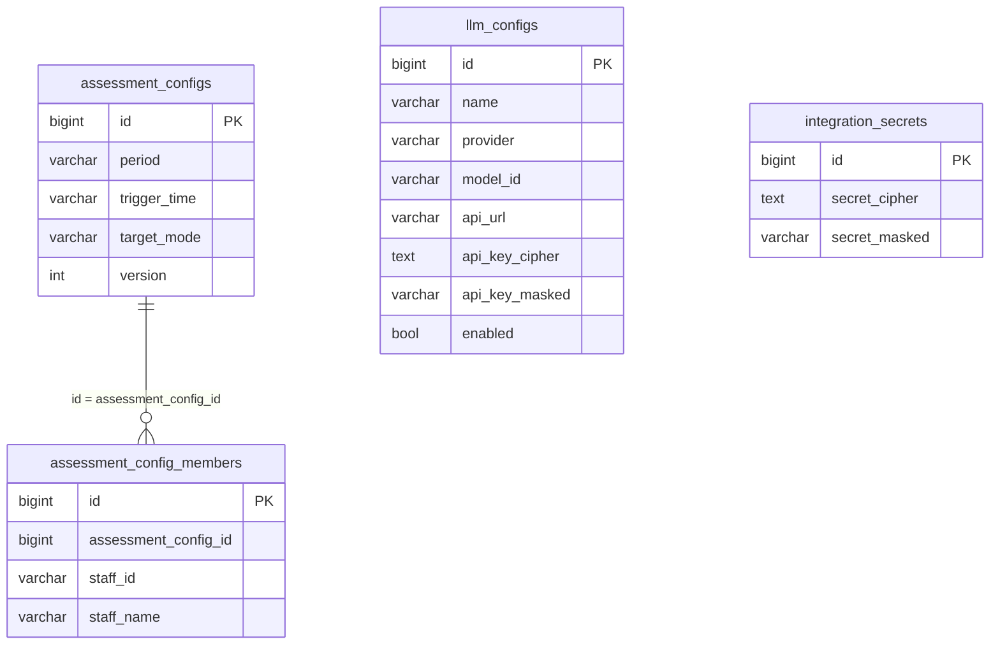

# 系统参数与大模型配置 数据库模型设计文档

## 文档信息

| 项目 | 内容 |
|------|------|
| Feature | P2_SYS_001_FEAT_系统参数与大模型配置 |
| 模块代号 | CFG（系统配置域） |
| 文档版本 | v1.0 |
| 创建日期 | 2026-08-12 |
| 作者 | lixuetao |
| 依据 | [01_功能需求规格说明书](01_功能需求规格说明书.md)、[AGENTS_DATABASE_API_RULE.md](../../../AGENTS_DATABASE_API_RULE.md)、[architecture.md](../../03_architecture/architecture.md) |

---

## 1. 设计依据与约定

### 1.1 数据库选型

按规则文件 §1.1，多库可切换，按 `SQL_DSN` 前缀选 dialector（空或 local 走 SQLite、postgres:// 走 PostgreSQL、其余走 MySQL）。生产推荐 PostgreSQL 或 MySQL。GORM AutoMigrate 为主建表加列加索引，本设计给出三库对照的 GORM 模型 tag 与 DDL。

模型 tag 一律用 GORM 通用类型（varchar/text/int/bigint），不写库特定类型（jsonb/timestamptz/bigserial），让 GORM 按当前 dialector 翻译。所有表通过 `model/migrate.go` 的 `allModels()` 登记参与 AutoMigrate。

### 1.2 主键策略

雪花 ID，应用层生成。GORM 全局 Create 回调对带 `ID int64` 且为 0 的模型透明赋值，模型 tag 只写 `gorm:"primaryKey"`。主键 json 序列化带 `,string`，前端类型用 string。

### 1.3 公共字段

业务表统一含 `created_at`（autoCreateTime）与 `updated_at`（autoUpdateTime），不引入 creator/updater/tenant_id。本功能不涉及软删除（模型删除为物理删除，评估配置与集成密钥为单例覆盖更新），故不引入 `deleted_at`。

### 1.4 命名与类型约束

snake_case 字段命名，语义化复数表名（规则文件 §1.9，沿用 GORM NamingPolicy，不挂 cfg_ 前缀）。半结构化数据用 TEXT 列存序列化字符串，禁用 JSON 类型列。布尔字段模型层用 bool 不加 default tag（规避 MySQL 与 PG 布尔默认值规范化差异导致 AutoMigrate 抖动），新建记录由业务层显式置值。表关联不开外键约束，靠业务字段（主键 ID）关联。

### 1.5 不引入字典表

规则文件 §1.8 显式排除 system_dict_type/system_dict_data 体系。period、target_mode、provider 等枚举用 Go 侧常量加业务字段承载，字段说明不使用 `[字典：xxx]` 标注，亦不生成字典 INSERT 语句。

### 1.6 密钥存储安全（specs §7）

API Key 与集成密钥 AES-256-GCM 对称加密存储，明文禁止落库。对称密钥由 `LLM_SECRET_KEY` 环境变量提供，生产强制覆盖。密文与 nonce 写入 TEXT 列（序列化为 `nonce:ciphertext`）。为避免列表查询把全量明文解密进内存（最小暴露），掩码值在密钥写入时同步生成快照存独立 `*_masked` 列，列表读取快照不解密。掩码规则保留前缀前 4 位与末 4 位、中段星号替代，短于 8 位全掩码。

`LLM_SECRET_KEY` 为本功能新增环境变量，纳入 config.go 的 BindEnv 绑定。开发默认值随源码公开，生产（非 SQLite）启动若未覆盖，main.go 拒绝启动（与 `JWT_SECRET` 同级熔断）。开发默认值与熔断逻辑在开发计划阶段落地。

---

## 2. ER 图



三组数据各自独立：`assessment_configs` 为评估周期单例配置，`assessment_config_members` 承载其指定人员关联（target_mode=specified 时生效）；`llm_configs` 为大模型清单，排他启用由业务层保证全表唯一 enabled=true；`integration_secrets` 为集成密钥单例。无外键约束，`assessment_config_members.assessment_config_id` 通过应用层关联到 `assessment_configs.id`。

---

## 3. 表结构定义

### 3.1 评估周期配置表

#### 3.1.1 assessment_configs

**表名：** `assessment_configs`

**用途：** 承载评估周期参数单例配置。周期长度决定跑批节奏，触发时点决定周期结束当天的触发时刻，评估对象决定跑批范围（同时作为使用活跃度统计范围）。系统级单例，首启 migrateDB 幂等插入默认行。

---

**DDL 语句（以 GORM 模型 tag 为权威，三库由 dialector 翻译；以下 MySQL DDL 供参考）：**

##### MySQL DDL

```sql
CREATE TABLE `assessment_configs` (
  `id` BIGINT NOT NULL COMMENT '主键ID（雪花ID）',
  `period` VARCHAR(16) NOT NULL COMMENT '周期长度 daily/weekly/monthly',
  `trigger_time` VARCHAR(8) NOT NULL COMMENT '触发时点 HH:mm',
  `target_mode` VARCHAR(16) NOT NULL COMMENT '评估对象模式 all/specified',
  `version` INT NOT NULL DEFAULT 1 COMMENT '乐观锁版本号',
  `created_at` DATETIME NOT NULL COMMENT '创建时间',
  `updated_at` DATETIME NOT NULL COMMENT '更新时间',
  PRIMARY KEY (`id`)
) ENGINE=InnoDB DEFAULT CHARSET=utf8mb4 COLLATE=utf8mb4_0900_ai_ci COMMENT='评估周期配置（系统级单例）';
```

##### PostgreSQL DDL

```sql
CREATE TABLE "assessment_configs" (
  id BIGINT NOT NULL,
  period VARCHAR(16) NOT NULL,
  trigger_time VARCHAR(8) NOT NULL,
  target_mode VARCHAR(16) NOT NULL,
  version INTEGER NOT NULL DEFAULT 1,
  created_at TIMESTAMP NOT NULL,
  updated_at TIMESTAMP NOT NULL,
  CONSTRAINT "assessment_configs_pkey" PRIMARY KEY (id)
);
COMMENT ON TABLE "assessment_configs" IS '评估周期配置（系统级单例）';
COMMENT ON COLUMN "assessment_configs".id IS '主键ID（雪花ID）';
COMMENT ON COLUMN "assessment_configs".period IS '周期长度 daily/weekly/monthly';
COMMENT ON COLUMN "assessment_configs".trigger_time IS '触发时点 HH:mm';
COMMENT ON COLUMN "assessment_configs".target_mode IS '评估对象模式 all/specified';
COMMENT ON COLUMN "assessment_configs".version IS '乐观锁版本号';
```

> 注：GORM 模型层布尔/整数字段不加 default tag，DDL 中的 `version DEFAULT 1` 仅表达迁移时初始值，实际由业务层显式置值，AutoMigrate 以模型 tag 为准。SQLite 由 GORM 直接翻译，不单列 DDL。

---

**字段说明：**

| 字段名 | 类型（MySQL）| 类型（PostgreSQL）| 必填 | 默认值 | 说明 |
|--------|------|------|------|--------|------|
| id | BIGINT | BIGINT | 是 | - | 主键ID（雪花ID），应用层生成，json `id,string` |
| period | VARCHAR(16) | VARCHAR(16) | 是 | - | 周期长度，枚举 daily/weekly/monthly，由 Go 侧常量承载 [长度来源：specs 4.1.2 枚举值] |
| trigger_time | VARCHAR(8) | VARCHAR(8) | 是 | - | 触发时点，HH:mm 格式（如 23:00）[长度来源：HH:mm 占 5 字符，列宽留余量] |
| target_mode | VARCHAR(16) | VARCHAR(16) | 是 | - | 评估对象模式，枚举 all/specified，由 Go 侧常量承载 |
| version | INT | INTEGER | 是 | 业务层置 1 | 乐观锁版本号，每次保存自增，并发更新冲突时返回 1306 |
| created_at | DATETIME | TIMESTAMP | 是 | GORM 自动 | 创建时间，autoCreateTime |
| updated_at | DATETIME | TIMESTAMP | 是 | GORM 自动 | 更新时间，autoUpdateTime |

**索引说明：**

| 索引名 | 类型 | 字段 | 用途 |
|--------|------|------|------|
| PRIMARY | PRIMARY KEY | id | 主键索引，单例表恒定 1 行 |

**业务规则：**

- 单例约束：migrateDB 幂等插入唯一默认行（period=weekly、trigger_time=23:00、target_mode=all、version=1），查询接口恒有数据。
- 乐观锁：保存接口 `UPDATE WHERE id=? AND version=?`，affected=0 返回 1306。更新成功后 version 自增。
- 枚举值校验由业务层在保存前断言，period 仅 daily/weekly/monthly、target_mode 仅 all/specified，非法值返 1400。

---

#### 3.1.2 assessment_config_members

**表名：** `assessment_config_members`

**用途：** 承载评估配置的指定人员关联。仅当 `assessment_configs.target_mode=specified` 时生效，target_mode=all 时此表清空。人员数据来自 sili-smart-api 用户体系，本系统仅存选中快照（人员标识与人名），不持久化人员主数据。

---

**DDL 语句：**

##### MySQL DDL

```sql
CREATE TABLE `assessment_config_members` (
  `id` BIGINT NOT NULL COMMENT '主键ID（雪花ID）',
  `assessment_config_id` BIGINT NOT NULL COMMENT '关联评估配置ID（assessment_configs.id）',
  `staff_id` VARCHAR(64) NOT NULL COMMENT '人员标识（来自sili-smart-api用户体系）',
  `staff_name` VARCHAR(64) NOT NULL COMMENT '人员姓名',
  `created_at` DATETIME NOT NULL COMMENT '创建时间',
  `updated_at` DATETIME NOT NULL COMMENT '更新时间',
  PRIMARY KEY (`id`),
  KEY `idx_assessment_config_id` (`assessment_config_id`),
  KEY `idx_staff_id` (`staff_id`)
) ENGINE=InnoDB DEFAULT CHARSET=utf8mb4 COLLATE=utf8mb4_0900_ai_ci COMMENT='评估配置指定人员关联';
```

##### PostgreSQL DDL

```sql
CREATE TABLE "assessment_config_members" (
  id BIGINT NOT NULL,
  assessment_config_id BIGINT NOT NULL,
  staff_id VARCHAR(64) NOT NULL,
  staff_name VARCHAR(64) NOT NULL,
  created_at TIMESTAMP NOT NULL,
  updated_at TIMESTAMP NOT NULL,
  CONSTRAINT "assessment_config_members_pkey" PRIMARY KEY (id)
);
CREATE INDEX "idx_assessment_config_id" ON "assessment_config_members"("assessment_config_id");
CREATE INDEX "idx_staff_id" ON "assessment_config_members"("staff_id");
COMMENT ON TABLE "assessment_config_members" IS '评估配置指定人员关联';
```

---

**字段说明：**

| 字段名 | 类型（MySQL）| 类型（PostgreSQL）| 必填 | 默认值 | 说明 |
|--------|------|------|------|--------|------|
| id | BIGINT | BIGINT | 是 | - | 主键ID（雪花ID），json `id,string` |
| assessment_config_id | BIGINT | BIGINT | 是 | - | 关联评估配置ID，值取自 assessment_configs.id（雪花ID），json `assessment_config_id,string` [长度来源：雪花ID int64] |
| staff_id | VARCHAR(64) | VARCHAR(64) | 是 | - | 人员标识，来自 sili-smart-api 用户体系 [长度来源：规则文件 §1.6 标识符 varchar(64)] |
| staff_name | VARCHAR(64) | VARCHAR(64) | 是 | - | 人员姓名 [长度来源：规则文件 §1.6 人员姓名 varchar(64)] |
| created_at | DATETIME | TIMESTAMP | 是 | GORM 自动 | 创建时间 |
| updated_at | DATETIME | TIMESTAMP | 是 | GORM 自动 | 更新时间 |

**索引说明：**

| 索引名 | 类型 | 字段 | 用途 |
|--------|------|------|------|
| PRIMARY | PRIMARY KEY | id | 主键索引 |
| idx_assessment_config_id | INDEX | assessment_config_id | 按配置 ID 查关联人员，跑批加载指定人员列表 |
| idx_staff_id | INDEX | staff_id | 按人员标识反查，离职/删除时的剔除校验 |

**关联关系：**

- `assessment_configs` (1) ────── (N) `assessment_config_members`，通过业务字段 `assessment_config_id` 关联，不开外键约束。

**关联关系说明：**

- 本表通过业务字段（assessment_config_id）与 assessment_configs 建立关系，不使用数据库外键约束。
- 关联完整性由应用层保证：保存配置时事务内全量覆盖（先按 assessment_config_id 删旧再插新）。
- 人员从 sili-smart-api 用户体系消失时（离职、删除），跑批时按 staff_id 跳过并记录，配置页下次加载剔除；剔除逻辑在跑批与配置加载时由应用层处理，DB 层不做级联。

**业务规则：**

- 全量覆盖：保存评估配置事务内，target_mode=specified 时先 `DELETE FROM assessment_config_members WHERE assessment_config_id=?` 再批量 INSERT；target_mode=all 时仅执行 DELETE。
- 系统无工号约束：staff_id 承载人员标识，不含员工编号字段（遵循系统无工号约束）。
- staff_id 为外部用户体系标识，可能为字符串形式（如 `usr_9001`），不用 int64 承载；若上游改为数值 ID，json 传输仍按 string 化（specs §2.3 已声明）。

---

### 3.2 大模型配置表

#### 3.2.1 llm_configs

**表名：** `llm_configs`

**用途：** 承载大模型清单与排他启用。每行一个模型配置，含模型显示名称、服务商、调用参数、API 地址、加密后的 API Key 与掩码快照、启用状态。同一时刻全表仅一行 enabled=true，由业务层在新增首个模型、启用、删除启用项时维护。模型删除为物理删除。

---

**DDL 语句：**

##### MySQL DDL

```sql
CREATE TABLE `llm_configs` (
  `id` BIGINT NOT NULL COMMENT '主键ID（雪花ID）',
  `name` VARCHAR(64) NOT NULL COMMENT '模型显示名称',
  `provider` VARCHAR(32) NOT NULL COMMENT '服务商 deepseek/openai/zhipu/anthropic',
  `model_id` VARCHAR(100) NOT NULL COMMENT '模型调用参数（如deepseek-chat）',
  `api_url` VARCHAR(500) NOT NULL DEFAULT '' COMMENT 'API地址，空串走服务商默认',
  `api_key_cipher` TEXT NOT NULL COMMENT 'API Key密文（AES-256-GCM：nonce:ciphertext）',
  `api_key_masked` VARCHAR(255) NOT NULL DEFAULT '' COMMENT 'API Key掩码快照',
  `enabled` TINYINT(1) NOT NULL DEFAULT 0 COMMENT '启用状态，全表唯一true',
  `created_at` DATETIME NOT NULL COMMENT '创建时间',
  `updated_at` DATETIME NOT NULL COMMENT '更新时间',
  PRIMARY KEY (`id`),
  KEY `idx_enabled` (`enabled`)
) ENGINE=InnoDB DEFAULT CHARSET=utf8mb4 COLLATE=utf8mb4_0900_ai_ci COMMENT='大模型配置清单';
```

##### PostgreSQL DDL

```sql
CREATE TABLE "llm_configs" (
  id BIGINT NOT NULL,
  name VARCHAR(64) NOT NULL,
  provider VARCHAR(32) NOT NULL,
  model_id VARCHAR(100) NOT NULL,
  api_url VARCHAR(500) NOT NULL DEFAULT '',
  api_key_cipher TEXT NOT NULL,
  api_key_masked VARCHAR(255) NOT NULL DEFAULT '',
  enabled BOOLEAN NOT NULL DEFAULT false,
  created_at TIMESTAMP NOT NULL,
  updated_at TIMESTAMP NOT NULL,
  CONSTRAINT "llm_configs_pkey" PRIMARY KEY (id)
);
CREATE INDEX "idx_enabled" ON "llm_configs"("enabled");
COMMENT ON TABLE "llm_configs" IS '大模型配置清单';
COMMENT ON COLUMN "llm_configs".api_key_cipher IS 'API Key密文（AES-256-GCM：nonce:ciphertext）';
COMMENT ON COLUMN "llm_configs".enabled IS '启用状态，全表唯一true（业务层保证，不加DB约束）';
```

> 注：模型层 enabled 为 bool 不加 default tag（规则文件 §1.5），DDL 中的 default 仅迁移期表达，AutoMigrate 以模型为准，新建记录由业务层显式置值。

---

**字段说明：**

| 字段名 | 类型（MySQL）| 类型（PostgreSQL）| 必填 | 默认值 | 说明 |
|--------|------|------|------|--------|------|
| id | BIGINT | BIGINT | 是 | - | 模型主键ID（雪花ID），json `id,string`，承载精度风险 |
| name | VARCHAR(64) | VARCHAR(64) | 是 | - | 模型显示名称，如「主力模型」[长度来源：specs 4.3.2 ≤50 字符，规则文件 §1.6 短名称留余量取 64] |
| provider | VARCHAR(32) | VARCHAR(32) | 是 | - | 服务商，枚举 deepseek/openai/zhipu/anthropic，Go 侧常量承载，决定所属接入协议 [长度来源：枚举值最长 anthropic=9，列宽留余量] |
| model_id | VARCHAR(100) | VARCHAR(100) | 是 | - | 模型调用参数（文本，如 deepseek-chat），传入服务商 model 参数，非雪花ID，不涉及精度 [长度来源：specs 4.3.2 ≤100 字符] |
| api_url | VARCHAR(500) | VARCHAR(500) | 是 | ''（空串） | API 地址，空串表示走服务商默认地址，填写则覆盖为代理地址 [长度来源：specs 4.3.2 ≤500 字符] |
| api_key_cipher | TEXT | TEXT | 是 | - | API Key 密文，AES-256-GCM 加密存储，格式 `nonce:ciphertext`，明文禁止落库 |
| api_key_masked | VARCHAR(255) | VARCHAR(255) | 是 | ''（空串） | API Key 掩码快照，写入时生成，列表读取此列不解密密文 [长度来源：规则文件 §1.6 摘要/令牌 varchar(255)] |
| enabled | TINYINT(1) / BOOLEAN | BOOLEAN | 是 | 业务层置 | 启用状态，全表唯一 true（排他启用，业务层事务保证，不加 DB 唯一约束） |
| created_at | DATETIME | TIMESTAMP | 是 | GORM 自动 | 创建时间 |
| updated_at | DATETIME | TIMESTAMP | 是 | GORM 自动 | 更新时间 |

**索引说明：**

| 索引名 | 类型 | 字段 | 用途 |
|--------|------|------|------|
| PRIMARY | PRIMARY KEY | id | 主键索引 |
| idx_enabled | INDEX | enabled | 快速定位当前启用模型，下游 LLM 调用底座高频读取启用行 |

> enabled 不加 DB 层 UNIQUE 约束：排他启用是跨行约束（全表至多一行 enabled=true），DB 单列唯一约束会阻止存在任何 enabled=false 的行成对（多行 false 冲突），无法表达「至多一行 true、多行 false」语义，故收敛到业务层事务保证，与规则文件 §1.10「唯一性收敛业务层」思路一致。

**业务规则：**

- 排他启用（specs 规则1）：新增首个模型时 enabled=true，其余新增 enabled=false；启用某模型时事务内 `UPDATE llm_configs SET enabled=false` 再置目标 true。
- 启用项保护（specs 规则2）：不提供 disable 接口，停用当前启用项的唯一路径是启用另一个模型。
- 删除前置与转启（specs 规则3）：清单仅剩一个时拒绝删除（1302）；删除启用态模型时事务内把剩余首个置 enabled=true，返回 transferred_enabled_id。
- 密钥掩码化（specs 规则4）：新增/编辑写入 api_key_cipher 时同步刷新 api_key_masked；列表查询只取 masked 列，明文仅详情接口按需解密。
- 物理删除：模型删除为物理 DELETE，不引入软删除，删除后无法恢复。

---

### 3.3 集成密钥表

#### 3.3.1 integration_secrets

**表名：** `integration_secrets`

**用途：** 承载sili-smart-ap日志集成密钥单例。访问 sili-smart-api 会话日志接口的 Bearer 密钥，加密存储。系统级单例，首启 migrateDB 幂等插入空密钥行。密钥配置状态由密文是否为空推导。

---

**DDL 语句：**

##### MySQL DDL

```sql
CREATE TABLE `integration_secrets` (
  `id` BIGINT NOT NULL COMMENT '主键ID（雪花ID）',
  `secret_cipher` TEXT NOT NULL COMMENT '集成密钥密文（AES-256-GCM：nonce:ciphertext），空串表示未配置',
  `secret_masked` VARCHAR(255) NOT NULL DEFAULT '' COMMENT '集成密钥掩码快照',
  `created_at` DATETIME NOT NULL COMMENT '创建时间',
  `updated_at` DATETIME NOT NULL COMMENT '更新时间',
  PRIMARY KEY (`id`)
) ENGINE=InnoDB DEFAULT CHARSET=utf8mb4 COLLATE=utf8mb4_0900_ai_ci COMMENT='sili-smart-ap日志集成密钥（系统级单例）';
```

##### PostgreSQL DDL

```sql
CREATE TABLE "integration_secrets" (
  id BIGINT NOT NULL,
  secret_cipher TEXT NOT NULL,
  secret_masked VARCHAR(255) NOT NULL DEFAULT '',
  created_at TIMESTAMP NOT NULL,
  updated_at TIMESTAMP NOT NULL,
  CONSTRAINT "integration_secrets_pkey" PRIMARY KEY (id)
);
COMMENT ON TABLE "integration_secrets" IS 'sili-smart-ap日志集成密钥（系统级单例）';
COMMENT ON COLUMN "integration_secrets".secret_cipher IS '集成密钥密文（AES-256-GCM：nonce:ciphertext），空串表示未配置';
```

---

**字段说明：**

| 字段名 | 类型（MySQL）| 类型（PostgreSQL）| 必填 | 默认值 | 说明 |
|--------|------|------|------|--------|------|
| id | BIGINT | BIGINT | 是 | - | 集成密钥主键ID（雪花ID），json `id,string` |
| secret_cipher | TEXT | TEXT | 是 | ''（空串） | 集成密钥密文，AES-256-GCM 加密存储，格式 `nonce:ciphertext`；空串表示未配置，明文禁止落库 |
| secret_masked | VARCHAR(255) | VARCHAR(255) | 是 | ''（空串） | 集成密钥掩码快照，写入时生成；未配置时为空串 [长度来源：规则文件 §1.6 摘要/令牌 varchar(255)] |
| created_at | DATETIME | TIMESTAMP | 是 | GORM 自动 | 创建时间 |
| updated_at | DATETIME | TIMESTAMP | 是 | GORM 自动 | 更新时间 |

**索引说明：**

| 索引名 | 类型 | 字段 | 用途 |
|--------|------|------|------|
| PRIMARY | PRIMARY KEY | id | 主键索引，单例表恒定 1 行 |

**业务规则：**

- 单例约束：migrateDB 幂等插入唯一空密钥行（secret_cipher 空串），查询接口恒有数据。
- 配置状态推导：configured = (secret_cipher 非空)，由业务层判断，不另设状态字段。
- 更新即覆盖（specs 4.5.4 规则1）：更新提交覆盖 secret_cipher 并刷新 secret_masked，旧密钥立即失效。
- 未配置前置拦截（specs 规则5）：临时查看（C2）、连通验证（C4）在 secret_cipher 为空时返回 1303。

---

## 4. 数据初始化

migrateDB 在 AutoMigrate 之后（C 段数据回填钩子）幂等插入两行单例默认数据，每次启动重跑靠幂等保证安全。判断条件为表为空才插入。

```sql
-- 评估周期配置默认行（仅当 assessment_configs 为空时插入）
INSERT INTO assessment_configs (id, period, trigger_time, target_mode, version, created_at, updated_at)
SELECT <雪花ID>, 'weekly', '23:00', 'all', 1, <now>, <now>
WHERE NOT EXISTS (SELECT 1 FROM assessment_configs);

-- 集成密钥默认空行（仅当 integration_secrets 为空时插入）
INSERT INTO integration_secrets (id, secret_cipher, secret_masked, created_at, updated_at)
SELECT <雪花ID>, '', '', <now>, <now>
WHERE NOT EXISTS (SELECT 1 FROM integration_secrets);
```

> 单例行的 id 由雪花生成器在应用层赋值（首启时通过 GORM Create 回调或显式生成），created_at/updated_at 由 GORM 自动维护。SQL 中 `<雪花ID>` 与 `<now>` 为示意，实际由 Go 代码在迁移钩子内构造结构体后 Create 落库，跨方言一致。

llm_configs 与 assessment_config_members 首启为空（无预置模型、无指定人员），由运营人员经界面维护。

---

## 5. 索引策略汇总

| 表 | 索引名 | 类型 | 字段 | 用途 |
|----|--------|------|------|------|
| assessment_configs | PRIMARY | PRIMARY KEY | id | 单例主键 |
| assessment_config_members | PRIMARY | PRIMARY KEY | id | 主键 |
| assessment_config_members | idx_assessment_config_id | INDEX | assessment_config_id | 按配置加载指定人员 |
| assessment_config_members | idx_staff_id | INDEX | staff_id | 离职剔除反查 |
| llm_configs | PRIMARY | PRIMARY KEY | id | 主键 |
| llm_configs | idx_enabled | INDEX | enabled | 定位当前启用模型 |
| integration_secrets | PRIMARY | PRIMARY KEY | id | 单例主键 |

无分表分库策略。本功能数据量小（单例表 1 行、模型清单个位数、指定人员百级），主库单机可承载。`idx_enabled` 服务于下游 LLM 调用底座与跑批的高频读取，配合缓存（见 §6）降低读放大。

---

## 6. 缓存与性能

### 6.1 Redis 热点配置缓存

架构文档将大模型配置、评估周期参数列为评估运行前必须就绪的热点配置缓存。本功能配置写入后，service 层同步刷新 Redis 缓存：

| 缓存键 | 内容 | 写入时机 | 失效策略 |
|--------|------|---------|---------|
| `hr:llm:enabled` | 当前启用模型（含 provider/model_id/api_url/api_key 明文） | 模型增删改、启停、首启 | 写操作同步覆盖，TTL 兜底 1h |
| `hr:config:assessment` | 评估周期配置（period/trigger_time/target_mode/指定人员快照） | 保存配置、首启 | 写操作同步覆盖，TTL 兜底 1h |
| `hr:integration:secret` | 集成密钥明文 | 更新密钥、首启已配置时 | 写操作同步覆盖，TTL 兜底 1h |

缓存供下游 engine、integration、worker 读取，降低跑批期内配置读取开销。写操作走 Cache-Aside：先更新 DB，再覆盖缓存（删或重写），读未命中回源 DB 再回填。api_key 与 secret 在缓存中以解密明文存（Redis 与主库同信任域，密钥保护侧重 DB 落库加密与传输加密），由 Redis 实例自身的访问控制兜底。

### 6.2 列表查询性能

模型列表不分页，全量返回。列表查询只读 api_key_masked 不解密密文，避免逐行解密的 CPU 与最小暴露成本。指定人员列表（A3）走外部代理查询，本侧不落主数据，无回源放大。

---

## 7. 配置新增（环境变量）

本功能新增一个环境变量，纳入 config.go BindEnv 绑定：

| 环境变量 | 用途 | 必填 | 说明 |
|---------|------|------|------|
| LLM_SECRET_KEY | API Key 与集成密钥 AES-256-GCM 对称密钥 | 生产必填 | 开发默认值随源码公开；生产（非 SQLite）启动未覆盖则 main.go 拒绝启动，与 JWT_SECRET 同级熔断 |

config.go 的 `applyDefaults` 提供开发默认值，生产熔断逻辑在 main.go 启动序列追加 `!IsSQLite() && IsDefaultLLMSecret()` 判定，复用 JWT_SECRET 的熔断范式。

---

## 8. SSOT 合规与一致性

### 8.1 字段定义对齐 specs

- 周期长度/触发时点/评估对象（specs 4.1.2）：assessment_configs.period/trigger_time/target_mode 对齐，枚举值与默认值（weekly/23:00/all）一致。
- 模型名称/服务商/模型 ID/API 地址/API Key（specs 4.3.2）：llm_configs 五字段对齐，长度约束（name ≤50→列 64、model_id ≤100→列 100、api_url ≤500→列 500、api_key ≤200→密文 TEXT）来源已标注。
- 集成密钥（specs 4.2.2C）：integration_secrets.secret_cipher 对齐，掩码与配置状态对齐。
- 模型主键 ID 与模型 ID 术语区分（specs 8.1）：llm_configs.id（雪花，string 化）与 llm_configs.model_id（文本）各自独立。

### 8.2 业务规则在 DB 设计的体现

- 排他启用（specs 规则1）、启用项保护（specs 规则2）、删除前置与转启（specs 规则3）：llm_configs 业务规则段明确事务边界。
- 密钥掩码化（specs 规则4）：api_key_masked/secret_masked 独立快照列，列表读快照不解密。
- 评估对象互斥（specs 4.1.4 规则2）：target_mode 二选一，specified 时关联表全量覆盖。
- 配置生效时机（specs 4.1.4 规则1）：乐观锁 version 字段支持下次跑批按新参数执行，历史不重算。

### 8.3 与接口设计的一致性

接口（03_api_interface.md）请求/响应字段与本文表结构一一对应：雪花 ID 字段双层 string 化（domain + DTO）、枚举值同名、掩码快照列对应接口 masked 字段、密文列不进任何响应。错误码 1301-1306 在 DB 业务规则中均有触发场景对应。

---

## 9. 不涉及的设计

按 specs 第 5 章，本功能无定时任务、消息队列消费或第三方回调。评估周期参数与模型密钥的生效由评估引擎、LLM 调用底座、会话日志集成在下次跑批或实际调用时读取，属于下游模块行为。本设计不包含：

- 跑批调度表与任务记录（归属 worker/engine）。
- LLM 调用日志与会话日志原文（原文不落本系统主库，见架构文档隐私架构）。
- 评分记录、画像、看板数据（归属各自业务域 Feature）。
- RSA 密钥对的 Redis 存储结构（复用 account 域 `/api/auth/public-key` 既有机制，见规则文件 §2.5，本功能不新增）。

---

**文档版本：** v1.0
**最后更新：** 2026-08-12
**作者：** lixuetao
