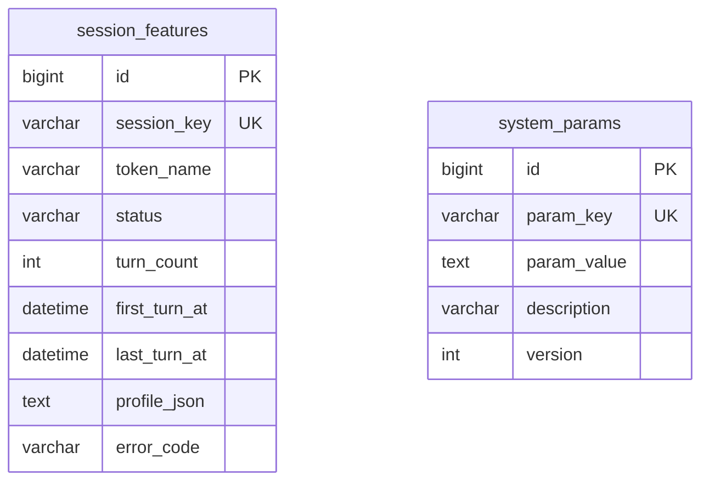

# 会话特征抽取 数据库模型设计文档

## 文档信息

| 项目 | 内容 |
|------|------|
| Feature | P2_TECH_003_TECH_会话特征抽取 |
| 模块代号 | TECH（技术组件，engine/extractor 子域） |
| 文档版本 | v1.2 |
| 创建日期 | 2026-08-23 |
| 作者 | lixuetao |
| 依据 | [01_功能需求规格说明书](01_功能需求规格说明书.md)（SSOT）、[AGENTS_DATABASE_API_RULE.md](../../../AGENTS_DATABASE_API_RULE.md)、[architecture.md](../../03_architecture/architecture.md) |

> v1.2（2026-08-27 代码评审回写）：§3.1 业务规则补「翻转 UPDATE 的并发防御」（id AND status 双条件与 RowsAffected 收敛）与 ErrDetailFetch 首次落行 epoch 口径。v1.1（2026-08-23 监理修复）：参考 DDL 去除三列 DEFAULT 子句（对齐模型层无 default tag、业务层显式置值口径），PG 时间列统一改 TIMESTAMPTZ（对齐 GORM 对 PG 的实际翻译）。

---

## 1. 设计依据与约定

### 1.1 数据库选型

按规则文件 §1.1，多库可切换（SQLite / PostgreSQL / MySQL），GORM AutoMigrate 为主建表加列加索引。模型 tag 一律用 GORM 通用类型（varchar/text/int/bigint），不写库特定类型，三库由 dialector 翻译。新表在 `model/migrate.go` 的 `allModels()` 登记参与 AutoMigrate。

### 1.2 主键策略

雪花 ID，应用层生成。GORM 全局 Create 回调对带 `ID int64` 且为 0 的模型透明赋值，模型 tag 只写 `gorm:"primaryKey"`。本组件无 HTTP 接口、无前端消费方，档案表主键不出现在任何 JSON 序列化路径；后续 T5 若经 DTO 下发档案，须按规则文件 §1.2 双层 string 化。

### 1.3 公共字段

统一含 `created_at`（autoCreateTime）与 `updated_at`（autoUpdateTime），不引入 creator/updater/tenant_id。两表均无逻辑删除需求（档案终态靠 status 列承载，参数为键值覆盖更新），不引入 `deleted_at`。

### 1.4 命名与类型约束

snake_case 字段命名，语义化复数表名（规则文件 §1.9，沿用 GORM NamingPolicy）。半结构化数据（特征档案四块 JSON、参数值）用 TEXT 列存序列化字符串，禁用 JSON 类型列。表关联不开外键约束。无布尔列（档案状态用 status 枚举承载）。

### 1.5 不引入字典表

规则文件 §1.8 显式排除字典表体系。status、error_code、param_key 枚举语义由 Go 侧常量加业务字段承载，字段说明不使用 `[字典：xxx]` 标注。

### 1.6 与 specs 的两处技术层偏差（按规则裁决）

技术实现层规则文件优先于 specs（技能 SSOT 合规约定），以下偏差已在本文档统一收敛：

| 项 | specs 表述 | 本设计 | 依据 |
|----|-----------|--------|------|
| 表名 | session_feature | `session_features` | 规则文件 §1.9，GORM 复数化 NamingPolicy，与已落地表（accounts、llm_configs 等）一致 |
| 时间列名 | first_turn_time / last_turn_time | `first_turn_at` / `last_turn_at` | 规则文件 §1.4，业务时间字段 `xxx_at` 后缀语义（account 域 `last_login_at` 样板）；上游 Unix 秒（int64）在仓储写入时转 `time.Time`，读取时反向转换，`ListByPersonAndRange` 的 Go 签名保持 specs 的 int64 入参 |

---

## 2. ER 图



两表互相独立，均无外部关联：`session_features.token_name` 是上游 sili-smart-api 调用令牌名（specs §3.3 人员标识最小化：无工号、无 user_id 冗余），与本地 `accounts` 表无关联；`system_params.param_key` 以点分模块前缀（`extractor.*`）自明归属。无外键约束。

---

## 3. 表结构定义

### 3.1 会话特征档案表

#### 3.1.1 session_features

**表名：** `session_features`

**用途：** 逐会话特征档案的幂等持久化载体。一会话一行，承载四块特征档案（统计块 + LLM 三块，脱敏后 TEXT 序列化）、抽取状态（success/failed/skipped）与元数据列。消费方：T5 综合评估（ListByPersonAndRange 取数）、T6 跑批（失败比例分子计数）。

---

**DDL 语句（以 GORM 模型 tag 为权威，三库由 dialector 翻译；以下 DDL 供参考，DEFAULT 子句省略与时间列精度差异以 GORM 翻译为准）：**

##### MySQL DDL

```sql
CREATE TABLE `session_features` (
  `id` BIGINT NOT NULL COMMENT '主键ID（雪花ID）',
  `session_key` VARCHAR(128) NOT NULL COMMENT '会话标识（上游会话键，幂等键）',
  `token_name` VARCHAR(64) NOT NULL COMMENT '人员归属（上游调用令牌名）',
  `status` VARCHAR(16) NOT NULL COMMENT '档案状态 success/failed/skipped',
  `turn_count` INT NOT NULL COMMENT '窗口内轮次数（元数据，skipped 行唯一计数载体）',
  `first_turn_at` DATETIME NOT NULL COMMENT '窗口内首轮时间（T5 周期区间筛选）',
  `last_turn_at` DATETIME NOT NULL COMMENT '窗口内末轮时间（T5 周期区间筛选）',
  `profile_json` TEXT NOT NULL COMMENT '特征档案四块JSON（脱敏后序列化；failed行仅统计块；skipped行空串）',
  `error_code` VARCHAR(64) NOT NULL COMMENT 'failed记组件错误码，skipped记跳过原因，success空串',
  `created_at` DATETIME NOT NULL COMMENT '创建时间',
  `updated_at` DATETIME NOT NULL COMMENT '更新时间',
  PRIMARY KEY (`id`),
  UNIQUE KEY `uk_session_key` (`session_key`),
  KEY `idx_token_first_turn` (`token_name`,`first_turn_at`)
) ENGINE=InnoDB DEFAULT CHARSET=utf8mb4 COLLATE=utf8mb4_0900_ai_ci COMMENT='会话特征档案';
```

##### PostgreSQL DDL

```sql
CREATE TABLE "session_features" (
  id BIGINT NOT NULL,
  session_key VARCHAR(128) NOT NULL,
  token_name VARCHAR(64) NOT NULL,
  status VARCHAR(16) NOT NULL,
  turn_count INTEGER NOT NULL,
  first_turn_at TIMESTAMPTZ NOT NULL,
  last_turn_at TIMESTAMPTZ NOT NULL,
  profile_json TEXT NOT NULL,
  error_code VARCHAR(64) NOT NULL,
  created_at TIMESTAMPTZ NOT NULL,
  updated_at TIMESTAMPTZ NOT NULL,
  CONSTRAINT "session_features_pkey" PRIMARY KEY (id)
);
CREATE UNIQUE INDEX "uk_session_key" ON "session_features"("session_key");
CREATE INDEX "idx_token_first_turn" ON "session_features"("token_name", "first_turn_at");
COMMENT ON TABLE "session_features" IS '会话特征档案';
```

> SQLite 由 GORM 直接翻译，不单列 DDL。GORM 模型落位 `internal/domain/session_feature.go`，模型层 `error_code` 无 default tag 由业务层显式置空串（规则文件 §1.5 同源约束适用于布尔列，字符串列沿用同一显式置值纪律）。

---

**字段说明：**

| 字段名 | 类型（MySQL）| 类型（PostgreSQL）| 必填 | 默认值 | 说明 |
|--------|------|------|------|--------|------|
| id | BIGINT | BIGINT | 是 | - | 主键ID（雪花ID），应用层生成 [长度来源：雪花 int64] |
| session_key | VARCHAR(128) | VARCHAR(128) | 是 | - | 会话标识，上游 sili-smart-api 会话键，详情拉取凭据与幂等键，原样透传（含中文乱码变体，specs §3.2）[长度来源：specs 未指定，按标识符语义留余量] |
| token_name | VARCHAR(64) | VARCHAR(64) | 是 | - | 人员归属，上游调用令牌名（中文人名），喂 LLM 前剥离、落库时回填（specs §3.3）[长度来源：规则文件 §1.6 人员姓名 varchar(64)] |
| status | VARCHAR(16) | VARCHAR(16) | 是 | - | 档案状态：success（四块完整）/ failed（LLM 段失败降级，仅统计块）/ skipped（过滤终态，仅元数据），Go 侧常量承载 [长度来源：枚举值最长 7 字符] |
| turn_count | INT | INTEGER | 是 | - | 窗口内轮次数，列表口径元数据；skipped 行不计算 Stats，此列是其唯一计数载体 [长度来源：int] |
| first_turn_at | DATETIME | TIMESTAMP | 是 | - | 窗口内首轮时间，由上游 Unix 秒转换；T5 按人加周期取档案的区间筛选列 |
| last_turn_at | DATETIME | TIMESTAMP | 是 | - | 窗口内末轮时间，同上转换口径 |
| profile_json | TEXT | TEXT | 是 | 业务层置空串 | 特征档案四块 JSON（Stats/Summary/Instruction/Behavior）脱敏后序列化；failed 行仅含 Stats 块；skipped 行为空串（specs §2.3 档案表注释）[长度来源：规则文件 §1.6 长文本 TEXT] |
| error_code | VARCHAR(64) | VARCHAR(64) | 是 | 业务层置空串 | failed 记组件错误码（ErrLLMUpstream/ErrSchemaInvalid/ErrDetailFetch/ErrContextLengthExceeded），skipped 记跳过原因（min_user_messages/empty_shell/detail_invalid/session_not_found），success 为空串 [长度来源：specs §2.3 错误码表值域] |
| created_at | DATETIME | TIMESTAMP | 是 | GORM 自动 | 创建时间，autoCreateTime |
| updated_at | DATETIME | TIMESTAMP | 是 | GORM 自动 | 更新时间，autoUpdateTime，failed 行原地翻转时刷新；UPDATE 显式写 UTC（与 first/last_turn_at 统一偏移口径，SQLite 文本字典序可比） |

**索引说明：**

| 索引名 | 类型 | 字段 | 用途 |
|--------|------|------|------|
| PRIMARY | PRIMARY KEY | id | 主键索引 |
| uk_session_key | UNIQUE | session_key | 幂等落库的 DB 兜底：并发双写同一会话时后者 insert 冲突，走重查路径收敛为 reused；本表无软删除，唯一索引无规则文件 §1.10 的 NULL 语义问题 |
| idx_token_first_turn | INDEX | token_name, first_turn_at | ListByPersonAndRange（按人加时间窗）取数路径，T5 evaluator 每人周期一次的高频读取 |

**业务规则：**

- **幂等状态机（specs §2.4 能力3 唯一权威）**：Save 前按 session_key 查行。无行 insert；已有 success 行返回 reused=true 且不覆盖；failed 行重抽成功后原地翻转 success 并补齐 LLM 三块（UPDATE 同一行）；skipped 行是终态，不重拉不重判不翻转。残留 failed 行终态化（上游删除会话后的 session_not_found 翻转）时 turn_count 与 first/last_turn_at 复用既有行原值，只翻 status 与 error_code（specs §2.3）。首次落行（ErrDetailFetch 且库内无既有行）turn_count 落 0、时间列落 epoch（NOT NULL 不可空，补跑翻转后由 detail 元数据覆盖，specs §2.3 错误码表 ErrDetailFetch）。
- **翻转 UPDATE 的并发防御（实现回写收编）**：failed 行原地翻转的 UPDATE 带 `WHERE id = ? AND status = ?` 双条件（status 锁读时快照），防 Asynq 双交付或并发重抽下后写者覆写已终态的行；RowsAffected=0（读后被改写）时重查一次按库内实际行收敛：终态行返回 reused=true，行缺失或仍非终态返回错误交任务重试（防静默丢档案）。这是唯一索引兜底 insert 冲突之外，UPDATE 路径的对应防御。
- **skipped 行内容口径**：profile_json 空串，仅落元数据列（session_key、token_name、turn_count、first/last_turn_at、status、error_code），不计算 Stats（specs §2.3）。
- **failed 行降级口径**：profile_json 仅序列化规则产出的 Stats 块，error_code 记组件错误码；当期评估照常推进（T5 取统计块参与活跃度与降权判定，specs §7.2 C06）。
- **时间转换**：first_turn_at/last_turn_at 由上游 SessionSummary 的 Unix 秒（int64）经 `time.Unix(n, 0)` 转换写入；ListByPersonAndRange 入参保持 Unix 秒，仓储内反向转换构造查询。
- **失败比例口径**：extract_fail_ratio 分子为本表 status=failed 计数，分母用周期会话总量（上游列表口径），非本表行数（specs §2.4 能力3 注意事项）。
- **无软删除、无覆盖重抽**：prompt 迭代后全量重抽由运维清表再跑批（specs §2.4 能力3），本表不设 deleted_at，Delete 为物理删除。
- **隐私边界**：profile_json 只存脱敏档案（指令片段过 Redact 正则集），对话原文与裁剪视图禁止落任何列（specs §3.3）。

---

### 3.2 通用系统参数表（共享 SYS 能力，本 Feature 落地）

#### 3.2.1 system_params

**表名：** `system_params`

**用途：** 通用 key-value 系统参数的持久化载体，为跨 Feature 共享的 SYS 域基础设施表（specs §4.3 将该能力列为必需依赖且标注「部分扩展」：当前系统仅有评估周期单例表，通用参数能力无处落地，经裁决随本 Feature 一并设计）。首发消费方为 extractor 的两个参数键，后续域按 `模块.参数名` 键约定复用。

---

**DDL 语句：**

##### MySQL DDL

```sql
CREATE TABLE `system_params` (
  `id` BIGINT NOT NULL COMMENT '主键ID（雪花ID）',
  `param_key` VARCHAR(128) NOT NULL COMMENT '参数键（模块前缀点分命名，如extractor.inject_prefixes）',
  `param_value` TEXT NOT NULL COMMENT '参数值（结构化值存序列化字符串）',
  `description` VARCHAR(255) NOT NULL COMMENT '参数用途说明（参数页展示）',
  `version` INT NOT NULL COMMENT '乐观锁版本号',
  `created_at` DATETIME NOT NULL COMMENT '创建时间',
  `updated_at` DATETIME NOT NULL COMMENT '更新时间',
  PRIMARY KEY (`id`),
  UNIQUE KEY `uk_param_key` (`param_key`)
) ENGINE=InnoDB DEFAULT CHARSET=utf8mb4 COLLATE=utf8mb4_0900_ai_ci COMMENT='通用系统参数（共享SYS能力）';
```

##### PostgreSQL DDL

```sql
CREATE TABLE "system_params" (
  id BIGINT NOT NULL,
  param_key VARCHAR(128) NOT NULL,
  param_value TEXT NOT NULL,
  description VARCHAR(255) NOT NULL,
  version INTEGER NOT NULL,
  created_at TIMESTAMPTZ NOT NULL,
  updated_at TIMESTAMPTZ NOT NULL,
  CONSTRAINT "system_params_pkey" PRIMARY KEY (id)
);
CREATE UNIQUE INDEX "uk_param_key" ON "system_params"("param_key");
COMMENT ON TABLE "system_params" IS '通用系统参数（共享SYS能力）';
```

---

**字段说明：**

| 字段名 | 类型（MySQL）| 类型（PostgreSQL）| 必填 | 默认值 | 说明 |
|--------|------|------|------|--------|------|
| id | BIGINT | BIGINT | 是 | - | 主键ID（雪花ID），应用层生成 [长度来源：雪花 int64] |
| param_key | VARCHAR(128) | VARCHAR(128) | 是 | - | 参数键，点分模块前缀命名（`extractor.inject_prefixes`、`extractor.redact_patterns`），全局唯一 [长度来源：specs §2.2 键名 24 字符内，留余量] |
| param_value | TEXT | TEXT | 是 | - | 参数值；本组件两键均为 JSON 数组序列化字符串（前缀黑名单、脱敏正则集）[长度来源：规则文件 §1.6 长文本 TEXT，前缀全集实测千字符级] |
| description | VARCHAR(255) | VARCHAR(255) | 是 | 业务层置值 | 参数用途说明，参数页展示 [长度来源：规则文件 §1.6 标题/简介] |
| version | INT | INTEGER | 是 | 业务层置 1 | 乐观锁版本号，参数页并发编辑冲突保护（对齐 assessment_configs 先例） |
| created_at | DATETIME | TIMESTAMP | 是 | GORM 自动 | 创建时间 |
| updated_at | DATETIME | TIMESTAMP | 是 | GORM 自动 | 更新时间 |

**索引说明：**

| 索引名 | 类型 | 字段 | 用途 |
|--------|------|------|------|
| PRIMARY | PRIMARY KEY | id | 主键索引 |
| uk_param_key | UNIQUE | param_key | 参数键唯一，按键点查是唯一读取路径；无软删除，无 §1.10 问题 |

**业务规则：**

- **值格式约定**：`extractor.inject_prefixes` 与 `extractor.redact_patterns` 的 param_value 为 JSON 字符串数组序列化（如 `["<system-reminder","Note:","..."]`），组件读取后反序列化为 []string。空数组合法，两参数空集语义方向相反（评审补口径）：黑名单清空回退 role 兜底全保留（放开过滤）；脱敏清空回退出厂正则集（安全机制不失效，与黑名单的放开语义刻意相反）。全空串条目的数组同样按清空处理。
- **读取时机**：每会话任务读取一次（两键批量单次往返，一会话一任务本就读写库，开销可忽略），满足参数页热调整在新一轮抽取生效（specs §5.2 黑名单参数联动用例），无 Redis 缓存需求。
- **键缺失回退**：仓储读取按 uk_param_key 点查，行不存在时组件回退包内出厂默认常量（InjectPrefixes/RedactPatterns，specs §2.2），DB 非唯一权威，运维清表不致组件瘫痪。
- **更新语义**：参数页整键覆盖 param_value（version 乐观锁防并发覆盖），不做增量增删；保存时同步把 `<param_key>.origin` 伴生键翻为 custom（出厂升级机制对运维改过的行不再覆盖，见 §4）。
- **归属声明**：本表为共享 SYS 能力，表结构与仓储随本 Feature 落地（否则两参数键无处承载、dev_plan 无法排任务）；参数页管理 HTTP 接口与界面归属系统参数域后续变更 Feature，本 Feature 只消费读取路径（见 [03_api_interface.md](03_api_interface.md) §6）。

---

## 4. 数据初始化

migrateDB 在 AutoMigrate 之后（C 段数据回填钩子）按键幂等插入默认参数行，参数页改过（行已存在）则不覆盖：

```sql
-- 注入前缀黑名单出厂默认（仅当键不存在时插入；实际值为 Go 包内常量 InjectPrefixes 的 JSON 序列化）
INSERT INTO system_params (id, param_key, param_value, description, version, created_at, updated_at)
SELECT <雪花ID>, 'extractor.inject_prefixes', '<InjectPrefixes 的 JSON 数组序列化>',
       '会话裁剪注入识别前缀黑名单（JSON数组，运维可增删）', 1, <now>, <now>
WHERE NOT EXISTS (SELECT 1 FROM system_params WHERE param_key = 'extractor.inject_prefixes');

-- 脱敏正则集出厂默认（同口径）
INSERT INTO system_params (id, param_key, param_value, description, version, created_at, updated_at)
SELECT <雪花ID>, 'extractor.redact_patterns', '<RedactPatterns 的 JSON 数组序列化>',
       '指令脱敏正则集（JSON数组，覆盖路径/密钥/内网地址）', 1, <now>, <now>
WHERE NOT EXISTS (SELECT 1 FROM system_params WHERE param_key = 'extractor.redact_patterns');
```

> 实际由 Go 代码在迁移钩子内构造 domain.SystemParam 结构体后 Create 落库，param_value 取 `internal/engine/extractor` 包内出厂常量序列化，跨方言一致。session_features 首启为空，随跑批增长。
>
> 出厂集演进的幂等升级（origin 伴生键机制，评审第四轮修订）：两参数键各配伴生键 `<param_key>.origin`（param_value 为 `["factory:v<N>"]` 或 `["custom"]`）。迁移钩子对 origin=factory 且版本落后的行覆盖为当前出厂集并同步 bump origin 版本号；origin=custom（参数页保存时翻转，归系统参数域）的行不升级。改出厂集（extractor 包内 factory 切片）时同步 +1 版本号，出厂集常量与版本号的一致性由守护测试锁定。存量旧库（无伴生键）首跑按「值匹配任一历史出厂集指纹（redact 三代冻结表）或当前出厂集」识别为 factory:v1 补写 origin 后走升级；inject_prefixes 无逐代指纹，历史集值视为 custom 不升级（已知取舍）。旧机制（值指纹精确匹配判定）的「忘追加指纹即静默跳过且无测试可拦」失效形态由版本号元数据点查消除。

---

## 5. 索引策略汇总

| 表 | 索引名 | 类型 | 字段 | 用途 |
|----|--------|------|------|------|
| session_features | PRIMARY | PRIMARY KEY | id | 主键 |
| session_features | uk_session_key | UNIQUE | session_key | 幂等落库 DB 兜底 |
| session_features | idx_token_first_turn | INDEX | token_name, first_turn_at | 按人加时间窗取档案（T5） |
| system_params | PRIMARY | PRIMARY KEY | id | 主键 |
| system_params | uk_param_key | UNIQUE | param_key | 按键点查唯一读取路径 |

无分表分库策略。量级评估：档案表随跑批增长，活跃人员周会话量数十（specs §2.4 能力2），百人级年增量万至十万行，单表单库可承载；周期取数走组合索引点查，无读放大。

---

## 6. 缓存与性能

本 Feature 无 Redis 缓存需求：档案表按会话单行写入（Asynq 一会话一任务，天然低并发争用），T5 按人周期读取频次低；系统参数每任务一次按键点查，开销可忽略（如后续参数消费方增多，可复用 P2_SYS_001 的 Cache-Aside 范式，届时归 SYS 域变更）。裁剪为纯内存操作（≤ 50ms/会话，specs §3.1），无库交互。

---

## 7. 环境变量

无新增。本 Feature 复用既有 LLM_SECRET_KEY、集成密钥与 Asynq 配置，阈值常量（MinUserMessages/MinKeptMessages/MaxSessionTokens）为包内常量随源码发版（specs §2.2），不入库不入环境变量。

---

## 8. SSOT 合规与一致性

### 8.1 字段定义对齐 specs

- 档案表列集合与 specs §2.3 档案表注释一一对应：session_key、token_name、status、turn_count、first/last_turn、profile_json、error_code、雪花主键，无增删。
- 三状态语义（success 四块 / failed 仅统计块 / skipped 仅元数据）与 specs §2.4 能力3 一致；error_code 值域对齐 specs §2.3 错误码表（ErrLLMUpstream/ErrSchemaInvalid）与 SkipReason 枚举（min_user_messages/empty_shell/detail_invalid）。
- 两处技术层偏差（表名复数、时间列 `_at` 后缀加 Unix 秒转换）已在 §1.6 显式声明并给出规则依据，语义与 specs 等价。

### 8.2 业务规则在 DB 设计的体现

- 幂等状态机（成功即跳过、failed 原地翻转、skipped 终态）：§3.1 业务规则段承载，唯一索引兜底并发。
- 降级保留统计（failed 行 Stats 块落库）：profile_json 口径分段说明。
- 隐私架构（原文不落库、档案脱敏）：profile_json 边界与 §3.1 隐私边界条目。
- 参数热调整（specs §2.2/§5.2）：system_params 键缺失回退与每任务读取时机。

### 8.3 与接口设计的一致性

[03_api_interface.md](03_api_interface.md) 的仓储契约（Save/ListByPersonAndRange）、系统参数读取契约（两参数键）与本文表结构一一对应；Asynq 任务 payload 不含库字段，雪花 ID 无 JSON 序列化路径（本组件无 HTTP 面）。

---

## 9. 不涉及的设计

- 会话原文与裁剪视图的任何存储（specs §3.3 隐私架构，原文仅内存临时持有）。
- 评分记录、画像、看板聚合表（归属 T5 及各业务域 Feature）。
- 跑批调度、任务记录、失败清单表（specs §2.4 能力3 明确无独立失败清单表；跑批编排除 T6）。
- 参数页管理 HTTP 接口与界面（归属系统参数域后续变更 Feature，本 Feature 仅落表与读取路径）。
- LLM 调用日志（归属 P2_TECH_001 底座与日志规范，不入主库）。

---

**文档版本：** v1.2
**最后更新：** 2026-08-27
**作者：** lixuetao
