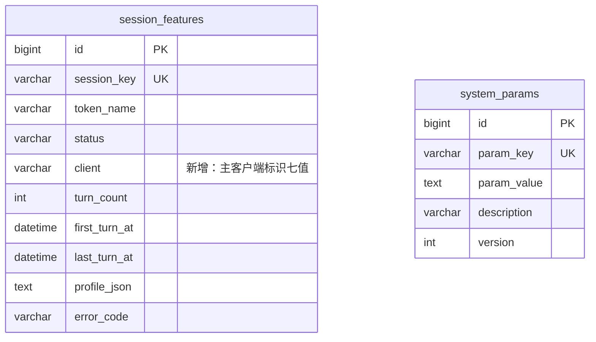

# 抽取规则分层 数据库模型设计文档

## 文档信息

| 项目 | 内容 |
|------|------|
| Feature | P2_TECH_004_TECH_抽取规则分层 |
| 模块代号 | TECH（技术组件，engine/extractor 子域结构重构） |
| 文档版本 | v1.0 |
| 创建日期 | 2026-08-28 |
| 作者 | lixuetao |
| 依据 | [01_功能需求规格说明书](01_功能需求规格说明书.md)（SSOT）、[AGENTS_DATABASE_API_RULE.md](../../../AGENTS_DATABASE_API_RULE.md)、[03_api_interface.md](03_api_interface.md)、基线 [P2_TECH_003 04_model_interface.md](../P2_TECH_003_TECH_会话特征抽取/04_model_interface.md) |

---

## 1. 设计范围声明

本 Feature 是基线 P2_TECH_003 的结构重构变更，数据库面只涉及两处：session_features 表新增 client 列、system_params 的 extractor.inject_prefixes 键 seed 与语义变更。本文档是基线 04 文档的**变更版**，只承载增量；表结构其余部分、ER 关系、索引策略、system_params 表结构全部沿用基线文档，不重复。

设计约定（主键、公共字段、命名、类型约束、无字典表）与基线 §1 完全一致，依据同一规则文件，无新增偏离。

---

## 2. ER 图（增量）



变更点：session_features 新增 client 列（置于 status 后，观测语义相邻）；system_params 表结构零变更，extractor.inject_prefixes 行的 param_value 语义从全量黑名单改为追加集（§4）。

---

## 3. 表结构定义（增量）

### 3.1 session_features.client 列

**表名：** `session_features`（基线表，本变更仅加列）

**DDL 语句（以 GORM 模型 tag 为权威，三库由 dialector 翻译）：**

模型层新增字段（落位 `internal/domain/session_feature.go`，置于 Status 与 TurnCount 之间）：

```go
Client string `gorm:"type:varchar(32);not null"` // 主客户端标识（探测七值），detail_invalid 行为空串
```

##### MySQL DDL（参考）

```sql
ALTER TABLE `session_features`
  ADD COLUMN `client` VARCHAR(32) NOT NULL DEFAULT '' COMMENT '主客户端标识（claude_code/opencode/workbuddy/omo/automation/mixed/unknown；detail_invalid行空串）' AFTER `status`;
```

##### PostgreSQL DDL（参考）

```sql
ALTER TABLE "session_features" ADD COLUMN "client" VARCHAR(32) NOT NULL DEFAULT '';
```

**实际落库路径：** GORM AutoMigrate 加列为主（规则文件 §1.1 加列是 AutoMigrate 范围），模型加字段随建表生效；另在 migrateDB 的 A 段加存量库幂等钩子 `migrateSessionFeatureClient`（表存在且列缺失时 `ALTER ... ADD COLUMN client varchar(32) NOT NULL DEFAULT ''`）：开发库与跑过 TECH_003 抽取的环境已有旧 schema 的 session_features 表，含数据行的库上 NOT NULL 无 default 加列会被 SQLite/PG 拒绝，钩子以 DEFAULT '' 兜底，旧行 client 为空串。参考 DDL 的 DEFAULT '' 与钩子同源，模型层无 default tag，新行由业务层显式置值（规则文件 §1.5 同源纪律）。SQLite 由 GORM 直接翻译，不单列 DDL。

---

**字段说明（增量列）：**

| 字段名 | 类型（MySQL）| 类型（PostgreSQL）| 必填 | 默认值 | 说明 |
|--------|------|------|------|--------|------|
| client | VARCHAR(32) | VARCHAR(32) | 是 | 业务层置值 | 主客户端标识，DetectClient 探测结果。值域七值：claude_code / opencode / workbuddy / omo / automation / mixed / unknown（Go 侧常量承载，规则文件 §1.8 无字典表）；detail_invalid 跳过行未经探测落空串（七值之外显式例外，观测按 client 聚合时空串行并入 detail_invalid 口径单独看）。枚举无敏感信息，随档案行落库不新增脱敏面（specs §3.3）[长度来源：枚举值最长 10 字符（claude_code），specs §2.3 定 varchar(32) 留余量] |

**索引说明（增量）：** client 列不加索引。按 client 聚合是 T5/T6 观测统计场景（周期级低频 GROUP BY，specs §2.5 SQL 示例），行量级万至十万（基线 04 §5 量级评估），全表聚合可承载；高频取数路径仍是 idx_token_first_turn，client 拆分与之正交。若后续观测消费升级为高频过滤，加单列索引归那时变更。

**业务规则（client 列与幂等状态机的交互，specs §2.4 能力3）：**

- **三态行均写入**：探测在 prepare 阶段与裁剪同步产出（单趟遍历），随三态行一并落库。探测对幂等判定零参与：Save 的状态机（无行 insert / success 复用 / failed 翻转 / skipped 终态）判定条件不含 client 列。
- **success/skipped 复用行不重探测**：复用路径 client 回传既有行值，不覆盖。
- **failed 行翻转 client 随新探测结果覆盖**：探测是纯函数，同一 Detail 结果确定，覆盖值恒等，无脏写面。
- **残留 failed 行终态化（session_not_found）**：上游已无会话不重探测，client 随元数据列（turn_count、first/last_turn_at）复用既有行原值，只翻 status 与 error_code。
- **detail_invalid 跳过行落空串**：判定在 prepare 之前短路（无消息可探测），client 是该路径唯一的空串来源。首抽即命中确定性拉取错误（ErrUnauthorized 等）落 failed 行 client=unknown（有会话引用但无探测输入），防 fetch 错误行混入 detail_invalid 观测桶。
- **翻转 UPDATE 并发防御不变**：基线 `WHERE id = ? AND status = ?` 双条件与 RowsAffected 收敛口径不涉及 client 列，沿用。

---

## 4. 数据初始化变更（extractor.inject_prefixes）

migrate.go 的 system_params seed 段变更：

| 项 | 基线 | 本变更 |
|----|------|--------|
| extractor.inject_prefixes seed 值 | `extractor.InjectPrefixes()` 出厂全集 JSON | 空数组 `[]`（specs §5.1：配置集不承载出厂前缀，出厂 seed 为空集） |
| extractor.redact_patterns seed 值 | `extractor.RedactPatterns()` | 不变 |

```sql
-- 变更后 seed（仅当键不存在时插入）
INSERT INTO system_params (id, param_key, param_value, description, version, created_at, updated_at)
SELECT <雪花ID>, 'extractor.inject_prefixes', '[]',
       '会话裁剪注入前缀全局追加黑名单（JSON数组，只追加不替换，出厂集在代码中）', 1, <now>, <now>
WHERE NOT EXISTS (SELECT 1 FROM system_params WHERE param_key = 'extractor.inject_prefixes');
```

实际仍由 migrate.go 的 seedStringArrayParam 以 Go 代码构造（values 传 `[]string{}`），幂等与并发双 seed 撞键口径沿用既有实现。

**存量库处置（specs §1.4：新项目无历史库，不做存量迁移）**：本项目当前无生产存量库，不写存量行清洗钩子。若有开发库残留基线全量 seed 行，该行在追加语义下会被当作「运维已追加全集」导致出厂前缀双份生效（并集去重后语义等价，仅参数页展示冗余），处置方式是手工删除该行或清库重建，属开发环境操作不进迁移代码。

**与 origin 伴生键机制的关系**：基线 04 §4 的出厂升级机制（origin 伴生键、factory 版本号）尚未落码，本变更将 inject_prefixes 的配置语义改为追加后，该键的出厂集不再进 DB，origin 机制对 inject_prefixes 失去适用对象（无出厂值可升级）；redact_patterns 仍为替换语义，若后续落 origin 机制仅覆盖该键。此项裁定随本设计冻结。

---

## 5. 索引策略汇总（增量）

本变更零新增索引、零索引变更，汇总表见基线 04 §5。量级与分表分库结论沿用基线（单表单库可承载）。

---

## 6. 环境变量

无新增，沿用基线 04 §7。

---

## 7. SSOT 合规与一致性

### 7.1 字段定义对齐 specs

- [x] client 列类型 varchar(32)、七值值域、三态行均写入、detail_invalid 空串例外：与 specs §2.3（client 列注释）与 §2.4 能力3 逐条一致。
- [x] specs §2.4 能力3 的四条幂等交互规则（复用不覆盖、failed 翻转覆盖、终态化复用、detail_invalid 空串）在 §3.1 业务规则全量承载。

### 7.2 业务规则在 DB 设计的体现

- [x] 追加语义变更（seed 空集、配置删除只收回运维条目）落 §4；键缺失/损坏回退空追加集的读取契约在 [03_api_interface.md](03_api_interface.md) §5.3。
- [x] 探测对幂等判定零参与（Save 状态机不含 client）显式声明，防实现期误把 client 纳入判定条件。
- [x] 隐私口径：client 是枚举标识非消息内容，specs §3.3 判定不新增脱敏面。

### 7.3 与接口设计的一致性

- [x] [03_api_interface.md](03_api_interface.md) §6 仓储契约的 Client 字段（varchar(32) not null）与本文 §3.1 模型 tag 一致。
- [x] specs §2.5 观测 SQL（GROUP BY client, status）在本文列结构与量级评估下可执行。

---

## 8. 不涉及的设计

- 评分、画像、看板等消费侧表（归 T5 与各业务域）。
- 会话原文与裁剪视图存储（specs §3.3 隐私架构沿用）。
- 参数页管理接口与界面（归系统参数域）。
- origin 伴生键机制的落地实现（基线机制未落码，本变更后 inject_prefixes 不再适用，见 §4 冻结裁定；redact_patterns 侧若后续需要归系统参数域变更）。

---

**文档版本：** v1.0
**最后更新：** 2026-08-28
**作者：** lixuetao
