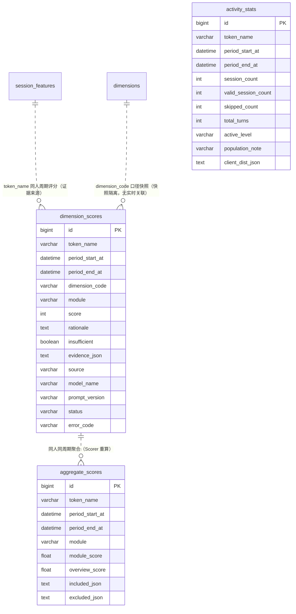

# 综合评估与聚合 数据库模型设计文档

## 文档信息

| 项目 | 内容 |
|------|------|
| Feature | P2_TECH_005_TECH_综合评估与聚合 |
| 模块代号 | TECH（技术组件，engine/evaluator + scorer + activity 子域） |
| 文档版本 | v1.3 |
| 创建日期 | 2026-09-05 |
| 作者 | lixuetao |
| 依据 | [01_功能需求规格说明书](01_功能需求规格说明书.md)（SSOT）、[AGENTS_DATABASE_API_RULE.md](../../../AGENTS_DATABASE_API_RULE.md)、[architecture.md](../../03_architecture/architecture.md) |

---

## 1. 设计依据与约定

### 1.1 数据库选型

按规则文件 §1.1，多库可切换（SQLite / PostgreSQL / MySQL），GORM AutoMigrate 为主建表加列加索引。模型 tag 一律用 GORM 通用类型（varchar/text/int/bigint/float），不写库特定类型。三张新表在 `model/migrate.go` 的 `allModels()` 登记参与 AutoMigrate。

### 1.2 主键策略

雪花 ID，应用层生成，模型 tag 只写 `gorm:"primaryKey"`（GORM 全局 Create 回调透明赋值）。本组件无 HTTP 面，三表主键无 JSON 序列化路径，不加 json tag；后续 F6/F9/F10 经 DTO 下发时须按规则文件 §1.2 双层 string 化（T4 同款预留声明）。

### 1.3 公共字段

统一含 `created_at`（autoCreateTime）与 `updated_at`（autoUpdateTime），不引入 creator/updater/tenant_id。三表均无逻辑删除需求（重算靠 upsert 覆盖、failed 翻转靠先删后落，历史周期行物理保留），不引入 `deleted_at`。

### 1.4 命名与类型约束

snake_case 字段命名，语义化复数表名（规则文件 §1.9）。半结构化数据（证据清单、口径快照、聚合快照、客户端分布）用 TEXT 列存序列化字符串，禁用 JSON 类型列。表关联不开外键约束，token_name 与 session_features 同名业务字段对齐。布尔列仅 dimension_scores.insufficient（模型层 bool，不加 default tag，业务层显式置值）。

### 1.5 不引入字典表

规则文件 §1.8 显式排除。status、source、active_level、population_note 枚举语义由 Go 侧常量加业务字段承载，字段说明不使用 `[字典：xxx]` 标注，无字典 INSERT 语句。

### 1.6 与 specs 的技术层偏差（按规则裁决）

技术实现层规则文件优先于 specs，以下偏差统一收敛（T4 §1.6 同款处理）：

| 项 | specs 表述 | 本设计 | 依据 |
|----|-----------|--------|------|
| 表名 | dimension_score / aggregate_score / activity_stat | `dimension_scores` / `aggregate_scores` / `activity_stats` | 规则文件 §1.9 复数化 NamingPolicy，与已落地表一致 |
| 时间列名 | period_start / period_end | `period_start_at` / `period_end_at` | 规则文件 §1.4 `xxx_at` 后缀语义；specs 已用 period_start/period_end 指 Period 结构体字段，列名带 _at 后区分 |
| period 列类型 | （specs 注释落 Unix 秒语义） | `time.Time` 列，仓储入参 Unix 秒转换 | 规则文件 §1.7 一律 time.Time；转换口径同 T4 first/last_turn_at |

---

## 2. ER 图



关联语义说明：三条虚线均为业务字段对齐而非外键（规则文件 §1.5 不开外键约束）。`dimension_scores.token_name + period_start_at` 定位同人同周期，评分行的 evidence_json 内 session_key 清单可追溯到 session_features 行（跨表追溯经应用层）；`dimension_code` 在落库时快照 dimensions 的口径（weight/InOverview 进 evidence_json），配置变更后历史行不随 dimensions 现值变动，这是快照隔离设计而非实时关联。

---

## 3. 表结构定义

### 3.1 维度评分表

#### 3.1.1 dimension_scores

**表名：** `dimension_scores`

**用途：** 单维度单周期评分记录的持久化载体。一人一周期一维度一行，承载 0-100 整数分、脱敏理由、insufficient 标记、证据清单与口径快照。写入方：本组件（source=conversation）与 F7 阅卷（source=active_test）；消费方：Scorer 聚合（ListByPersonPeriodExact）、F6 画像快照生成、F9 画像、T6 观测（eval_fail_ratio 分子）。

---

**DDL 语句（以 GORM 模型 tag 为权威，三库由 dialector 翻译；以下 DDL 供参考，DEFAULT 子句省略与时间列精度差异以 GORM 翻译为准）：**

##### MySQL DDL

```sql
CREATE TABLE `dimension_scores` (
  `id` BIGINT NOT NULL COMMENT '主键ID（雪花ID）',
  `token_name` VARCHAR(64) NOT NULL COMMENT '人员归属（上游调用令牌名）',
  `period_start_at` DATETIME NOT NULL COMMENT '评估周期起点（含）',
  `period_end_at` DATETIME NOT NULL COMMENT '评估周期终点（不含）',
  `dimension_code` VARCHAR(64) NOT NULL COMMENT '维度编码（维度配置原值快照）',
  `module` VARCHAR(32) NOT NULL COMMENT '所属模块编码（AI_USAGE/AI_MGMT/ENNEAGRAM）',
  `score` INT NOT NULL COMMENT '维度分0-100整数，insufficient与failed行落0',
  `rationale` TEXT NOT NULL COMMENT '评分理由（脱敏后，≤200字约定，schema容差2倍）',
  `insufficient` TINYINT(1) NOT NULL COMMENT '证据不足标记，true时聚合剔除',
  `evidence_json` TEXT NOT NULL COMMENT '证据与口径快照JSON（session_key清单+统计摘要+维度口径摘要）',
  `source` VARCHAR(16) NOT NULL COMMENT '数据来源 conversation/active_test',
  `model_name` VARCHAR(128) NOT NULL COMMENT '评分时启用模型ID，未调LLM行空串',
  `prompt_version` VARCHAR(16) NOT NULL COMMENT '评分prompt模板版本（evaluator包内常量）',
  `status` VARCHAR(16) NOT NULL COMMENT '评分状态 success/failed',
  `error_code` VARCHAR(64) NOT NULL COMMENT 'failed记组件错误码，success空串',
  `created_at` DATETIME NOT NULL COMMENT '创建时间',
  `updated_at` DATETIME NOT NULL COMMENT '更新时间',
  PRIMARY KEY (`id`),
  UNIQUE KEY `uk_person_period_dim` (`token_name`,`period_start_at`,`dimension_code`),
  KEY `idx_period_status` (`period_start_at`,`status`),
  KEY `idx_module_insufficient` (`module`,`insufficient`)
) ENGINE=InnoDB DEFAULT CHARSET=utf8mb4 COLLATE=utf8mb4_0900_ai_ci COMMENT='维度评分记录';
```

##### PostgreSQL DDL

```sql
CREATE TABLE "dimension_scores" (
  id BIGINT NOT NULL,
  token_name VARCHAR(64) NOT NULL,
  period_start_at TIMESTAMPTZ NOT NULL,
  period_end_at TIMESTAMPTZ NOT NULL,
  dimension_code VARCHAR(64) NOT NULL,
  module VARCHAR(32) NOT NULL,
  score INTEGER NOT NULL,
  rationale TEXT NOT NULL,
  insufficient BOOLEAN NOT NULL,
  evidence_json TEXT NOT NULL,
  source VARCHAR(16) NOT NULL,
  model_name VARCHAR(128) NOT NULL,
  prompt_version VARCHAR(16) NOT NULL,
  status VARCHAR(16) NOT NULL,
  error_code VARCHAR(64) NOT NULL,
  created_at TIMESTAMPTZ NOT NULL,
  updated_at TIMESTAMPTZ NOT NULL,
  CONSTRAINT "dimension_scores_pkey" PRIMARY KEY (id)
);
CREATE UNIQUE INDEX "uk_person_period_dim" ON "dimension_scores"("token_name", "period_start_at", "dimension_code");
CREATE INDEX "idx_period_status" ON "dimension_scores"("period_start_at", "status");
CREATE INDEX "idx_module_insufficient" ON "dimension_scores"("module", "insufficient");
COMMENT ON TABLE "dimension_scores" IS '维度评分记录';
```

> SQLite 由 GORM 直接翻译，不单列 DDL。GORM 模型落位 `internal/domain/dimension_score.go`。

---

**字段说明：**

| 字段名 | 类型（MySQL）| 类型（PostgreSQL）| 必填 | 默认值 | 说明 |
|--------|------|------|------|--------|------|
| id | BIGINT | BIGINT | 是 | - | 主键ID（雪花ID），应用层生成 [长度来源：雪花 int64] |
| token_name | VARCHAR(64) | VARCHAR(64) | 是 | - | 人员归属，上游调用令牌名（中文人名），与 session_features.token_name 同口径；喂 LLM 前剥离、落库时回填（specs §3.3）[长度来源：规则文件 §1.6 人员姓名，与 session_features 对齐] |
| period_start_at | DATETIME | TIMESTAMP | 是 | - | 评估周期起点（含），调用方 Period.Start 的 Unix 秒经 time.Unix(n,0).UTC() 转换写入；幂等判定与聚合读数按此列加 period_end_at 双界精确匹配 [长度来源：规则文件 §1.7 time.Time] |
| period_end_at | DATETIME | TIMESTAMP | 是 | - | 评估周期终点（不含），同上转换口径；定向分析窄窗口行与周期批量行按 period_start_at 隔离 [长度来源：同上] |
| dimension_code | VARCHAR(64) | VARCHAR(64) | 是 | - | 维度编码，取维度配置 code 原值（如 AI_INSTRUCTION）；唯一索引第三列，不含 source 列的前提是 DIM 数据来源单选、conversation 与 active_test 的 code 集合恒不相交（specs §2.3 注释）[长度来源：与 domain.Dimension.Code varchar(64) 对齐] |
| module | VARCHAR(32) | VARCHAR(32) | 是 | - | 所属模块编码，取维度配置 module_code 原值（AI_USAGE / AI_MGMT / ENNEAGRAM），聚合按此列分组 [长度来源：与 domain.Dimension.ModuleCode varchar(32) 对齐] |
| score | INT | INTEGER | 是 | - | 维度分 0-100 整数；insufficient 行落 0、failed 占位行落 0（真实分缺失由 status 与 insufficient 语义承载，聚合不读这两种行的分值）[长度来源：specs 0-100 整数分制] |
| rationale | TEXT | TEXT | 是 | 业务层置值 | 评分理由，LLM 从脱敏档案产出（≤200 字约定，schema 容差 2 倍），落库前过 Redact 第二道防线；insufficient 补行取 LLM 输出或配置缺省文案；零档案跳过行取缺省文案 [长度来源：规则文件 §1.6 长文本 TEXT] |
| insufficient | BOOLEAN | BOOLEAN | 是 | 业务层显式置值 | 证据不足标记：true 时评分照存但聚合剔除（等价权重归零），画像呈现维度分加标注；零有效档案、bypass/auto_client 签名、部分维度缺提示词三类路径均落 true；不加 default tag（规则文件 §1.5）[长度来源：bool] |
| evidence_json | TEXT | TEXT | 是 | 业务层置值 | 证据与口径快照序列化 JSON：周期 success 档案 session_key 清单 + 统计摘要快照 + 维度口径摘要（weight、in_overview，聚合唯一权重来源）+ config_missing 标记（缺提示词维度）。规则产出全量追溯，不用 LLM 引用防幻觉；F7 写入的 active_test 行须同构携带口径摘要（specs §2.4 能力1 注意事项，F7 消费契约）[长度来源：规则文件 §1.6 长文本 TEXT] |
| source | VARCHAR(16) | VARCHAR(16) | 是 | - | 数据来源：conversation（本组件）/ active_test（F7 阅卷），取维度配置 data_source 的落库形态（specs 用小写枚举，DIM 表存大写 CONVERSATION/TEST，落库时按 source 值域映射）[长度来源：枚举值最长 12 字符] |
| model_name | VARCHAR(128) | VARCHAR(128) | 是 | 业务层置空串 | 评分时经 EnabledModelProvider 解析的启用模型 ModelID；零档案跳过等未调 LLM 的行落空串；观测侧按模型拆分 schema 失败率（specs §6.4 问题2 排查路径）[长度来源：与 llm_configs.model_id 量级对齐留余量] |
| prompt_version | VARCHAR(16) | VARCHAR(16) | 是 | - | 评分 prompt 模板版本（evaluator 包内常量，如 v1），模板版本化演进时历史行口径可拆分观测（specs §3.2 档案演进兼容同构）[长度来源：版本号短串] |
| status | VARCHAR(16) | VARCHAR(16) | 是 | - | 评分状态：success（含 insufficient 标记行）/ failed（LLM 段失败全维度占位，error_code 记因，补跑重评）。与 session_features 三态差异：评分行无 skipped 态（零档案走 insufficient+success）[长度来源：枚举值最长 7 字符] |
| error_code | VARCHAR(64) | VARCHAR(64) | 是 | 业务层置空串 | failed 记组件错误码（ErrLLMEvalUpstream / ErrSchemaInvalid），success 空串；值域与 specs §2.3 错误码表对齐 [长度来源：specs 错误码值域] |
| created_at | DATETIME | TIMESTAMP | 是 | GORM 自动 | 创建时间，autoCreateTime |
| updated_at | DATETIME | TIMESTAMP | 是 | GORM 自动 | 更新时间，autoUpdateTime，upsert 覆盖落库时刷新；显式 UTC 与 T4 utcNow 同口径（SQLite 文本字典序可比） |

**索引说明：**

| 索引名 | 类型 | 字段 | 用途 |
|--------|------|------|------|
| PRIMARY | PRIMARY KEY | id | 主键索引 |
| uk_person_period_dim | UNIQUE | token_name, period_start_at, dimension_code | upsert 幂等键：同人同周期同维度唯一，重评覆盖、F7 写入与 conversation 行天然防撞（两 source 的 dimension_code 集合不相交）；本表无软删除，无规则文件 §1.10 的 NULL 语义问题 |
| idx_period_status | INDEX | period_start_at, status | T6 周期观测：eval_fail_ratio 按周期聚合 failed 行计数（分子），周期内点查 |
| idx_module_insufficient | INDEX | module, insufficient | F6 快照生成与 F9 画像、F10 看板的模块级维度分读取路径（按模块过滤、insufficient 标注呈现），兜底消费方查询 |

**业务规则：**

- **幂等与重评（specs §2.4 能力1/6 唯一权威）**：Evaluate 前按双界精确匹配读同人同周期 source=conversation 行。全 success 且维度集合齐 → Reused=true 跳过 LLM；存在 failed → 先删同人同周期 source=conversation 的 failed 行再完整重评（整体重评非单维补评，active_test 行不动）；重评产出行按唯一索引 upsert 全列覆盖。
- **insufficient 行口径**：score 落 0、insufficient=true、status=success；三类产出路径（LLM 输出 insufficient、schema 缺失维度补行、零有效档案全维度跳过）同型落库，聚合一律剔除。
- **failed 占位行**：LLM 段失败（ErrLLMEvalUpstream/ErrSchemaInvalid）时全维度落 failed 行（score=0、rationale 空串或占位、error_code 记因），当期聚合照常推进（剔除 failed 维度），补跑时先删后评翻转。
- **权重快照契约**：evidence_json 内维度口径摘要（weight、in_overview）是聚合的唯一权重来源，Scorer 不从 dimension 域现读（防当期重算引入新权重）；F7 写入行必须同构携带（跨 Feature 契约，specs §2.4 能力1 注意事项）。
- **时间转换**：period_start_at/period_end_at 由 Period 的 Unix 秒转换写入，查询双界精确匹配用 `time.Unix(n,0).UTC()`（T4 ListByPersonAndRange 同款 UTC 口径）。
- **隐私边界**：rationale 只存脱敏后文本（Redact 第二道防线），evidence_json 只存 session_key 清单与统计摘要（数字与键），prompt 文本与档案内容禁落任何列（specs §3.3）。
- **无软删除**：重评覆盖与 failed 翻转均为 upsert/物理删除，历史周期行物理保留供画像趋势消费。

---

### 3.2 聚合结果表

#### 3.2.1 aggregate_scores

**表名：** `aggregate_scores`

**用途：** 单模块单周期聚合记录的持久化载体。一人一周期一模块一行加一行总览（module 落哨兵值 overview），承载模块分/总览分与参与/剔除维度快照。写入方：Scorer.Aggregate（upsert）；消费方：F6 画像快照、F9 画像、F10 看板、F7 阅卷后刷新。

---

**DDL 语句：**

##### MySQL DDL

```sql
CREATE TABLE `aggregate_scores` (
  `id` BIGINT NOT NULL COMMENT '主键ID（雪花ID）',
  `token_name` VARCHAR(64) NOT NULL COMMENT '人员归属（上游调用令牌名）',
  `period_start_at` DATETIME NOT NULL COMMENT '评估周期起点（含）',
  `period_end_at` DATETIME NOT NULL COMMENT '评估周期终点（不含）',
  `module` VARCHAR(32) NOT NULL COMMENT '模块编码，总览行落哨兵值overview',
  `module_score` DOUBLE NULL COMMENT '模块分（加权平均保留一位小数），总览行与全剔除模块为NULL',
  `overview_score` DOUBLE NULL COMMENT '总览分（仅总览行落值），全剔除为NULL',
  `included_json` TEXT NOT NULL COMMENT '参与聚合维度编码与权重快照JSON',
  `excluded_json` TEXT NOT NULL COMMENT '剔除维度清单JSON（insufficient与failed）',
  `created_at` DATETIME NOT NULL COMMENT '创建时间',
  `updated_at` DATETIME NOT NULL COMMENT '更新时间',
  PRIMARY KEY (`id`),
  UNIQUE KEY `uk_person_period_module` (`token_name`,`period_start_at`,`module`)
) ENGINE=InnoDB DEFAULT CHARSET=utf8mb4 COLLATE=utf8mb4_0900_ai_ci COMMENT='聚合结果';
```

##### PostgreSQL DDL

```sql
CREATE TABLE "aggregate_scores" (
  id BIGINT NOT NULL,
  token_name VARCHAR(64) NOT NULL,
  period_start_at TIMESTAMPTZ NOT NULL,
  period_end_at TIMESTAMPTZ NOT NULL,
  module VARCHAR(32) NOT NULL,
  module_score DOUBLE PRECISION,
  overview_score DOUBLE PRECISION,
  included_json TEXT NOT NULL,
  excluded_json TEXT NOT NULL,
  created_at TIMESTAMPTZ NOT NULL,
  updated_at TIMESTAMPTZ NOT NULL,
  CONSTRAINT "aggregate_scores_pkey" PRIMARY KEY (id)
);
CREATE UNIQUE INDEX "uk_person_period_module" ON "aggregate_scores"("token_name", "period_start_at", "module");
COMMENT ON TABLE "aggregate_scores" IS '聚合结果';
```

> SQLite 由 GORM 直接翻译。module_score/overview_score 模型层用 `*float64`（可空，规则文件 §1.7 可空字段指针口径），tag 用 GORM 通用 float 类型。

---

**字段说明：**

| 字段名 | 类型（MySQL）| 类型（PostgreSQL）| 必填 | 默认值 | 说明 |
|--------|------|------|------|--------|------|
| id | BIGINT | BIGINT | 是 | - | 主键ID（雪花ID），应用层生成 [长度来源：雪花 int64] |
| token_name | VARCHAR(64) | VARCHAR(64) | 是 | - | 人员归属，同 dimension_scores 口径 [长度来源：规则文件 §1.6] |
| period_start_at | DATETIME | TIMESTAMP | 是 | - | 评估周期起点（含），与评分行同转换口径；聚合读数按双界精确匹配 [长度来源：规则文件 §1.7] |
| period_end_at | DATETIME | TIMESTAMP | 是 | - | 评估周期终点（不含），同上 [长度来源：同上] |
| module | VARCHAR(32) | VARCHAR(32) | 是 | - | 模块编码：业务模块行落维度配置 module_code 原值（AI_USAGE / AI_MGMT / ENNEAGRAM），总览行为独立行落哨兵值 `overview`（specs §2.3 注释）。哨兵值与 DIM 模块枚举（ACTIVITY/AI_USAGE/AI_MGMT/ENNEAGRAM）无碰撞，活跃度模块无聚合行（RULE 维度不评分）[长度来源：与 module_code 对齐] |
| module_score | DOUBLE | DOUBLE PRECISION | 否 | NULL | 模块分：模块内 InOverview 且非剔除维度的加权平均，保留一位小数（round half up）；总览行恒 NULL、模块全剔除时 NULL（画像呈现数据不足）[长度来源：float64] |
| overview_score | DOUBLE | DOUBLE PRECISION | 否 | NULL | 总览分：全部参与维度跨模块直接加权平均，保留一位小数；仅总览行落值，业务模块行恒 NULL，无任何参与维度时 NULL [长度来源：float64] |
| included_json | TEXT | TEXT | 是 | 业务层置值 | 参与聚合维度与权重快照：模块 → [{code, weight}]（IncludedWeight 序列化），权重取评分行 evidence_json 口径摘要（快照权重，含 active_test 行）；口径差异排查的追溯依据（specs §6.4 问题3）[长度来源：规则文件 §1.6 长文本 TEXT] |
| excluded_json | TEXT | TEXT | 是 | 业务层置值 | 剔除维度清单：模块 → [code]（insufficient 与 failed 维度），画像降权标注呈现的数据来源 [长度来源：同上] |
| created_at | DATETIME | TIMESTAMP | 是 | GORM 自动 | 创建时间 |
| updated_at | DATETIME | TIMESTAMP | 是 | GORM 自动 | 更新时间，upsert 覆盖时刷新，显式 UTC 口径 |

**索引说明：**

| 索引名 | 类型 | 字段 | 用途 |
|--------|------|------|------|
| PRIMARY | PRIMARY KEY | id | 主键索引 |
| uk_person_period_module | UNIQUE | token_name, period_start_at, module | upsert 幂等键：同人同周期同模块（含 overview 哨兵行）唯一；无软删除无 §1.10 问题 |

画像/看板按 token_name + 周期读取全部行走唯一索引前缀，无额外索引需求（单人周期行数为模块数+1，量级个位数）。

**业务规则：**

- **聚合口径（specs §2.4 能力5 唯一权威）**：聚合域为同人同周期双界精确匹配的全部 status=success 评分行（两 source 并列）；insufficient 维度与 failed 维度剔除出聚合；模块分按模块内 InOverview 且参与维度的实际权重归一化（Σ(score×weight)/Σweight，权重和偏离 100 不校验不纠偏）；总览分跨模块直接聚合；保留一位小数 round half up。
- **空聚合覆盖**：全剔除时 module_score/overview_score 写 NULL 显式落空，旧聚合行的非空值不保留（upsert 全列覆盖）；聚合行照常落库，画像按数据不足呈现。
- **幂等重算**：Aggregate 按唯一索引 upsert（同人同周期同模块覆盖更新），F7 阅卷新增评分行后重调即刷新；历史周期行不动（配置变更历史不重算）。
- **写入时机**：EvaluatePerson 组合路径落一次；F7 阅卷后自调一次；两者并发由唯一索引兜底（后写者覆盖，重算幂等无正确性问题）。
- **快照一致性**：included/excluded 快照取自当次聚合读到的评分行 evidence_json，与 module_score 同批落库，保证行内自洽。

---

### 3.3 活跃度统计表

#### 3.3.1 activity_stats

**表名：** `activity_stats`

**用途：** 单人单周期活跃度记录的持久化载体。一人一周期一行，承载会话计数、有效会话数、分级、人群签名标注与客户端分布。写入方：activity.StatPersonByKey / StatPerson（upsert）；消费方：F6 画像快照生成、F9 画像（活跃度模块呈现、签名 note i18n）、T6 观测（population_signature_ratio 按 population_note 分桶、unused_ratio）。

---

**DDL 语句：**

##### MySQL DDL

```sql
CREATE TABLE `activity_stats` (
  `id` BIGINT NOT NULL COMMENT '主键ID（雪花ID）',
  `token_name` VARCHAR(64) NOT NULL COMMENT '人员归属（上游调用令牌名）',
  `period_start_at` DATETIME NOT NULL COMMENT '评估周期起点（含）',
  `period_end_at` DATETIME NOT NULL COMMENT '评估周期终点（不含）',
  `session_count` INT NOT NULL COMMENT '窗口内会话总数（列表口径）',
  `valid_session_count` INT NOT NULL COMMENT '有效会话数（档案status∈{success,failed}口径）',
  `skipped_count` INT NOT NULL COMMENT 'skipped档案行数',
  `total_turns` INT NOT NULL COMMENT '轮次合计（列表口径含skipped会话）',
  `active_level` VARCHAR(16) NOT NULL COMMENT '活跃分级 active/low_freq/unused',
  `population_note` VARCHAR(64) NOT NULL COMMENT '人群签名文案键，空串为normal',
  `client_dist_json` TEXT NOT NULL COMMENT '按档案行client列聚合的分布JSON',
  `created_at` DATETIME NOT NULL COMMENT '创建时间',
  `updated_at` DATETIME NOT NULL COMMENT '更新时间',
  PRIMARY KEY (`id`),
  UNIQUE KEY `uk_person_period` (`token_name`,`period_start_at`),
  KEY `idx_period_level` (`period_start_at`,`active_level`),
  KEY `idx_period_note` (`period_start_at`,`population_note`)
) ENGINE=InnoDB DEFAULT CHARSET=utf8mb4 COLLATE=utf8mb4_0900_ai_ci COMMENT='使用活跃度统计';
```

##### PostgreSQL DDL

```sql
CREATE TABLE "activity_stats" (
  id BIGINT NOT NULL,
  token_name VARCHAR(64) NOT NULL,
  period_start_at TIMESTAMPTZ NOT NULL,
  period_end_at TIMESTAMPTZ NOT NULL,
  session_count INTEGER NOT NULL,
  valid_session_count INTEGER NOT NULL,
  skipped_count INTEGER NOT NULL,
  total_turns INTEGER NOT NULL,
  active_level VARCHAR(16) NOT NULL,
  population_note VARCHAR(64) NOT NULL,
  client_dist_json TEXT NOT NULL,
  created_at TIMESTAMPTZ NOT NULL,
  updated_at TIMESTAMPTZ NOT NULL,
  CONSTRAINT "activity_stats_pkey" PRIMARY KEY (id)
);
CREATE UNIQUE INDEX "uk_person_period" ON "activity_stats"("token_name", "period_start_at");
CREATE INDEX "idx_period_level" ON "activity_stats"("period_start_at", "active_level");
CREATE INDEX "idx_period_note" ON "activity_stats"("period_start_at", "population_note");
COMMENT ON TABLE "activity_stats" IS '使用活跃度统计';
```

---

**字段说明：**

| 字段名 | 类型（MySQL）| 类型（PostgreSQL）| 必填 | 默认值 | 说明 |
|--------|------|------|------|--------|------|
| id | BIGINT | BIGINT | 是 | - | 主键ID（雪花ID），应用层生成 [长度来源：雪花 int64] |
| token_name | VARCHAR(64) | VARCHAR(64) | 是 | - | 人员归属，同 dimension_scores 口径 [长度来源：规则文件 §1.6] |
| period_start_at | DATETIME | TIMESTAMP | 是 | - | 评估周期起点（含），同转换口径 [长度来源：规则文件 §1.7] |
| period_end_at | DATETIME | TIMESTAMP | 是 | - | 评估周期终点（不含），同上 [长度来源：同上] |
| session_count | INT | INTEGER | 是 | - | 窗口内该人会话总数，列表口径（StatPerson 传入列表计数或 StatPersonByKey 拉取后分组计数，按 session_key 去重兜底）；人群签名 tc=1 占比与列表量门槛的分母 [长度来源：int] |
| valid_session_count | INT | INTEGER | 是 | - | 有效会话数：档案集 status ∈ {success, failed} 行数（末轮归属过滤后的 status 口径全集），skipped 不计；分级判据（specs 术语表）[长度来源：int] |
| skipped_count | INT | INTEGER | 是 | - | skipped 档案行数（同集合口径）；列表口径与档案口径差值的解释项之一 [长度来源：int] |
| total_turns | INT | INTEGER | 是 | - | 轮次合计，列表口径（含 skipped 会话的轮次），表征使用强度；与能力证据口径（档案侧）语义分离不混用（specs §2.4 能力3 注意事项）[长度来源：int] |
| active_level | VARCHAR(16) | VARCHAR(16) | 是 | - | 活跃分级：active（有效数 ≥ 活跃下限，DIM 默认 10）/ low_freq（≥ 低频下限，默认 5）/ unused；auto_client 签名强制 unused；阈值运行时从 dimension_settings 读取 [长度来源：枚举值最长 8 字符（low_freq）] |
| population_note | VARCHAR(64) | VARCHAR(64) | 是 | 业务层置空串 | 人群签名文案键（i18n 键，前端呈现归 F6/F9）：空串=normal、evidence_note.auto_client、evidence_note.bypass、evidence_note.threshold（首期不生效）、evidence_note.work_tc1；只落枚举键不落中文文案，避免文案变更动数据（specs §2.4 能力4 注意事项）[长度来源：键名最长 33 字符（evidence_note.bypass_orchestrator）留余量] |
| client_dist_json | TEXT | TEXT | 是 | 业务层置值 | 按档案行 client 列聚合的分布 JSON（map[client]count，三态行均含 client 列，detail_invalid 行空串计入空串桶）；观测侧人工核对签名判定的人工复核依据（specs §6.4 问题4）[长度来源：规则文件 §1.6 长文本 TEXT，七值加空串桶量级很小] |
| created_at | DATETIME | TIMESTAMP | 是 | GORM 自动 | 创建时间 |
| updated_at | DATETIME | TIMESTAMP | 是 | GORM 自动 | 更新时间，upsert 覆盖时刷新，显式 UTC 口径 |

**索引说明：**

| 索引名 | 类型 | 字段 | 用途 |
|--------|------|------|------|
| PRIMARY | PRIMARY KEY | id | 主键索引 |
| uk_person_period | UNIQUE | token_name, period_start_at | upsert 幂等键：同人同周期唯一（specs 明确唯一索引不含 period_end，定向窗口起点与批量起点重合时按幂等覆盖语义处理）；无软删除无 §1.10 问题 |
| idx_period_level | INDEX | period_start_at, active_level | T6 观测（F11 呈现）：unused_ratio 按周期聚合 unused 行计数 |
| idx_period_note | INDEX | period_start_at, population_note | T6 观测：population_signature_ratio 按周期按 note 文案键分桶计数 |

**业务规则：**

- **统计口径（specs §2.4 能力3 唯一权威）**：窗口归属按 last_turn_time ∈ [Start, End)（末轮归属）；档案侧取数 start 前移 24h 缓冲后统一内存过滤归一（跨边界会话跨周期只计一次）；ValidSessionCount/SkippedCount/ClientDist 为档案口径，SessionCount/TotalTurns 为列表口径，两口径语义分离。
- **分级判定**：ActiveLevel 按 ValidSessionCount 与 dimension_settings 阈值比较；签名 auto_client 命中时强制 unused（C08 承接）；阈值热调在新一轮统计生效。
- **人群签名判定次序**：failed 主导（failed 行占比 ≥ 50%）前置排除 → success 占比 ≥ 20% 走 work_tc1 正常路径 → client 全行属旁路族判 bypass_orchestrator → 其余档案趋零形态判 auto_client；threshold_overskip 首期保留枚举不生效；空档案集边界（0 行）按列表量分派 auto_client/normal。判据细节与分母口径以 specs §2.4 能力4 表格为唯一权威。
- **幂等 upsert**：同人同周期重跑按唯一索引全列覆盖，历史周期行不动。
- **签名 note 落库单点**：评分侧（Evaluate 全维度 insufficient 处置）与活跃度侧共用 IdentifyPopulation 产出，两侧档案集合口径一致，规避同人 note 与评分处置矛盾（specs §2.4 能力4 描述）。

---

## 4. 数据初始化

三表首启为空，随评估跑批增长，**无数据初始化语句**。人群签名阈值（活跃 10 / 低频 5）与维度口径均来自 dimensions / dimension_settings 既有配置（P2_DIM_001 落地，migrateDB 已 seed dimension_settings 单行），本 Feature 无新参数键（rationale 脱敏复用 extractor.redact_patterns 既有键，见 [03_api_interface.md](03_api_interface.md) §5.3）。

---

## 5. 索引策略汇总

| 表 | 索引名 | 类型 | 字段 | 用途 |
|----|--------|------|------|------|
| dimension_scores | PRIMARY | PRIMARY KEY | id | 主键 |
| dimension_scores | uk_person_period_dim | UNIQUE | token_name, period_start_at, dimension_code | 评分 upsert 幂等键 |
| dimension_scores | idx_period_status | INDEX | period_start_at, status | T6 失败率观测 |
| dimension_scores | idx_module_insufficient | INDEX | module, insufficient | 画像/看板模块级读取 |
| aggregate_scores | PRIMARY | PRIMARY KEY | id | 主键 |
| aggregate_scores | uk_person_period_module | UNIQUE | token_name, period_start_at, module | 聚合 upsert 幂等键 |
| activity_stats | PRIMARY | PRIMARY KEY | id | 主键 |
| activity_stats | uk_person_period | UNIQUE | token_name, period_start_at | 活跃度 upsert 幂等键 |
| activity_stats | idx_period_level | INDEX | period_start_at, active_level | 未使用人群占比观测 |
| activity_stats | idx_period_note | INDEX | period_start_at, population_note | 签名分桶观测 |

无分表分库策略。量级评估：百人级 × 每周一次跑批，dimension_scores 年增量十万行内（人均周期 8-20 维度），aggregate_scores 与 activity_stats 年增量万行内，单表单库可承载；聚合与幂等读数均走唯一索引前缀点查，观测索引兜底周期级聚合扫描。

---

## 6. 缓存与性能

本 Feature 无 Redis 缓存需求：三表写入按人粒度 upsert（一人一任务，低并发争用），聚合读数为单人周期点查（索引前缀命中，≤ 100ms/人 specs §3.1）；维度口径每任务读一次 DB（周期跑批低频，无热点配置缓存诉求，与 T4 参数读取同判）。性能约束（活跃度 ≤500ms、组装 ≤200ms、聚合 ≤100ms、LLM ≤120s 正常路径）由组件实现承载，见 specs §3.1 与 [03_api_interface.md](03_api_interface.md) §3.3。

---

## 7. 环境变量

无新增。LLM 密钥、集成密钥、Asynq 并发度复用既有配置；评估行为常量（MinValidProfilesForEval / MaxProfileSetTokens / MaxProfileSetChars / MaxRationaleChars / ScoreMin / ScoreMax）为 evaluator 包内常量随源码发版（specs §2.2），不入库不入环境变量。

---

## 8. SSOT 合规与一致性

### 8.1 字段定义对齐 specs

- dimension_scores 列集合与 specs §2.3 DimensionScore 注释一一对应：token_name、period_start、period_end、dimension_code、module、score、rationale、insufficient、evidence_json、source、model_name、prompt_version、status、error_code、雪花主键，无增删。
- aggregate_scores 列集合与 AggregateResult 注释一一对应：module、module_score（可空）、overview_score（仅总览行）、included_json（IncludedWeight 快照）、excluded_json、哨兵值 overview 行结构。
- activity_stats 列集合与 ActivityStat 注释一一对应：session_count、valid_session_count、skipped_count、total_turns、active_level、population_note、client_dist_json。
- 三处技术层偏差（表名复数、时间列 _at 后缀加 Unix 秒转换、period 列 time.Time 化）已在 §1.6 显式声明并给出规则依据，语义与 specs 等价。

### 8.2 业务规则在 DB 设计的体现

- 幂等语义（评分复用/failed 先删后评、聚合与活跃度 upsert 覆盖、历史周期不动）：三表唯一索引加各自业务规则段承载。
- insufficient 标记 + 聚合剔除 + 空值显式落空：§3.1/§3.2 业务规则段（specs §2.4 能力5 规则 4/6）。
- 人群签名（判定次序、failed 主导排除、强制 unused、note 枚举键）：§3.3 业务规则段，判据细节以 specs 为唯一权威。
- 隐私架构（rationale 脱敏、evidence 只存键与数字、人名剥离）：§3.1 隐私边界条目。
- 权重快照契约（聚合唯一权重来源、F7 同构携带）：§3.1/§3.2 业务规则段。

### 8.3 与接口设计的一致性

[03_api_interface.md](03_api_interface.md) 的仓储契约（ListByPersonPeriodExact / DeleteConversationFailed / SaveAll / UpsertAll / Upsert）与本文三表唯一索引一一对应；payload 的 period_start/period_end 为 Unix 秒，与 period_start_at/period_end_at 的转换口径在仓储层闭环；雪花 ID 无 JSON 序列化路径（本组件无 HTTP 面），F6/F9/F10 下发时再双层 string 化（§1.2 预留声明）。

---

## 9. 不涉及的设计

- 画像快照表、看板聚合表、态势表（F6/F9/F10 各业务域，消费本组件三表数据二次汇聚）。
- F7 阅卷写入 active_test 评分行的字段扩展（若 F7 需要附加列，走其 Feature 的变更设计；本表结构对其够用）。
- 跑批任务记录、失败清单表（T6；specs 明确无独立失败清单页）。
- prompt 模板内容与维度配置的存储（分别归 evaluator 包内常量与 dimensions 既有表）。

---

**文档版本：** v1.3
**最后更新：** 2026-09-06
**作者：** lixuetao
