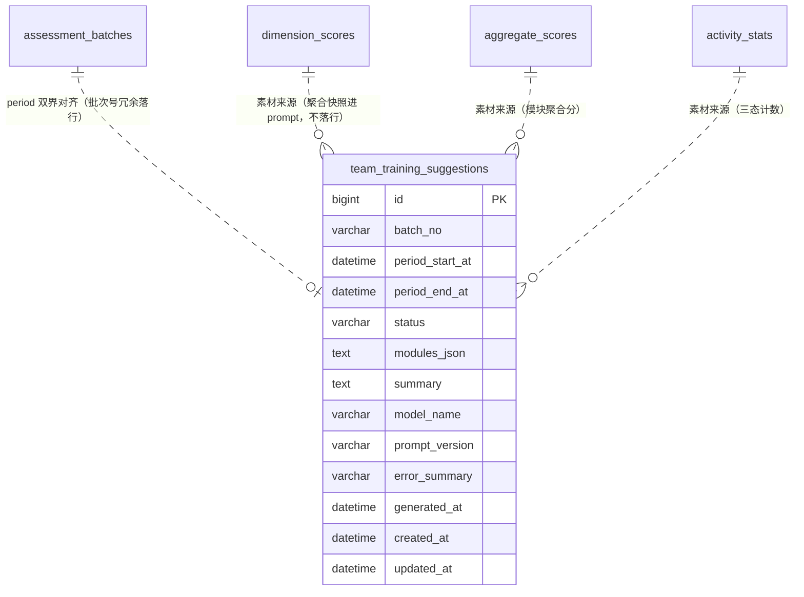

# 团队看板 数据库模型设计文档

## 文档信息

| 项目 | 内容 |
|------|------|
| Feature | P2_TMD_001_FEAT_团队看板 |
| 模块代号 | TMD（团队看板域） |
| 文档版本 | v1.0 |
| 创建日期 | 2026-10-05 |
| 作者 | lixuetao |
| 依据 | [01_功能需求规格说明书](01_功能需求规格说明书.md)（SSOT）、[AGENTS_DATABASE_API_RULE.md](../../../AGENTS_DATABASE_API_RULE.md)、[architecture.md](../../03_architecture/architecture.md)、[03_api_interface.md](03_api_interface.md) |

---

## 1. 设计依据与约定

### 1.1 数据库选型

按规则文件 §1.1，多库可切换（SQLite / MySQL / PostgreSQL），GORM AutoMigrate 为主建表加列加索引。模型 tag 一律用 GORM 通用类型（varchar/text/int/bigint），不写库特定类型。一张新表在 `model/migrate.go` 的 allModels() 尾部登记，首版建表无存量数据，不需手写迁移钩子。

### 1.2 主键策略

雪花 ID，应用层生成，模型 tag 只写 `gorm:"primaryKey"`（GORM 全局 Create 回调透明赋值）。本表无 HTTP 序列化路径（03 §2.4：建议内容按 period 定位，接口不回显雪花 ID）；雪花 ID 仅在 worker payload（batch_id 十进制字符串，任务内 strconv 解析）与 assessment_batches 主键间流转，行内以 batch_no 业务批次号承载关联（非雪花），domain 层不加 json tag，规则文件 §1.2 的双层 string 化约束在本表无落点。

### 1.3 公共字段

统一含 `created_at`（autoCreateTime）与 `updated_at`（autoUpdateTime），不引入 creator/updater/tenant_id。无逻辑删除需求：建议行是生成链路的幂等载体，同 period 重跑覆盖续作而非删除（specs §5.1.4 规则2），历史建议行随 period 保留（回看需求本期不承载，但行不清理），不引入 deleted_at。

### 1.4 命名与类型约束

snake_case 字段命名，语义化复数表名（规则文件 §1.9）。表名 `team_training_suggestions` 为 specs §5.1.3 直接命名的实体（specs 明文引用该表名，SSOT 优先于复数化惯例的再推导，实体复数化天然满足）。半结构化数据（两模块建议清单）用 TEXT 列存序列化 JSON，禁用 JSON 类型列。表关联不开外键约束，`batch_no` 为业务字段关联（批次号冗余落行，消费方免联表），关联完整性由应用层保证（period 匹配在 service 层校验）。

### 1.5 不引入字典表

规则文件 §1.8 显式排除。`status` 枚举语义由 Go 侧常量加业务字段承载，字段说明不使用 `[字典：xxx]` 标注，无字典 INSERT 语句。

### 1.6 与 specs 的技术层偏差（按规则裁决）

| 项 | specs 表述 | 本设计 | 依据 |
|----|-----------|--------|------|
| 建议行唯一键 | 以 period 起止为唯一约束（一区间一行，批次号为随 upsert 更新的普通字段） | `uk_suggestion_period` 复合唯一索引 (period_start_at, period_end_at)，batch_no 普通列随重置续作更新 | specs §5.1.3/§5.1.4 规则2 明文；批次号参与唯一键会让重跑批次生成第二行，违背一区间一行 |
| 生成失败原因 | 建议行落 failed 状态与失败原因 | `error_summary` varchar(255)，与 assessment_batches.error_summary 同名同档 | specs §5.1.5 异常表「记因」；规则文件 §1.6 标题/简介档 varchar(255) |
| 两模块建议载体 | 携带两模块建议 JSON | 单 TEXT 列 `modules_json` 存两模块数组（`[{"module":"AI_USAGE","suggestions":[...]}, ...]`），单列单次 upsert | 规则文件 §1.5 半结构化数据 TEXT 列；拆两列会让重置续作的列清单翻倍且模块顺序无存储语义 |

---

## 2. ER 图



关联语义说明：唯一业务关联是对齐 `assessment_batches` 的 period 双界（重跑批次命中同一 period 即同一建议行），`batch_no` 为批次号冗余（最新生成所属批次，随重置续作更新）；三张素材表与建议行无落库关联（素材经 prompt 汇总后只保留 LLM 产出的脱敏建议文本，聚合数字不落本表，specs §5.2.4 规则3 聚合实时计算不落库）。

---

## 3. 表结构定义

### 3.1 团队培训方向建议表

#### 3.1.1 team_training_suggestions

**表名：** `team_training_suggestions`

**用途：** 团队级培训方向建议的落库载体（specs §5.1.3），一行一评估区间。承载建议生成任务的幂等状态机（生成中行即拾取锁，specs §5.1.4 规则5）与 LLM 产出的脱敏建议内容。写入方：suggest-tick（幂等建行/重置续作）、suggest-generate（终态落库）；消费方：团队看板页建议区（A1 suggestion 字段）。

---

**DDL 语句（以 GORM 模型 tag 为权威，三库由 dialector 翻译；以下 DDL 供参考，DEFAULT 子句省略与时间列精度差异以 GORM 翻译为准）：**

##### MySQL DDL

```sql
CREATE TABLE `team_training_suggestions` (
  `id` BIGINT NOT NULL COMMENT '主键ID（雪花ID）',
  `batch_no` VARCHAR(32) NOT NULL COMMENT '最新生成所属周期批次号（冗余，随重置续作更新）',
  `period_start_at` DATETIME NOT NULL COMMENT '评估周期起点（含）',
  `period_end_at` DATETIME NOT NULL COMMENT '评估周期终点（不含）',
  `status` VARCHAR(16) NOT NULL COMMENT '建议行状态 generating/generated/failed',
  `modules_json` TEXT NOT NULL COMMENT '两模块建议清单JSON（脱敏后）',
  `summary` TEXT NOT NULL COMMENT '团队综合研判（脱敏后）',
  `model_name` VARCHAR(128) NOT NULL COMMENT '生成时启用模型ID',
  `prompt_version` VARCHAR(16) NOT NULL COMMENT '建议prompt模板版本',
  `error_summary` VARCHAR(255) NOT NULL COMMENT '失败原因摘要，非failed为空串',
  `generated_at` DATETIME NULL COMMENT '生成完成时间，非generated为NULL',
  `created_at` DATETIME NOT NULL COMMENT '创建时间',
  `updated_at` DATETIME NOT NULL COMMENT '更新时间',
  PRIMARY KEY (`id`),
  UNIQUE KEY `uk_suggestion_period` (`period_start_at`,`period_end_at`)
) ENGINE=InnoDB DEFAULT CHARSET=utf8mb4 COLLATE=utf8mb4_0900_ai_ci COMMENT='团队培训方向建议';
```

##### PostgreSQL DDL

```sql
CREATE TABLE "team_training_suggestions" (
  id BIGINT NOT NULL,
  batch_no VARCHAR(32) NOT NULL,
  period_start_at TIMESTAMPTZ NOT NULL,
  period_end_at TIMESTAMPTZ NOT NULL,
  status VARCHAR(16) NOT NULL,
  modules_json TEXT NOT NULL,
  summary TEXT NOT NULL,
  model_name VARCHAR(128) NOT NULL,
  prompt_version VARCHAR(16) NOT NULL,
  error_summary VARCHAR(255) NOT NULL,
  generated_at TIMESTAMPTZ,
  created_at TIMESTAMPTZ NOT NULL,
  updated_at TIMESTAMPTZ NOT NULL,
  CONSTRAINT "team_training_suggestions_pkey" PRIMARY KEY (id)
);
CREATE UNIQUE INDEX "uk_suggestion_period" ON "team_training_suggestions"("period_start_at", "period_end_at");
COMMENT ON TABLE "team_training_suggestions" IS '团队培训方向建议';
```

> SQLite 由 GORM 直接翻译，不单列 DDL。GORM 模型落位 `internal/domain/team_training_suggestion.go`。

---

**字段说明：**

| 字段名 | 类型（MySQL）| 类型（PostgreSQL）| 必填 | 默认值 | 说明 |
|--------|------|------|------|--------|------|
| id | BIGINT | BIGINT | 是 | - | 主键ID（雪花ID），应用层生成，GORM Create 回调透明赋值 [长度来源：雪花 int64] |
| batch_no | VARCHAR(32) | VARCHAR(32) | 是 | 业务层置值 | 最新生成所属周期批次号（assessment_batches.batch_no 冗余快照，消费方免联表）。tick 拾取建行/重置续作时刷新为当前命中批次号；specs §5.1.4 规则2 判定 b 以此列比对建议行所属批次新旧 [长度来源：与 assessment_batches.batch_no 对齐] |
| period_start_at | DATETIME | TIMESTAMPTZ | 是 | - | 评估周期起点（含），Unix 秒经 time.Unix(n,0).UTC() 转换写入，与 dimension_scores 等上游表同口径。与 period_end_at 构成唯一约束承载一区间一行（specs §5.1.4 规则2 幂等 upsert 冲突键） [长度来源：规则文件 §1.7 time.Time] |
| period_end_at | DATETIME | TIMESTAMPTZ | 是 | - | 评估周期终点（不含），同上转换口径。唯一约束第二列 [长度来源：规则文件 §1.7 time.Time] |
| status | VARCHAR(16) | VARCHAR(16) | 是 | 业务层置 generating | 建议行状态三态（specs §6 唯一权威）：`generating` 生成中（含任务级重试续作中，行存在即拾取锁）/ `generated` 已生成（LLM 产出校验通过并脱敏落库）/ `failed` 生成失败（重试耗尽或批次数据异常，error_summary 记因）。转换：generating→generated、generating→failed、generated/failed→generating（同 period 重跑周期批次终态成功后重生成，specs §6 第三行） [长度来源：枚举值最长 10 字符] |
| modules_json | TEXT | TEXT | 是 | 业务层置空串 | 两模块建议清单 JSON 序列化：`[{"module":"AI_USAGE","suggestions":[{"name":"...","description":"..."}]}, ...]`，每模块 2-4 条（specs §5.1.2 步4）。落库前经 Redact 脱敏；建行时置空串占位，终态覆盖写入 [长度来源：规则文件 §1.6 长文本 TEXT] |
| summary | TEXT | TEXT | 是 | 业务层置空串 | 团队综合研判（LLM 产出一段文本，specs §5.1.2 步4），脱敏后落库；建行时置空串占位 [长度来源：规则文件 §1.6 长文本 TEXT] |
| model_name | VARCHAR(128) | VARCHAR(128) | 是 | 业务层置空串 | 生成时启用模型 ModelID（排他启用唯一模型快照，与 dimension_scores.model_name 同口径）；建行（未调 LLM）置空串 [长度来源：与既有表 model_name 对齐] |
| prompt_version | VARCHAR(16) | VARCHAR(16) | 是 | 业务层置空串 | 建议生成 prompt 模板版本（suggestgen 包内常量，evaluator/questiongen 同模式） [长度来源：与既有表 prompt_version 对齐] |
| error_summary | VARCHAR(255) | VARCHAR(255) | 是 | 业务层置空串 | 生成失败原因摘要（LLM 重试耗尽 / 返回校验持续失败 / 批次数据异常，specs §5.1.5），failed 行非空，其余空串 [长度来源：规则文件 §1.6 标题/简介档，与 assessment_batches.error_summary 对齐] |
| generated_at | DATETIME | TIMESTAMPTZ | 否 | NULL | 生成完成时间（generated 落库时刻），非 generated 为 NULL；看板建议区展示（specs §4.1.2 E 建议区间） [长度来源：规则文件 §1.7 可空指针] |
| created_at | DATETIME | TIMESTAMPTZ | 是 | GORM 自动 | 创建时间（首次拾取建行时刻） |
| updated_at | DATETIME | TIMESTAMPTZ | 是 | GORM 自动 | 更新时间（续作重置与终态落库时刷新，显式 UTC 口径与 T4 utcNow 同，SQLite 文本字典序可比） |

**索引说明：**

| 索引名 | 类型 | 字段 | 用途 |
|--------|------|------|------|
| PRIMARY | PRIMARY KEY | id | 主键索引 |
| uk_suggestion_period | UNIQUE | period_start_at, period_end_at | 一区间一行幂等约束（specs §5.1.4 规则2）：tick 幂等建行的冲突键、跨 tick 重复拾取与并发落库的数据库层兜底。本表无软删除，无规则文件 §1.10 的 NULL 语义问题 |

**业务规则：**

- **状态机（specs 第 6 章唯一权威）**：generating → generated（LLM 校验通过且落库成功）/ generating → failed（重试耗尽 / 校验持续失败 / 批次数据异常）；generated / failed → generating（同 period 重跑周期批次终态 success 后 tick 拾取重置续作）。终态更新走条件写（`WHERE status='generating'` 守卫），重置续作走条件写（`WHERE status IN ('generated','failed')` 守卫），affected=0 即竞态或非法转换，幂等返回。
- **拾取锁语义**：generating 行存在期间 tick 扫描条件不命中（specs §5.1.4 规则5），跨 tick 重复拾取由行存在性拦下；唯一约束兜底并发建行撞键（UniqueViolation 容错收敛，与首启 seed 同范式）。
- **重跑覆盖**：仅同 period 重跑周期批次终态为 success 才重生成覆盖（部分失败/失败的重跑不覆盖既有建议行，specs §5.1.4 规则2 判定 b），重置沿用既有行（uk 命中 UPDATE，不产生第二行）。
- **失败不阻断**：failed 行看板走提示态，下个周期批次自然覆盖（specs §5.1.4 规则3）；不回溯阻断批次链路、不产告警信号。
- **隐私边界**：modules_json 与 summary 只存 Redact 后的脱敏文本；聚合素材数字不落本表（实时聚合，specs §5.2.4 规则3）；prompt 全文禁落任何列。

---

## 4. 消费表清单（全部只读）

看板查询链路读七张既有表（含 JOIN 中间表 assessment_test_tasks）加一个上游系统，读写属性为**全部只读**（specs §1.1 只读消费定位；架构 2.2 结果消费层经 repository 直接读取）。表结构定义归各自 Feature 的模型文档，此处登记取数口径与索引核对。

| 表 | 来源 Feature | 取数口径 | 消费场景 |
|----|-------------|---------|---------|
| activity_stats | P2_TECH_005（F6 链路落库） | 所选区间全行（三态计数）+ 上一落库区间全行（环比） | 活跃度概览 |
| dimension_scores | P2_TECH_005 + P2_TST_001（conversation 与 active_test 源并列落库） | 所选区间全公司行按 source 分模块聚合（剔除 insufficient/failed）；A2 为窗口全区间行逐期聚合 | 维度均分雷达、低分占比、共性短板、走势序列 |
| aggregate_scores | P2_TECH_005（scorer 聚合落库） | 全表 distinct period 双界（区间列表并集来源之一）；建议素材的模块聚合分（module_score 平均） | 区间列表、建议素材 |
| assessment_test_results | P2_TST_001（enneagram 阅卷落库） | 经 task_id JOIN assessment_test_tasks 取 staff_name，每人最新 grading_status=scored 且 main_type 非空行（03 §1.8 过滤降级占位行），复用 ListLatestScoredByStaffNames | 九型构成快照、测评覆盖数 |
| assessment_test_tasks | P2_TST_001 | 仅作 results 取人的 JOIN 中间表（test_type=enneagram 的任务行） | 判型行到人的映射 |
| assessment_batches | P2_ASM_001 | period 双界匹配行的 finished_at（同区间多批次取最新终态，03 §1.8）；建议生成扫描周期批次终态记录 | 数据更新时间、建议拾取 |
| dimensions | P2_DIM_001 | 启用且 module ∈ {AI_USAGE, AI_MGMT} 的维度集合（雷达轴、短板判定、走势分面基准） | 维度基准集合与显示名 |
| sili-smart-api 用户体系 | 外部（integration/userapi） | WalkStaffPages 翻页全员名单计数 | 全员人数（统计分母） |

人员归属键：上游四表的 `token_name` 列与 userapi `staff_name`（username）同源（P2_ASM_001 §1.6 既定契约），联接键为字符串等值匹配。

### 4.1 索引与查询性能核对

既有表索引已覆盖本域查询形态，逐项核对（索引定义为来源 Feature 交付，此处验证匹配性）：

| 查询形态（03 §4.3） | 命中索引 | 判定 |
|---------------------|---------|------|
| dimension_scores 按区间全公司取行（A1 均分/低分占比） | idx_period_status (period_start_at, status) | 已覆盖（period 等值 + status 过滤，行数级为全员 × 维度数，百人级量级无压力，F9 公司均分同款） |
| dimension_scores 按窗口多区间全公司取行（A2 逐期走势） | idx_period_status | 已覆盖（period_start_at IN 窗口区间集，最多 8 期） |
| activity_stats 按区间全行计数 | idx_period_level (period_start_at, active_level) | 已覆盖 |
| aggregate_scores 全表 distinct period | uk_person_period_module 首列扫描或全表扫描 | 已覆盖（行数级为全员 × 模块数 × 期数，distinct 归并在内存做） |
| assessment_test_results 按 tasks JOIN 取人 | uk_result_task（task_id 点查）+ tasks 表 idx_staff_name / idx_type_status_created | 已覆盖（F9 ListLatestScoredByStaffNames 既有方法直接复用） |
| assessment_batches 按 period 双界匹配 | 全表扫描或 idx_status_triggered 辅助 | 已覆盖（批次行数级为周频一条加重跑，量级极小） |
| team_training_suggestions 按 period 新到旧取第一条 | uk_suggestion_period | 已覆盖（建议行一区间一行，行数级同期数，量级极小） |
| 看板/趋势批量 IN 聚合（specs §5.2.4 规则1 防逐人逐维度查询） | 同上各索引 | 已覆盖 |

**结论：无需新增索引。** 本表查询形态均为低行数点查或既有评估链路查询形态的只读复用，最重查询为 A2 趋势的 8 期全公司维度行批量 IN 聚合（百人级 × 13 维 × 8 期），远低于这些表在跑批链路中的写入与查询压力。

---

## 5. 不落库的数据口径（查询期派生）

以下数据为展示期实时计算或规则映射，刻意不落库（specs 明文或按只读消费定位推导），开发时按 03 文档执行，此处汇总防误建列建表：

| 数据 | 计算位置 | 不落库依据 |
|------|---------|-----------|
| 维度全员均分与低分占比 | A1/A2 查询期实时聚合 | specs §4.1.4 规则3：均分为展示期实时聚合，不落库 |
| 共性短板判定 | A1 查询期按未取整均分计算 | specs §4.1.4 规则4：展示期计算口径，非持久化实体 |
| 综合分与较上期变化 | A2 查询期逐期计算 | specs §4.2.4 规则2：接口计算，无存储语义 |
| 活跃度三态计数与环比 | A1 查询期计数 | specs §5.2.2 步1：聚合实时计算 |
| 九型构成快照统计 | A1 查询期对最新判型集合统计 | specs §4.1.4 规则5：快照口径实时统计 |
| 全维度均值参考线 | A1 查询期计算 | specs §4.1.4 规则3：实时聚合不落库 |
| 建议生成的素材快照（均分/聚合分/三态/短板清单） | 生成任务现算进 prompt，不落行 | specs §5.2.4 规则3 聚合实时计算不落库；建议行只存 LLM 产出的脱敏文本 |
| 服务端缓存 | 无 | specs §5.2.4 规则3：不加服务端缓存 |

---

## 6. 数据初始化与 seed

无 seed 行。建议表首启为空，行由建议生成链路随周期批次终态自然产生；无数据初始化语句。无新增系统参数键：脱敏正则复用既有 inject 前缀键（extractor.ParamKeyRedactPatterns，Redact 调用侧同 grading），建议链路常量（240s 超时、MaxRetry 3、窗口 8 期等）为包内常量随源码发版（03 §4.4）。

---

## 7. SSOT 合规与一致性

- [x] 无新增实体遗漏：specs 新增持久化实体仅 team_training_suggestions（§5.1.3 明文）；聚合快照、看板物化、建议素材落库等易误建对象已在 §5 逐项排除。
- [x] 主键/公共字段/命名/类型约束：雪花主键应用层生成（§1.2）、created_at/updated_at 无审计列（§1.3）、snake_case 与语义化表名（§1.4）、TEXT 存序列化 JSON 无 JSON 类型列（§1.6）、无外键约束（§1.4）、布尔列不存在（状态枚举承载）、无字典表（§1.5），均符合规则文件 §1.2-1.10。
- [x] 字段说明与索引说明完整：本表 13 字段全量说明含长度来源标注（§3.1），索引 2 项含用途（§3.1）。
- [x] 字段长度参考 specs：status/modules_json/error_summary 等列宽来源逐字段标注（specs 枚举值、对齐既有表、规则文件档位）。
- [x] 与 03 接口文档一致：A1 suggestion 字段为 status/period/内容四态映射（03 §1.5），建议行状态三态加 none 无行态与 specs 第 6 章状态表一致；两段式任务契约（03 §4.1/§4.2）的建行/续作/终态条件写与 §3.1 业务规则对应。
- [x] 架构一致：结果消费层经 repository 直接读取、数据依赖而非服务调用（架构 2.2/2.3）；建议生成任务为 worker 层 Asynq 任务，遵循 scheduler 注册 + task handler + NewMux 单一注册入口的既有模式。

---

## 8. 不涉及的设计

- 任何既有表的 DDL 变更、迁移钩子：消费表全部只读，本 feature 仅新增一张表，model/migrate.go 只追加 allModels() 登记。
- 建议行软删除与清理任务：specs 无删除语义（重跑覆盖续作、失败自然覆盖），行随期数增长量级为周频一行，无需清理。
- 建议素材快照列（聚合数字落行）：specs §5.2.4 规则3 实时聚合，素材进 prompt 不落库（§5 已列）。
- Redis 缓存键设计：本 feature 无缓存（specs §5.2.4 规则3）。
- 对外预留接口的凭据存储：本域无对外输出通道（specs 无 §5.3 类预留）。

---

**文档版本：** v1.0
**最后更新：** 2026-10-05
**作者：** lixuetao
