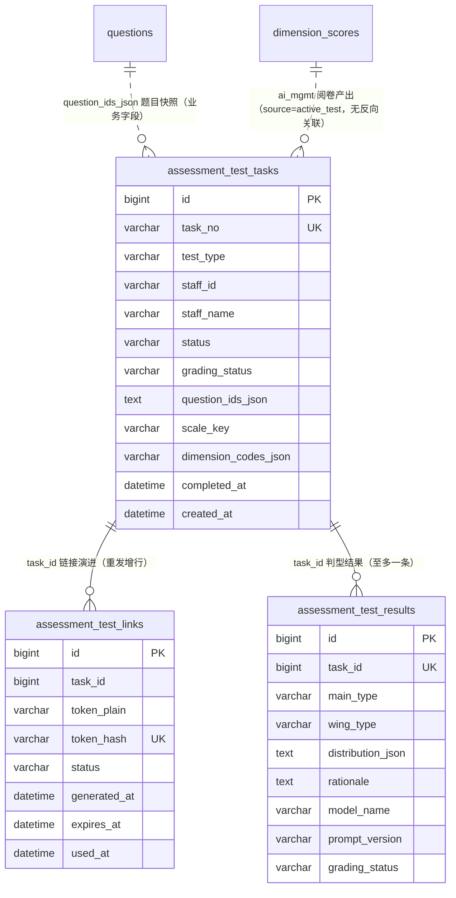

# 主动测试评估运营 数据库模型设计文档

## 文档信息

| 项目 | 内容 |
|------|------|
| Feature | P2_TST_001_FEAT_主动测试评估运营 |
| 模块代号 | TST（主动测试域） |
| 文档版本 | v1.1 |
| 创建日期 | 2026-09-28 |
| 作者 | lixuetao |
| 依据 | [01_功能需求规格说明书](01_功能需求规格说明书.md)（SSOT）、[AGENTS_DATABASE_API_RULE.md](../../../AGENTS_DATABASE_API_RULE.md)、[architecture.md](../../03_architecture/architecture.md)、[03_api_interface.md](03_api_interface.md) |

---

## 1. 设计依据与约定

### 1.1 数据库选型

按规则文件 §1.1，多库可切换（SQLite / MySQL / PostgreSQL），GORM AutoMigrate 为主建表加列加索引。模型 tag 一律用 GORM 通用类型（varchar/text/int/bigint），不写库特定类型。三张新表在 `model/migrate.go` 的 `allModels()` 尾部登记（现有 19 个模型之后），首版建表无存量数据，不需手写迁移钩子。

### 1.2 主键策略

雪花 ID，应用层生成，模型 tag 只写 `gorm:"primaryKey"`（GORM 全局 Create 回调透明赋值）。三张表均有 HTTP 序列化路径，主键与外键 `task_id` 按规则文件 §1.2 双层 string 化（domain 与 service DTO 各打 `json:"id,string"` / `json:"task_id,string"`），前端类型用 string。

### 1.3 公共字段

统一含 `created_at`（autoCreateTime）与 `updated_at`（autoUpdateTime），不引入 creator/updater/tenant_id。三表均无逻辑删除需求：测试任务是运营审计留痕（取消是终态不是删除，specs §8.3 偏离记录第 4 条），链接行随重发新增不删旧行（历史链接可见性 specs §4.3.4 规则1），判型结果为阅卷产出。均不引入 `deleted_at`。

### 1.4 命名与类型约束

snake_case 字段命名，语义化复数表名（规则文件 §1.9）。`assessment_test_*` 前缀与既有 `assessment_batches` 家族同域归置，表明评估运营域内主动测试线与批次线并列且物理隔离。半结构化数据（题目快照、倾向分布、判定依据）用 TEXT 列存序列化 JSON，禁用 JSON 类型列。表关联不开外键约束，`task_id`/`question_ids` 为业务字段关联，关联完整性由应用层保证。

布尔列：本域无布尔列（三态及以上语义均用状态枚举承载）。

### 1.5 不引入字典表

规则文件 §1.8 显式排除。`test_type`、`status`、`link_status`、`grading_status`、`enneagram_code` 枚举语义由 Go 侧常量加业务字段承载，字段说明不使用 `[字典：xxx]` 标注，无字典 INSERT 语句。

### 1.6 与 specs 的技术层偏差（按规则裁决）

| 项 | specs 表述 | 本设计 | 依据 |
|----|-----------|--------|------|
| 表名 | 测试任务记录 / 作答链接记录 / 评分记录 | `assessment_test_tasks` / `assessment_test_links` / `assessment_test_results` | 规则文件 §1.9 复数化 NamingPolicy；`assessment_` 前缀归置评估运营域 |
| 令牌存储 | 生成一次性作答令牌与作答链接 | `token_plain` 落原文、`token_hash` 落 SHA-256 双列：原文列支撑链接弹窗事后展示链接全文（specs §4.3.4 规则1 历史链接也可见，哈希不可逆），哈希列承载 F8 校验点查与唯一性兜底 | specs §4.3.4 规则1 展示需求；防枚举语义收敛为令牌随机不可预测加一次性有效（specs §5.1.4 规则1 本义），双列各司其职 |
| 九型评分记录 | 阅卷结果落库（评分记录，含 evidence） | 判型结果独立表 `assessment_test_results`，不写 `dimension_scores` | specs §5.2.4 规则2 与 P2_DIM_001 参考性口径：九型不进硬性聚合，写 dimension_scores 会被聚合链路消费违背物理隔离 |
| ai_mgmt 评分落点 | 阅卷成功汇入个人画像 | 写既有 `dimension_scores`（source=active_test）+ 自调聚合，不建新评分表 | TECH_005 §6 跨 Feature 契约已预留 active_test 源；避免第二套评分存储 |
| 题目快照形态 | 固化题目快照（题目 ID 列表与内容） | `question_ids_json` 落 ID 数组，文本经 ID 现读 questions（Unscoped 含软删行） | specs §5.1.2 步骤2 与 §8.1 术语表「题目 ID 列表」为权威表述；文本级冻结需求出现时再扩展快照列（03 文档 §4.6 注记） |
| 发起人 | 落测试任务记录（…发起人、发起时间） | 不落发起人列 | 规则文件 §1.3 明确不引入审计人字段（creator/updater）；specs §2.1 平台账号全量共享无创建人隔离，发起人无消费方 |

---

## 2. ER 图



关联语义说明：三条线均为业务字段对齐而非外键（规则文件 §1.5）。`assessment_test_links` 一任务多行（创建与每次重发各一行，当前链接为最新行）；`assessment_test_results` 一任务至多一行（uk_result_task 幂等）；ai_mgmt 类任务的阅卷产出落既有 `dimension_scores`（token_name=staff_name 对齐、source=active_test），与 conversation 行按 dimension_code 集合不相交天然防撞（TECH_005 §3.1.1 唯一索引口径）。

---

## 3. 表结构定义

### 3.1 测试任务表

#### 3.1.1 assessment_test_tasks

**表名：** `assessment_test_tasks`

**用途：** 一次主动测评的持久化载体（specs §8.1 术语表：一人一类型一任务），任务状态机与阅卷状态机的双轴持有者。一行一任务，承载对象快照、类型、题目快照、双状态轴与完成时间。写入方：发起接口（创建）、F8 回调（StartSession/CompleteTask，03 文档 §4.6）、逾期 tick（推进 expired）、取消接口、阅卷任务（grading_status 推进）；消费方：评测运营中心页两 tab、F8 作答页（经 service）、F11 工作台（逾期态势）。

---

**DDL 语句（以 GORM 模型 tag 为权威，三库由 dialector 翻译；以下 DDL 供参考，DEFAULT 子句省略与时间列精度差异以 GORM 翻译为准）：**

##### MySQL DDL

```sql
CREATE TABLE `assessment_test_tasks` (
  `id` BIGINT NOT NULL COMMENT '主键ID（雪花ID）',
  `task_no` VARCHAR(32) NOT NULL COMMENT '任务号，T/E前缀+日期+4位当日序号',
  `test_type` VARCHAR(16) NOT NULL COMMENT '测试类型 ai_mgmt/enneagram',
  `staff_id` VARCHAR(64) NOT NULL COMMENT '被测评人标识（上游user_id字符串快照）',
  `staff_name` VARCHAR(64) NOT NULL COMMENT '被测评人姓名快照（人员归属键）',
  `status` VARCHAR(16) NOT NULL COMMENT '任务状态 pending/in_progress/completed/expired/canceled',
  `grading_status` VARCHAR(16) NOT NULL COMMENT '阅卷状态 waiting/grading/scored/degraded',
  `question_ids_json` TEXT NOT NULL COMMENT '题目快照（题目雪花ID数组的JSON序列化）',
  `scale_key` VARCHAR(32) NOT NULL COMMENT '量表标识，仅enneagram任务非空',
  `dimension_codes_json` TEXT NOT NULL COMMENT '子能力维度编码快照（JSON数组），仅ai_mgmt任务非空',
  `completed_at` DATETIME NULL COMMENT '完成时间（作答提交时刻），未完成为NULL',
  `created_at` DATETIME NOT NULL COMMENT '创建时间（发起时间）',
  `updated_at` DATETIME NOT NULL COMMENT '更新时间',
  PRIMARY KEY (`id`),
  UNIQUE KEY `uk_task_no` (`task_no`),
  KEY `idx_type_status_created` (`test_type`,`status`,`created_at`),
  KEY `idx_staff_name` (`staff_name`)
) ENGINE=InnoDB DEFAULT CHARSET=utf8mb4 COLLATE=utf8mb4_0900_ai_ci COMMENT='主动测试任务记录';
```

##### PostgreSQL DDL

```sql
CREATE TABLE "assessment_test_tasks" (
  id BIGINT NOT NULL,
  task_no VARCHAR(32) NOT NULL,
  test_type VARCHAR(16) NOT NULL,
  staff_id VARCHAR(64) NOT NULL,
  staff_name VARCHAR(64) NOT NULL,
  status VARCHAR(16) NOT NULL,
  grading_status VARCHAR(16) NOT NULL,
  question_ids_json TEXT NOT NULL,
  scale_key VARCHAR(32) NOT NULL,
  dimension_codes_json TEXT NOT NULL,
  completed_at TIMESTAMPTZ,
  created_at TIMESTAMPTZ NOT NULL,
  updated_at TIMESTAMPTZ NOT NULL,
  CONSTRAINT "assessment_test_tasks_pkey" PRIMARY KEY (id)
);
CREATE UNIQUE INDEX "uk_task_no" ON "assessment_test_tasks"("task_no");
CREATE INDEX "idx_type_status_created" ON "assessment_test_tasks"("test_type", "status", "created_at");
CREATE INDEX "idx_staff_name" ON "assessment_test_tasks"("staff_name");
COMMENT ON TABLE "assessment_test_tasks" IS '主动测试任务记录';
```

> SQLite 由 GORM 直接翻译，不单列 DDL。GORM 模型落位 `internal/domain/assessment_test_task.go`。

---

**字段说明：**

| 字段名 | 类型（MySQL）| 类型（PostgreSQL）| 必填 | 默认值 | 说明 |
|--------|------|------|------|--------|------|
| id | BIGINT | BIGINT | 是 | - | 主键ID（雪花ID），应用层生成 [长度来源：雪花 int64] |
| task_no | VARCHAR(32) | VARCHAR(32) | 是 | 业务层置值 | 任务号，格式：T 前缀（ai_mgmt）/ E 前缀（enneagram）+ yyyyMMdd + 4 位当日序号（如 `T202609280001`，共 13 字符），运营人工沟通的引用锚点（specs §4.1.2 B）。当日序号在任务创建事务内取号（按同前缀同日期已有最大序号递增），`uk_task_no` 唯一约束兜底防并发重号（specs §5.1.2 步骤2） [长度来源：specs 编号规则，32 字符留余量] |
| test_type | VARCHAR(16) | VARCHAR(16) | 是 | - | 测试类型：`ai_mgmt`（AI 管理能力，情境题对话作答）/ `enneagram`（九型人格，量表全量作答）。决定任务号前缀、组卷来源与阅卷产出落点 [长度来源：枚举值最长 9 字符] |
| staff_id | VARCHAR(64) | VARCHAR(64) | 是 | - | 被测评人标识快照，上游 user_id 的字符串形态（发起时经 `GET /api/staffs` 选定）。发起事务内经上游校验存在性（specs §5.1.5）；供 F8 会话对齐与后续画像按人归并的辅助键，人员归属主键为 staff_name [长度来源：规则文件 §1.6 标识符档] |
| staff_name | VARCHAR(64) | VARCHAR(64) | 是 | - | 被测评人姓名快照（人名即标识，系统无工号）。与 `dimension_scores.token_name`/`assessment_batch_persons.token_name` 同口径的人员归属键，ai_mgmt 阅卷评分行按此列对齐；列表「对象」列与搜索的消费字段（specs §4.1.2 B） [长度来源：规则文件 §1.6 人员姓名，与既有表对齐] |
| status | VARCHAR(16) | VARCHAR(16) | 是 | 业务层置 pending | 任务状态五态（specs §6.1 唯一权威）：`pending` 待作答 / `in_progress` 进行中（F8 会话上报）/ `completed` 已完成（终态，作答侧）/ `expired` 已逾期 / `canceled` 已取消（终态）。转换：pending→in_progress/completed/expired/canceled、in_progress→completed/canceled、expired→pending（重发）/canceled；completed 与 canceled 无出边 [长度来源：枚举值最长 11 字符] |
| grading_status | VARCHAR(16) | VARCHAR(16) | 是 | 业务层置 waiting | 阅卷状态四态（specs §6.1）：`waiting` 待阅卷 / `grading` 阅卷中（含重试等待）/ `scored` 已评分（九型 tab 呈现为已判定，取值同源文案前端映射）/ `degraded` 已降级（重试耗尽终态）。与任务状态独立双轴：作答侧终态后阅卷异步推进；已取消任务的阅卷照常推进到终态（specs §5.2.4 规则4），作答未提交的取消任务停留 waiting [长度来源：枚举值最长 8 字符] |
| question_ids_json | TEXT | TEXT | 是 | 业务层置值 | 题目快照：任务创建时取题集合的题目雪花 ID 数组 JSON 序列化（specs §5.1.4 规则2）。作答与阅卷的取题集合以此为准，与题库后续启停/编辑/删除隔离（删除题经 Unscoped 现读）。ai_mgmt 为勾选子能力的全部启用 AI 题，enneagram 为最新引入量表的全部启用 SCALE 题；创建事务内同步写题目 `reference_count` +1 [长度来源：规则文件 §1.6 长文本 TEXT] |
| scale_key | VARCHAR(32) | VARCHAR(32) | 是 | 业务层置空串 | 量表标识：`RISO_HUDSON` / `ESSENCE`，仅 enneagram 任务非空（组卷时最新引入的一套，specs §4.2.4 规则2），ai_mgmt 任务空串。留痕组卷来源，任务创建后题库再引入新量表不影响已建任务 [长度来源：与 questions.scale_key 对齐] |
| dimension_codes_json | TEXT | TEXT | 是 | 业务层置值 | 子能力维度编码快照：发起时勾选的 AI_MGMT 子能力 dimension code 数组 JSON 序列化，仅 ai_mgmt 任务非空（'[]'），enneagram 任务空数组。阅卷按此圈定评分维度与 evidence_json 口径摘要来源（specs §4.2.2 A 子能力维度、§5.2.2 步骤2c）；编码快照而非 ID 快照与 dimension_scores.dimension_code 口径对齐 [长度来源：规则文件 §1.6 长文本 TEXT] |
| completed_at | DATETIME | TIMESTAMP | 否 | NULL | 完成时间（员工作答提交时刻），与 status→completed 同批写入；列表「完成时间」列消费，未完成显示 —（specs §4.1.2 B） [长度来源：规则文件 §1.7 可空指针] |
| created_at | DATETIME | TIMESTAMP | 是 | GORM 自动 | 创建时间即发起时间，列表按此列倒序（specs §8.3 偏离记录第 2 条：按发起时间倒序） |
| updated_at | DATETIME | TIMESTAMP | 是 | GORM 自动 | 更新时间，状态推进时刷新，显式 UTC 口径（与 T4 utcNow 同，SQLite 文本字典序可比） |

**索引说明：**

| 索引名 | 类型 | 字段 | 用途 |
|--------|------|------|------|
| PRIMARY | PRIMARY KEY | id | 主键索引 |
| uk_task_no | UNIQUE | task_no | 任务号唯一：人工引用锚点，事务内取号的并发兜底（撞键重取序号重试）；本表无软删除，无规则文件 §1.10 的 NULL 语义问题 |
| idx_type_status_created | INDEX | test_type, status, created_at | 两 tab 列表主查询路径：按类型（tab）加状态筛选按发起时间倒序分页；轮询计数（A2）与逾期 tick 扫描（status=pending）共用前缀 |
| idx_staff_name | INDEX | staff_name | keyword 搜索的姓名分支与 F9 画像按人聚合的消费路径 |

**业务规则：**

- **状态机（specs §6.1/§6.2 唯一权威）**：任务五态转换全部走条件更新（`WHERE status IN (前置态集合)`），affected=0 即并发竞态或非法转换，返回 1802 或幂等跳过。completed/canceled 终态无出边；expired 经重发回到 pending（新链接新有效期，specs §4.1.4 规则1）。
- **双状态轴独立**：status 承载作答侧（运营观察面），grading_status 承阅览卷侧（AI 处理面），互不联动改写；列表两列独立呈现（specs §6.2 说明）。取消不冻结 grading_status（specs §5.2.4 规则4）。
- **取题与引用计数同事务**：创建事务为「校验对象（上游）→ 取题（题库）→ 取号 → 落任务行 → 落链接行 → 题目 reference_count +1」六步，任一步失败整体回滚（specs §5.1.4 规则3、§5.1.5）。
- **快照不可变**：question_ids_json/scale_key/dimension_codes_json 创建后不再刷新，题库与维度配置后续变更不回改已建任务（specs §5.1.4 规则2）。
- **无软删除**：任务是运营审计留痕，取消为终态保留呈现，物理保留供 F9/F11 消费。

---

### 3.2 作答链接表

#### 3.2.1 assessment_test_links

**表名：** `assessment_test_links`

**用途：** 一次性作答令牌与链接生命周期的载体。一行一链接：任务创建落首行，每次重发增一行（旧行终态化 invalid），当前链接为该任务最新一行。写入方：发起接口（创建）、重发接口（作废旧行+落新行）、F8 回调（used）、逾期 tick（invalid）、取消接口（invalid）；消费方：作答链接弹窗、F8 令牌校验（哈希比对）。

---

**DDL 语句（以 GORM 模型 tag 为权威）：**

##### MySQL DDL

```sql
CREATE TABLE `assessment_test_links` (
  `id` BIGINT NOT NULL COMMENT '主键ID（雪花ID）',
  `task_id` BIGINT NOT NULL COMMENT '所属任务ID',
  `token_plain` VARCHAR(64) NOT NULL COMMENT '一次性令牌原文（base64url 43字符），支撑链接弹窗展示',
  `token_hash` VARCHAR(64) NOT NULL COMMENT '令牌SHA-256哈希（hex），F8校验点查与唯一性兜底',
  `status` VARCHAR(16) NOT NULL COMMENT '链接状态 valid/used/invalid',
  `generated_at` DATETIME NOT NULL COMMENT '生成时间',
  `expires_at` DATETIME NOT NULL COMMENT '到期时间（生成时刻+7天）',
  `used_at` DATETIME NULL COMMENT '使用时间（提交时刻），未使用为NULL',
  `created_at` DATETIME NOT NULL COMMENT '创建时间',
  `updated_at` DATETIME NOT NULL COMMENT '更新时间',
  PRIMARY KEY (`id`),
  UNIQUE KEY `uk_token_hash` (`token_hash`),
  KEY `idx_task_generated` (`task_id`,`generated_at`),
  KEY `idx_status_expires` (`status`,`expires_at`)
) ENGINE=InnoDB DEFAULT CHARSET=utf8mb4 COLLATE=utf8mb4_0900_ai_ci COMMENT='主动测试作答链接';
```

##### PostgreSQL DDL

```sql
CREATE TABLE "assessment_test_links" (
  id BIGINT NOT NULL,
  task_id BIGINT NOT NULL,
  token_plain VARCHAR(64) NOT NULL,
  token_hash VARCHAR(64) NOT NULL,
  status VARCHAR(16) NOT NULL,
  generated_at TIMESTAMPTZ NOT NULL,
  expires_at TIMESTAMPTZ NOT NULL,
  used_at TIMESTAMPTZ,
  created_at TIMESTAMPTZ NOT NULL,
  updated_at TIMESTAMPTZ NOT NULL,
  CONSTRAINT "assessment_test_links_pkey" PRIMARY KEY (id)
);
CREATE UNIQUE INDEX "uk_token_hash" ON "assessment_test_links"("token_hash");
CREATE INDEX "idx_task_generated" ON "assessment_test_links"("task_id", "generated_at");
CREATE INDEX "idx_status_expires" ON "assessment_test_links"("status", "expires_at");
COMMENT ON TABLE "assessment_test_links" IS '主动测试作答链接';
```

---

**字段说明：**

| 字段名 | 类型（MySQL）| 类型（PostgreSQL）| 必填 | 默认值 | 说明 |
|--------|------|------|------|--------|------|
| id | BIGINT | BIGINT | 是 | - | 主键ID（雪花ID），应用层生成 [长度来源：雪花 int64] |
| task_id | BIGINT | BIGINT | 是 | - | 所属任务主键，取自 `assessment_test_tasks.id`（雪花ID），超 2^53 必须 string 化下发 [长度来源：外键对齐] |
| token_plain | VARCHAR(64) | VARCHAR(64) | 是 | 业务层置值 | 一次性令牌原文（crypto/rand 32 字节 base64url，恒 43 字符）。支撑链接弹窗在创建/重发之后的独立打开时刻展示链接全文与复制分发（specs §4.3.4 规则1：历史链接也可见，哈希不可逆无法承载）；仅经 C1/B1/C2 响应下发，与 token_hash 同批写入 [长度来源：base64url 43 字符，64 留余量] |
| token_hash | VARCHAR(64) | VARCHAR(64) | 是 | - | 一次性令牌的 SHA-256 哈希（hex 编码，恒 64 字符）。F8 校验按原文哈希后比对，点查路径；唯一索引保证令牌全局不重（随机 32 字节碰撞概率可忽略，兜底生成侧异常重取） [长度来源：SHA-256 hex 定长 64] |
| status | VARCHAR(16) | VARCHAR(16) | 是 | 业务层置 valid | 链接状态三态（specs §6.1）：`valid` 有效 / `used` 已使用（终态，提交消耗）/ `invalid` 已失效（终态：到期未用、任务取消、重发作废）。链接状态是任务状态的伴生呈现，不独立操作（specs §4.1.4 规则2）；有效链接对已建立会话的员工保持可用（进行中任务到期不失效，specs §5.3.4 规则1） [长度来源：枚举值最长 7 字符] |
| generated_at | DATETIME | TIMESTAMP | 是 | - | 本条链接生成时刻（重发后为新链接时刻，specs §4.1.4 规则1），链接弹窗「生成时间」消费 [长度来源：规则文件 §1.7 time.Time] |
| expires_at | DATETIME | TIMESTAMP | 是 | - | 到期时刻 = generated_at + 7 天（linkTTL 包内常量，specs §4.1.4 规则4 初值）。逾期 tick 的扫描判据（status=valid 且 expires_at < now 的所属任务推进 expired）；重发新行重算 [长度来源：同上] |
| used_at | DATETIME | TIMESTAMP | 否 | NULL | 使用时刻（员工作答提交），与 status→used 同批写入；未使用为 NULL。F8 令牌一次性语义的落库佐证 [长度来源：规则文件 §1.7 可空指针] |
| created_at | DATETIME | TIMESTAMP | 是 | GORM 自动 | 创建时间 |
| updated_at | DATETIME | TIMESTAMP | 是 | GORM 自动 | 更新时间，状态终态化时刷新，显式 UTC 口径 |

**索引说明：**

| 索引名 | 类型 | 字段 | 用途 |
|--------|------|------|------|
| PRIMARY | PRIMARY KEY | id | 主键索引 |
| uk_token_hash | UNIQUE | token_hash | 令牌全局唯一：随机 32 字节下碰撞概率可忽略，唯一索引兜底生成侧异常重取；F8 校验的点查路径 |
| idx_task_generated | INDEX | task_id, generated_at | 取任务当前链接（最新一行）与历史链接的定位路径 |
| idx_status_expires | INDEX | status, expires_at | 逾期 tick 扫描（status=valid 且 expires_at < now）与到期判定的点查路径 |

**业务规则：**

- **一任务一有效链接（specs §4.1.4 规则1）**：任一时刻至多一行 status=valid。重发事务为「旧行 → invalid（条件更新 WHERE status='valid'）+ 落新行 valid」，两步同事务；并发双重发由旧行条件更新守卫（第二个事务 affected=0 后重读重试或报错）。
- **失效联动（specs §4.1.4 规则2）**：提交 → used（F8 回调 CompleteTask 事务内）；到期未提交 → invalid 且任务 expired（tick）；取消 → invalid（取消事务内）；重发作废 → invalid（重发事务内）。已使用与已失效的链接不可再次进入作答页（F8 校验侧承载）。
- **进行中任务的链接豁免**：in_progress 任务的 valid 链接到期不作废、任务不逾期（specs §5.3.4 规则1）；tick 只扫 status=pending 的任务，链接侧自然豁免。
- **历史链接保留**：重发不删旧行，弹窗「始终展示链接全文（历史链接也可见）」由最新行承载，历史行供审计追溯（specs §4.3.4 规则1 与本表多行形态的对应）。
- **无软删除**：链接行随任务物理保留。

---

### 3.3 九型判型结果表

#### 3.3.1 assessment_test_results

**表名：** `assessment_test_results`

**用途：** 九型人格任务的阅卷产出载体：主型、翼型、9 型倾向分布与判定依据（specs §5.2.2 步骤3c/4）。一任务至多一行（幂等 upsert）。写入方：阅卷任务（assessment:test-grade）；消费方：F9 个人画像（九型参考性呈现）。AI 管理能力任务的阅卷产出落既有 `dimension_scores`（source=active_test），不进本表。

---

**DDL 语句（以 GORM 模型 tag 为权威）：**

##### MySQL DDL

```sql
CREATE TABLE `assessment_test_results` (
  `id` BIGINT NOT NULL COMMENT '主键ID（雪花ID）',
  `task_id` BIGINT NOT NULL COMMENT '所属任务ID',
  `main_type` VARCHAR(4) NOT NULL COMMENT '主型（1-9的数字串）',
  `wing_type` VARCHAR(4) NOT NULL COMMENT '翼型（相邻主型的数字串），无显著翼型为空串',
  `distribution_json` TEXT NOT NULL COMMENT '9型倾向分布JSON（type1-type9百分比）',
  `rationale` TEXT NOT NULL COMMENT '判定依据（脱敏后）',
  `model_name` VARCHAR(128) NOT NULL COMMENT '阅卷时启用模型ID',
  `prompt_version` VARCHAR(16) NOT NULL COMMENT '阅卷prompt模板版本（grading包内常量）',
  `grading_status` VARCHAR(16) NOT NULL COMMENT '结果状态 scored/degraded（任务行grading_status的冗余终态快照）',
  `created_at` DATETIME NOT NULL COMMENT '创建时间',
  `updated_at` DATETIME NOT NULL COMMENT '更新时间',
  PRIMARY KEY (`id`),
  UNIQUE KEY `uk_result_task` (`task_id`)
) ENGINE=InnoDB DEFAULT CHARSET=utf8mb4 COLLATE=utf8mb4_0900_ai_ci COMMENT='九型人格判型结果';
```

##### PostgreSQL DDL

```sql
CREATE TABLE "assessment_test_results" (
  id BIGINT NOT NULL,
  task_id BIGINT NOT NULL,
  main_type VARCHAR(4) NOT NULL,
  wing_type VARCHAR(4) NOT NULL,
  distribution_json TEXT NOT NULL,
  rationale TEXT NOT NULL,
  model_name VARCHAR(128) NOT NULL,
  prompt_version VARCHAR(16) NOT NULL,
  grading_status VARCHAR(16) NOT NULL,
  created_at TIMESTAMPTZ NOT NULL,
  updated_at TIMESTAMPTZ NOT NULL,
  CONSTRAINT "assessment_test_results_pkey" PRIMARY KEY (id)
);
CREATE UNIQUE INDEX "uk_result_task" ON "assessment_test_results"("task_id");
COMMENT ON TABLE "assessment_test_results" IS '九型人格判型结果';
```

---

**字段说明：**

| 字段名 | 类型（MySQL）| 类型（PostgreSQL）| 必填 | 默认值 | 说明 |
|--------|------|------|------|--------|------|
| id | BIGINT | BIGINT | 是 | - | 主键ID（雪花ID），应用层生成 [长度来源：雪花 int64] |
| task_id | BIGINT | BIGINT | 是 | - | 所属任务主键（enneagram 类），唯一索引承载一任务至多一行；超 2^53 必须 string 化下发 [长度来源：外键对齐] |
| main_type | VARCHAR(4) | VARCHAR(4) | 是 | - | 主型："1" 至 "9" 数字串（对应九型 1 完美型 … 9 和平型，型名映射由前端 i18n 承载） [长度来源：单字符数字，4 留余量] |
| wing_type | VARCHAR(4) | VARCHAR(4) | 是 | 业务层置空串 | 翼型：与主型相邻的型别数字串（如主型 9 翼型为 8 或 1）；LLM 判定无显著翼型时落空串 [长度来源：同上] |
| distribution_json | TEXT | TEXT | 是 | 业务层置值 | 9 型倾向分布：`{"1":12.5,"2":8.3,…,"9":22.1}` 形态的百分比 JSON（各项 0-100，一位小数，总和容差 100±2）。画像侧倾向分布图的直接数据源（specs §5.2.2 步骤3c） [长度来源：规则文件 §1.6 长文本 TEXT] |
| rationale | TEXT | TEXT | 是 | 业务层置值 | 判定依据（LLM 产出，脱敏后落库），供画像与结果追溯消费；落库前过 extractor.Redact 第二道防线（同 dimension_scores.rationale 口径） [长度来源：规则文件 §1.6 长文本 TEXT] |
| model_name | VARCHAR(128) | VARCHAR(128) | 是 | 业务层置空串 | 阅卷时经 EnabledModelProvider 解析的启用模型 ModelID，观测侧拆分口径（与 dimension_scores.model_name 同构） [长度来源：与 llm_configs.model_id 量级对齐] |
| prompt_version | VARCHAR(16) | VARCHAR(16) | 是 | - | 阅卷 prompt 模板版本（grading 包内常量，如 v1），模板演进时历史行口径可拆分（specs §3.2 档案演进兼容同构，与 dimension_scores.prompt_version 同构） [长度来源：版本号短串] |
| grading_status | VARCHAR(16) | VARCHAR(16) | 是 | - | 结果行状态快照：`scored`（阅卷成功落库）/ `degraded`（重试耗尽降级终态，此时 main_type 等判型字段为占位空值、rationale 落降级说明）。与任务行 grading_status 同批写入，供 F9 免联表区分；重复阅卷 upsert 覆盖 [长度来源：枚举值最长 8 字符] |
| created_at | DATETIME | TIMESTAMP | 是 | GORM 自动 | 创建时间（首次判型落库时刻） |
| updated_at | DATETIME | TIMESTAMP | 是 | GORM 自动 | 更新时间，upsert 覆盖时刷新，显式 UTC 口径 |

**索引说明：**

| 索引名 | 类型 | 字段 | 用途 |
|--------|------|------|------|
| PRIMARY | PRIMARY KEY | id | 主键索引 |
| uk_result_task | UNIQUE | task_id | 一任务至多一行（specs §5.2.4 规则1 幂等）：重复触发/重试按此键 upsert 收敛到同一份结果；F9 按任务取结果与按人聚合（经任务行 staff_name 关联）的点查路径 |

**业务规则：**

- **幂等（specs §5.2.4 规则1）**：同一任务至多一份有效结果，阅卷任务 handler 的 waiting 守卫 + 本表唯一索引双保险；重试与补偿收敛到同一份结果（upsert 全列覆盖）。
- **参考性口径隔离（specs §5.2.4 规则2）**：判型结果不写 `dimension_scores`、不进 scorer 聚合、不影响模块分与总览分（P2_DIM_001 九型 is_reference 既定约束）；画像呈现归 F9 按参考性口径消费本表。
- **降级行形态**：重试耗尽落 degraded 行（判型字段占位、rationale 记降级说明），保留统计上下文供运营对同对象重新发起测试补偿（specs §5.2.5 降级行）；不产出告警信号。
- **取消任务照常落库（specs §5.2.4 规则4）**：作答已提交的取消任务，判型结果照常写入与消费。
- **无软删除**：结果为阅卷产出留痕，物理保留。

---

## 4. 数据初始化

三表首启为空，随运营发起与阅卷执行增长，**无数据初始化语句**、无 seed 行。无新增系统参数键：链接有效期（7 天）、阅卷任务超时（300s）、阅卷 LLM client Timeout（240s）为包内常量随源码发版（specs §4.1.4 规则4、§5.2.4 规则3 明确在线配置不在本期范围）。

---

## 5. 索引策略汇总

| 表 | 索引名 | 类型 | 字段 | 用途 |
|----|--------|------|------|------|
| assessment_test_tasks | PRIMARY | PRIMARY KEY | id | 主键 |
| assessment_test_tasks | uk_task_no | UNIQUE | task_no | 任务号唯一与取号并发兜底 |
| assessment_test_tasks | idx_type_status_created | INDEX | test_type, status, created_at | 两 tab 列表主路径（类型筛选+状态筛选+倒序分页）、轮询计数、逾期 tick 扫描前缀 |
| assessment_test_tasks | idx_staff_name | INDEX | staff_name | 姓名搜索与画像按人聚合 |
| assessment_test_links | PRIMARY | PRIMARY KEY | id | 主键 |
| assessment_test_links | uk_token_hash | UNIQUE | token_hash | 令牌唯一与 F8 校验点查 |
| assessment_test_links | idx_task_generated | INDEX | task_id, generated_at | 当前/历史链接定位 |
| assessment_test_links | idx_status_expires | INDEX | status, expires_at | 逾期 tick 扫描与到期判定 |
| assessment_test_results | PRIMARY | PRIMARY KEY | id | 主键 |
| assessment_test_results | uk_result_task | UNIQUE | task_id | 判型结果幂等与消费点查 |

无分表分库策略。量级评估：任务按运营发起频率增长（单人定向、无全员批次洪峰），年增量千行级；链接行为任务数的 1.x 倍（重发率低）；判型结果不超过九型任务数。单表单库轻易承载，无分区与归档需求。

---

## 6. 缓存与性能

本功能无 Redis 缓存需求：任务列表为分页点查（索引前缀命中），轮询计数为两类 COUNT（idx_type_status_created 前缀覆盖），链接查询为 task_id 点查，单次查询量毫秒级。

写路径集中在发起事务（六步单事务，含题目引用计数批量 +1）与阅卷落库（dimension_scores upsert + 聚合刷新或判型结果单行 upsert），均为低频操作。LLM 阅卷段（240s 量级）由专用 client 并发 gate 与 Asynq 任务级超时承载，不在数据库侧（03 文档 §4.4/§4.5）。

雪花 ID 的 string 化双层覆盖见 §1.2；LIKE 搜索的通配符转义按规则文件 §1.11 落地（likeescape.EscapeLike + `ESCAPE '\'`）。

---

## 7. 环境变量

无新增。人员检索集成密钥、LLM 配置、Asynq 并发度复用既有配置；三常量（linkTTL、任务超时、client Timeout）为包内常量（§4）。

---

## 8. SSOT 合规与一致性

### 8.1 字段定义对齐 specs

- `assessment_test_tasks` 列集合与 specs §5.1.2 步骤2 的任务记录要素（状态、对象、类型、题目快照、发起时间）及 §4.1.2B 列表显示字段（任务号、对象、状态、链接状态派生、阅卷状态、发起时间、完成时间）一一对应；发起人列的省略已在 §1.6 声明依据。
- `assessment_test_links` 列集合与 specs §5.1.2 步骤3 的链接记录要素（状态、生成时间、到期时间）及 §5.1.4 规则1 的一次性令牌语义对应；令牌原文与哈希双列形态为 §1.6 声明的技术层延伸。
- `assessment_test_results` 列集合与 specs §5.2.2 步骤3c 的九型产出（主型、翼型、9 型倾向分布、判定依据）及 §5.2.3 评分记录的模型留痕口径（model_name/prompt_version）对应。
- 六处技术层偏差（表名、令牌双列存储、九型独立表、ai_mgmt 落点、快照形态、发起人省略）已在 §1.6 显式声明并给出依据。

### 8.2 业务规则在 DB 设计的体现

- 任务五态与双状态轴独立：§3.1 业务规则段（specs §6.1/§6.2）。
- 一任务一有效链接与失效联动：§3.2 业务规则段（specs §4.1.4 规则1/2）。
- 进行中任务到期顺延：§3.2 规则段（specs §5.3.4 规则1）。
- 逾期判定幂等：§3.1/§3.2 的条件更新守卫（specs §5.3.4 规则3）。
- 阅卷幂等：§3.3 唯一索引与 waiting 守卫（specs §5.2.4 规则1）。
- 参考性口径隔离：§3.3 业务规则段（specs §5.2.4 规则2）。
- 取消任务阅卷照常推进：§3.1 grading_status 说明与 §3.3 规则段（specs §5.2.4 规则4）。
- **隐私边界**：令牌原文与哈希双列落链接行（原文支撑弹窗展示、哈希承载校验点查，§1.6）、rationale 过 Redact、prompt 与作答对话原文禁落任何列（§3.3）。

### 8.3 与接口设计的一致性

[03_api_interface.md](03_api_interface.md) 的六个接口字段与本文三表列一一对应：列表（A1）读 `assessment_test_tasks` 全列投影加当前链接状态（最新链接行 join）；轮询计数（A2）按 idx_type_status_created 前缀 COUNT；发起（B1）单事务写任务行+链接行+题目引用计数；量表就绪（B2）读 `question_batches`/`questions`（既有表只读）；链接查询/重发/取消（C1/C2/C3）读写链接行与任务行。`id`/`task_id` 的 string 化在 domain 与 DTO 双层覆盖（§1.2），`answer_url` 的令牌原文经响应下发、链接行 token_plain 列承载（§3.2）。

---

## 9. 不涉及的设计

- 员工作答记录表（F8 落库的逐题对话）：归 F8（specs §5.2.3 作答对话记录的数据来源）。
- 个人画像表与团队看板表（F9/F10）：消费本域评分行与判型结果的二次汇聚。
- 工作台逾期态势表（F11）：按任务表 status=expired 实时计数即可，无独立表。
- `dimension_scores`/`aggregate_scores` 的结构变更：只按 TECH_005 既有契约写入（source=active_test、evidence_json 口径摘要同构），结构归 TECH_005。
- `questions.reference_count` 的结构变更：字段已预置（QBN_001），本功能只做 +1 写入。
- 链接有效期/阅卷超时的在线配置表（specs 明确包内常量）。

---

**文档版本：** v1.1
**最后更新：** 2026-09-28
**作者：** lixuetao
