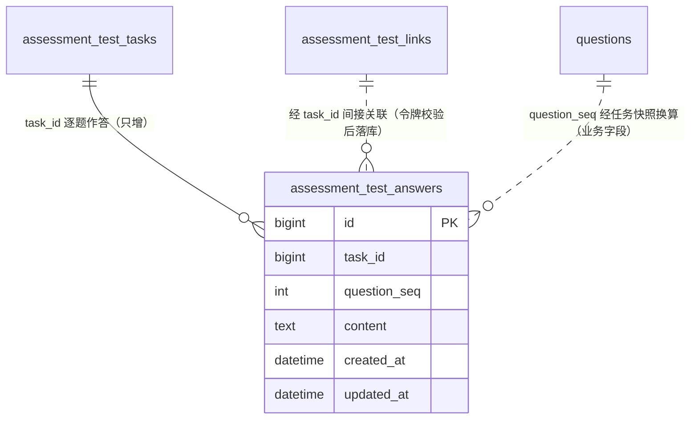

# 员工作答 数据库模型设计文档

## 文档信息

| 项目 | 内容 |
|------|------|
| Feature | P2_TST_002_FEAT_员工作答 |
| 模块代号 | TST（answer 员工作答） |
| 文档版本 | v1.2 |
| 创建日期 | 2026-09-29 |
| 作者 | lixuetao |
| 依据 | [01_功能需求规格说明书](01_功能需求规格说明书.md)（SSOT）、[AGENTS_DATABASE_API_RULE.md](../../../AGENTS_DATABASE_API_RULE.md)、[architecture.md](../../03_architecture/architecture.md)、[03_api_interface.md](03_api_interface.md)、F7 模型规格（[P2_TST_001 04_model_interface.md](../P2_TST_001_FEAT_主动测试评估运营/04_model_interface.md)） |

---

## 1. 设计依据与约定

### 1.1 数据库选型

按规则文件 §1.1，多库可切换（SQLite / MySQL / PostgreSQL），GORM AutoMigrate 建表加列加索引。模型 tag 一律用 GORM 通用类型（varchar/text/int/bigint）。一张新表在 `model/migrate.go` 的 `allModels()` 尾部登记（现有 22 个模型之后），首版建表无存量数据，不需手写迁移钩子。

### 1.2 主键策略

雪花 ID，应用层生成，模型 tag 只写 `gorm:"primaryKey"`（GORM 全局 Create 回调透明赋值）。本表有 HTTP 序列化路径（A1/A2 读写），`task_id` 外键按规则文件 §1.2 打 `,string`（domain 与 service DTO 双层覆盖）。

### 1.3 公共字段

统一含 `created_at`（autoCreateTime）与 `updated_at`（autoUpdateTime），不引入 creator/updater/tenant_id。无逻辑删除需求：作答记录只增不改（specs §5.2.4 规则3），无任何删除路径，不引入 `deleted_at`。

### 1.4 命名与类型约束

snake_case 字段命名，语义化复数表名（规则文件 §1.9）。表名 `assessment_test_answers` 与 F7 `assessment_test_tasks`/`assessment_test_links`/`assessment_test_results` 同族归置，表明主动测试线内作答记录与任务/链接/结果的业务关联。表关联不开外键约束，`task_id` 为业务字段关联。无布尔列、无半结构化列（回复内容为纯文本）。

### 1.5 不引入字典表

规则文件 §1.8 显式排除。无状态枚举列（记录生命周期单态「已落库」，specs §6.1），无字典字段。

### 1.6 与 specs 的技术层偏差（按规则裁决）

| 项 | specs 表述 | 本设计 | 依据 |
|----|-----------|--------|------|
| 表名 | 作答对话记录（本 feature 新建数据） | `assessment_test_answers` | 规则文件 §1.9 复数化 NamingPolicy；`assessment_test_` 前缀与 F7 三表同族归置（主动测试线数据物理聚置） |
| 题目定位形态 | 落库对话记录（含题号与回复内容） | `question_seq` 落快照内 1-based 序号，不落题目雪花 ID | 员工侧与阅卷侧的题目定位均按「第 X 题」语义消费（A1/A2 的 seq、阅卷对话段逐题行）；题目 ID 经任务快照 question_ids_json + seq 即可换算（数组下标），落 ID 列属冗余；seq 与快照顺序在创建时已固化，无漂移窗口 |
| 回复内容长度 | ai_mgmt 上限 500 字符 | `text` 列 | specs §4.1.2 B 校验规则只约束 ai_mgmt；enneagram 恒 1 字符。500 字符本可 varchar(500)，但两类型共用一列，取 text 消除类型分支（规则文件 §1.6 长文本档），服务层校验承载上限 |
| 回复时间 | 落库对话记录（题号、回复内容、时间） | `created_at` 承载回复时间，不设独立 replied_at | 一行一回复且永不更新，created_at 语义即回复时刻；specs §8.3 明确对话时间戳不展示（前端无消费方），阅卷 prompt 也不携带时间 |

---

## 2. ER 图



关联语义说明：关联均为业务字段对齐而非外键（规则文件 §1.5）。一任务 N 行（一题一行，理论上每题至多一条合法回复，specs §5.2.4 规则2「同一题的多次合法回复不覆盖，理论上同题仅一条合法回复」——服务端按已落库记录数推算当前题保证推进单调，异常路径（如并发双发）可能产生同题多行，落库侧不设唯一约束拦截，见 §3 业务规则）。`questions` 的关联经任务快照 question_ids_json 的数组下标换算（`question_ids_json[question_seq-1]`），题目文本现读（Unscoped 含软删行，F7 既定口径）。完成判定按「已落库行数 ≥ 题目总数」口径（specs §5.3.4 规则1 不等式语义，03 文档 §1.7）：同题多行的异常态下 COUNT 超题目总数仍判完成，员工侧保留提交入口闭环，三接口行为一致。

---

## 3. 表结构定义

### 3.1 作答对话记录表

#### 3.1.1 assessment_test_answers

**表名：** `assessment_test_answers`

**用途：** 员工作答全过程逐题回复的持久化载体（specs §5.1.3「断点恢复」、§5.2.3「逐条落库，一行一回复，阅卷输入载体」）。一行一条合法回复，只增不改。写入方：A2 作答回复接口（每次合法回复一行）；消费方：A1 上下文组装（已有回复按序返回）、A3 提交完整性校验（计数）、grading 阅卷引擎（作答对话段，03 文档 §4.3）。

---

**DDL 语句（以 GORM 模型 tag 为权威，三库由 dialector 翻译；以下 DDL 供参考，DEFAULT 子句省略与时间列精度差异以 GORM 翻译为准）：**

##### MySQL DDL

```sql
CREATE TABLE `assessment_test_answers` (
  `id` BIGINT NOT NULL COMMENT '主键ID（雪花ID）',
  `task_id` BIGINT NOT NULL COMMENT '所属测试任务ID',
  `question_seq` INT NOT NULL COMMENT '题目序号（任务快照内1-based，与question_ids_json数组下标换算）',
  `content` TEXT NOT NULL COMMENT '员工回复内容（ai_mgmt≤500字符，enneagram为1-5数字串）',
  `created_at` DATETIME NOT NULL COMMENT '创建时间（回复时刻）',
  `updated_at` DATETIME NOT NULL COMMENT '更新时间（无更新路径，与created_at同值）',
  PRIMARY KEY (`id`),
  KEY `idx_task_seq` (`task_id`,`question_seq`)
) ENGINE=InnoDB DEFAULT CHARSET=utf8mb4 COLLATE=utf8mb4_0900_ai_ci COMMENT='主动测试作答对话记录';
```

##### PostgreSQL DDL

```sql
CREATE TABLE "assessment_test_answers" (
  id BIGINT NOT NULL,
  task_id BIGINT NOT NULL,
  question_seq INTEGER NOT NULL,
  content TEXT NOT NULL,
  created_at TIMESTAMPTZ NOT NULL,
  updated_at TIMESTAMPTZ NOT NULL,
  CONSTRAINT "assessment_test_answers_pkey" PRIMARY KEY (id)
);
CREATE INDEX "idx_task_seq" ON "assessment_test_answers"("task_id", "question_seq");
COMMENT ON TABLE "assessment_test_answers" IS '主动测试作答对话记录';
```

> SQLite 由 GORM 直接翻译，不单列 DDL。GORM 模型落位 `internal/domain/assessment_test_answer.go`。

---

**字段说明：**

| 字段名 | 类型（MySQL）| 类型（PostgreSQL）| 必填 | 默认值 | 说明 |
|--------|------|------|------|--------|------|
| id | BIGINT | BIGINT | 是 | - | 主键ID（雪花ID），应用层生成 [长度来源：雪花 int64] |
| task_id | BIGINT | BIGINT | 是 | - | 所属测试任务主键，取自 `assessment_test_tasks.id`（雪花ID），超 2^53 必须 string 化下发（domain 与 DTO 双层，规则文件 §1.2） [长度来源：外键对齐] |
| question_seq | INT | INTEGER | 是 | - | 题目序号：任务快照 question_ids_json 数组内的 1-based 顺序号，员工侧「第 X 题」与服务端进度推算的统一锚点。题目雪花 ID 经 `question_ids_json[question_seq-1]` 换算现读，本题不落 ID 列（§1.6） [长度来源：题量量级，Riso-Hudson 18 题上限，int 余量充足] |
| content | TEXT | TEXT | 是 | - | 员工回复内容：ai_mgmt 为自由文本（服务层校验去首尾空格非空且 ≤500 字符，specs §5.2.2 步骤2）、enneagram 为 1-5 数字串（恒 1 字符）。只存合法回复（非法回复不落库，specs §5.2.4 规则2） [长度来源：specs §4.1.2 B 校验规则 ai_mgmt 500 字符上限；列型取 text 消除两类型分支（§1.6）] |
| created_at | DATETIME | TIMESTAMP | 是 | GORM 自动 | 创建时间即回复时刻（一行一回复且永不更新，specs §5.2.2 步骤3 落库三要素「题号、回复内容、时间」的时间承载）；前端对话不展示时间戳（specs §8.3 偏离记录），阅卷 prompt 亦不消费 |
| updated_at | DATETIME | TIMESTAMP | 是 | GORM 自动 | 更新时间，无更新路径恒与 created_at 同值，规则文件 §1.3 公共字段统一保留 |

**索引说明：**

| 索引名 | 类型 | 字段 | 用途 |
|--------|------|------|------|
| PRIMARY | PRIMARY KEY | id | 主键索引 |
| idx_task_seq | INDEX | task_id, question_seq | 全部消费路径共用：A1 按任务取已有回复按序返回、A2 落库前按任务计数推算当前题（COUNT）、A3 完整性校验（COUNT 对比题目数）、阅卷按任务取全过程对话按序拼接 |

**业务规则：**

- **只增不改（specs §5.2.4 规则3）**：已落库回复无任何修改、删除路径，员工重进从断点续答、无回改上一题能力；无软删除（取消任务已产生的对话记录保留，specs §4.1.4 规则5）。
- **服务端进度权威（specs §5.2.4 规则1）**：当前题号 = 该任务已落库行数 + 1，由 COUNT(idx_task_seq 前缀) 推算；客户端传入题号仅展示，落库一律按服务端推算题号。
- **推进单调性**：A2 落库前校验「当前推算题号 ≤ 题目总数」（已完成后再发回复返回 1902 兜底，防完成态后多余落库）；正常链路逐题 +1 推进，同题多行仅并发双发异常路径可产生，落库侧不设 (task_id, question_seq) 唯一约束拦截（拦截会让员工的合法重试被 500 卡死，多一行记录对阅卷与断点恢复无害，阅卷按行序全量消费）。完成判定按已落库行数 ≥ 题目总数（03 文档 §1.7）：COUNT 超题目总数的异常态仍判完成，A1/A2/A3 三面行为一致，员工经提交按钮闭环。
- **落库门槛前置**：仅合法回复落库（非空 / ai_mgmt ≤500 字符 / enneagram 1-5 整数，specs §5.2.2 步骤2），非法回复不产生行、不推进题号。
- **阅卷输入载体（specs §5.2.3）**：提交后记录成为 grading 引擎作答对话段数据源（03 文档 §4.3 接入声明），全过程对话非仅最终选项；记录随任务物理保留，无清理路径。

---

## 4. 数据初始化

表首启为空，随员工作答逐题增长，**无数据初始化语句**、无 seed 行、无新增系统参数键（限流阈值为注册处常量，03 文档 §2.1）。

---

## 5. 索引策略汇总

| 表 | 索引名 | 类型 | 字段 | 用途 |
|----|--------|------|------|------|
| assessment_test_answers | PRIMARY | PRIMARY KEY | id | 主键 |
| assessment_test_answers | idx_task_seq | INDEX | task_id, question_seq | 按任务取回复（恢复/计数/阅卷）唯一访问路径 |

无分表分库策略。量级评估：行数 = 任务数 × 题量（ai_mgmt 约 5 题、enneagram 约 9-18 题），年增量万行级，单表单库轻易承载，无分区与归档需求。

---

## 6. 缓存与性能

本功能无 Redis 缓存需求（限流桶除外，属平台既有中间件）：全部查询走 idx_task_seq 前缀点查（毫秒级），写入为逐行 Insert（员工交互节奏天然限频，单人每分钟至多十余行）。

作答页三接口零 LLM 调用（施测规则化，specs §4.1.4 规则1），无重计算；A3 的事务与阅卷投递归 F7 repo 承载（03 文档 §4.2），本域只组装调用。

雪花 ID 的 string 化双层覆盖见 §1.2；本表无 LIKE 搜索场景（无关键词查询），规则文件 §1.11 不适用。

---

## 7. 环境变量

无新增。限流复用量表既有 Redis；令牌哈希复用标准库 crypto/sha256；题目与维度读取复用既有 DB 连接。

---

## 8. SSOT 合规与一致性

### 8.1 字段定义对齐 specs

- 列集合与 specs §5.2.2 步骤3 落库三要素（题号、回复内容、时间）一一对应：question_seq / content / created_at；task_id 为关联载体。
- 四处技术层偏差（表名、序号定位形态、内容列型、时间列复用）已在 §1.6 显式声明并给出依据。
- specs §6.1 作答对话记录状态「已落库」单态：无状态列，只增语义承载。

### 8.2 业务规则在 DB 设计的体现

- 只增不改与断点恢复：§3 业务规则段（specs §5.2.4 规则2/3、§1.2 业务目标3）。
- 服务端进度权威与题号推算：§3 业务规则段（specs §5.2.4 规则1）。
- 九型非法回复不落库：§3 content 说明与落库门槛（specs §5.2.4 规则2）。
- 作答中被取消的记录保留：§3 只增不改规则（specs §4.1.4 规则5）。
- **隐私边界**：本表落员工回复原文（阅卷证据链要求，specs §5.2.3），无脱敏要求（脱敏对象是 LLM 产出的 rationale 落库，员工作答输入是评分依据本身）；阅卷后 rationale 经 Redact 落库的约束归 F7 grading。

### 8.3 与接口设计的一致性

[03_api_interface.md](03_api_interface.md) 三接口字段与本表列一一对应：A1 的 replies[]（seq/content 按序投影）、answered_count（COUNT）、A2 落库（task_id/question_seq/content）与响应 answered_count、A3 完整性校验（COUNT ≥ question_total，完成判定 ≥ 口径见 03 文档 §1.7）；questions/next_question 条目经任务快照换算现读 questions 表（本表不承载题目文本）。`task_id` 的 string 化在 domain 与 DTO 双层覆盖（§1.2）。

---

## 9. 不涉及的设计

- 任务/链接/判型结果表的结构变更：归 F7 三表（本域只读与经契约写）。
- 题目与维度表的结构变更：只读消费（现读通道 F7 已建）。
- 作答记录的管理端查询面（运营查看作答明细）：specs §2.1 员工独占作答内容，本期无运营可见面（03 文档 §8）。
- 作答记录的归档与清理策略：specs 未给保留期约束，物理保留随任务。

---

**文档版本：** v1.2（v1.2 监理模式二二轮修复：§2/§3 补完成判定 ≥ 口径（COUNT 超题目总数的同题多行异常态仍判完成），对齐 03 文档 §1.7；监理三轮补 §8.3 残留等号同步）
**最后更新：** 2026-09-29
**作者：** lixuetao
