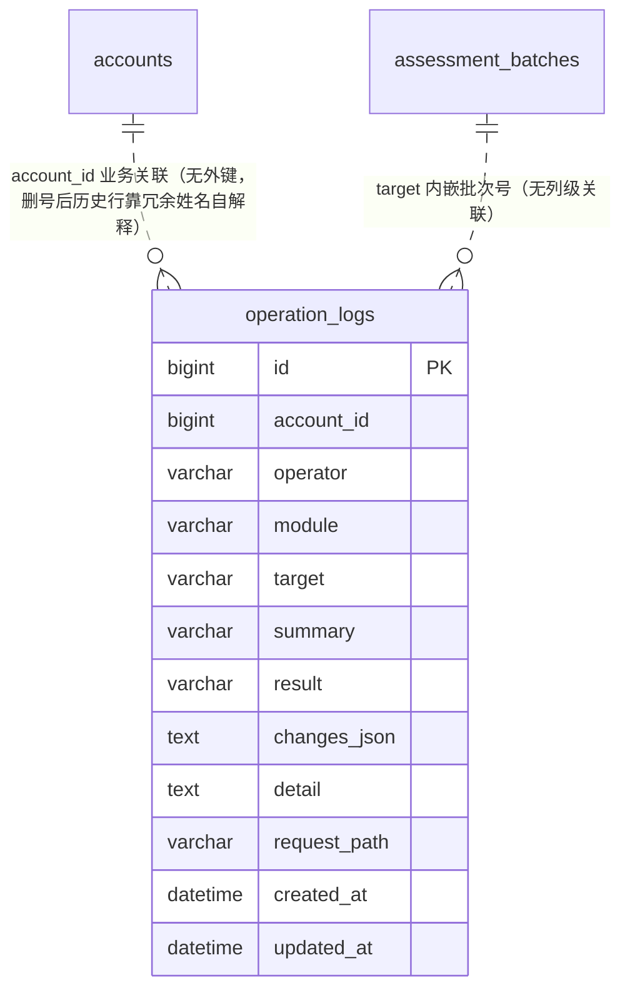

# 操作日志 数据库模型设计文档

## 文档信息

| 项目 | 内容 |
|------|------|
| Feature | P4_LOG_001_FEAT_操作日志 |
| 模块代号 | LOG（操作日志域） |
| 文档版本 | v1.0 |
| 创建日期 | 2026-10-07 |
| 作者 | lixuetao |
| 依据 | [01_功能需求规格说明书](01_功能需求规格说明书.md)（SSOT）、[AGENTS_DATABASE_API_RULE.md](../../../AGENTS_DATABASE_API_RULE.md)、[architecture.md](../../03_architecture/architecture.md)、[03_api_interface.md](03_api_interface.md) |

---

## 1. 适用性结论与设计依据

### 1.1 适用性结论

**status: applicable（新建一张表，零既有表变更）**

规格依据：specs §5.1.3「operation_logs（本 feature 新建表）」、§5.3.3「日志记录 | operation_logs | 列表与详情数据 | 含变更对比 TEXT 序列化字段」、§5.5.3「过期日志 | operation_logs | 清理对象」。API 侧两接口（03 A1/A2）的数据源均为本表，API 与模型双适用。

### 1.2 数据库选型

按规则文件 §1.1，多库可切换（SQLite / MySQL / PostgreSQL），GORM AutoMigrate 建表。模型 tag 用 GORM 通用类型（varchar/text/int/bigint），不写库特定类型。新表在 `model/migrate.go` 的 allModels() 尾部登记，首版建表无存量数据，无手写迁移钩子。

### 1.3 主键策略

雪花 ID，应用层生成，模型 tag 只写 `gorm:"primaryKey"`（GORM 全局 Create 回调透明赋值）。主键 `id` 有 HTTP 序列化路径（A1 列表行回显），domain 模型与 service DTO 双层 `json:"id,string"`（规则文件 §1.2，account 链路样板）。`account_id` 仅落库不回显 HTTP（03 §2.4），domain 层打 json tag 时按 `json:"-"` 处理或 DTO 层不透传，杜绝雪花 ID number 下发。

### 1.4 公共字段

统一含 `created_at`（autoCreateTime）与 `updated_at`（autoUpdateTime）。不引入 creator/updater/tenant_id（规则文件 §1.3，操作人由业务列 operator 承载，语义不同名）。无逻辑删除需求：追加型审计数据，生命周期只有落库与 180 天定期物理删除（specs 第 6 章），不引入 deleted_at——软删除会让清理任务与查询都要过滤 deleted_at，且已删除语义在审计场景无消费方。

### 1.5 命名与类型约束

snake_case 字段命名，语义化复数表名 `operation_logs`（GORM 默认 NamingPolicy，OperationLog → operation_logs，规则文件 §1.9）。变更对比与文本详情两处半结构化数据用 TEXT 列存序列化字符串（规则文件 §1.5），无 JSON 类型列。布尔承载：result 为两态枚举，用 varchar(16) 字符串列（success/fail），与既有域 status 类列同风格（team_training_suggestions.status 先例），不引入 bool 列。无外键约束：account_id 为业务字段关联（规则文件 §1.5），且刻意允许指向已删账号（冗余姓名已落行，关联完整性无校验需求，specs §5.3.3 账号删除后日志仍可读）。

### 1.6 不引入字典表

规则文件 §1.8 显式排除。module 八类与 result 两态由 Go 侧常量加业务字段承载，字段说明不使用 `[字典：xxx]` 标注，无字典 INSERT 语句。八类枚举值常量收敛在 domain 包（OpModule*），埋点侧、查询校验、导出中文名映射同源引用。

### 1.7 与 specs 的技术层偏差（按规则裁决）

| 项 | specs 表述 | 本设计 | 依据 |
|----|-----------|--------|------|
| 请求路径留存 | §5.1.3 中间件捕获「请求路径与方法」 | 落 `request_path` varchar(255) 列（兜底路径的 target 素材 + 排障回溯） | 规则文件 §1.6 标题/简介档；路径是兜底语义的唯一对象描述来源，不留列则兜底行 target 无从组装 |
| 操作结果 | §4.1.2 B result success/fail | varchar(16) 字符串列非 bool | 两态带展示语义（导出中文名、标签渲染），与既有域枚举列风格一致；bool 列在导出与 i18n 映射需二次转换 |
| 账号关联 | §5.1.3 操作人取 JWT 上下文（account_id、姓名） | account_id bigint 落库 + operator varchar(64) 姓名冗余双列 | specs §5.3.3 明文「落库时冗余存储，不回查账号表」；account_id 留作排障关联键不参与展示 |
| 变更对比 | §4.2.2 changes 结构 | 单 TEXT 列 `changes_json` 存数组序列化（03 §1.7 结构） | 规则文件 §1.5 半结构化数据 TEXT 列；无对比数据空串占位（与 team_training_suggestions.modules_json 建行空串同范式） |

---

## 2. ER 图



关联语义说明：accounts 与 operation_logs 是弱关联（account_id 落库但不校验、不联表，查询按冗余 operator 字符串匹配）；批次类节点的对象关联靠 target 文本内嵌批次号，无列级外键语义。本表是全平台审计的终点表，无下游表引用它。

---

## 3. 表结构定义

### 3.1 operation_logs 操作日志表

**表名：** `operation_logs`

**用途：** 全平台操作审计日志的唯一载体（specs §5.1.3）。一行一次操作：平台账号写接口调用（成功与失败各一条）、登录成功与失败、系统自动任务的批次级节点。追加型数据，写入方为记录中间件（异步通道）与 worker 侧节点写入；消费方为操作日志页 A1/A2（只读）与清理任务（删除）。

---

**DDL 语句（以 GORM 模型 tag 为权威，三库由 dialector 翻译；以下 DDL 供参考，DEFAULT 子句省略与时间列精度差异以 GORM 翻译为准）：**

##### MySQL DDL

```sql
CREATE TABLE `operation_logs` (
  `id` BIGINT NOT NULL COMMENT '主键ID（雪花ID）',
  `account_id` BIGINT NOT NULL COMMENT '操作人账号主键（业务关联无外键），系统任务为0',
  `operator` VARCHAR(64) NOT NULL COMMENT '操作人姓名冗余快照，系统任务为「系统」，登录失败为请求username原值',
  `module` VARCHAR(16) NOT NULL COMMENT '操作类型八类：login/account/dimension/system_params/llm_config/question_bank/assessment/system_job',
  `target` VARCHAR(255) NOT NULL COMMENT '操作对象描述（埋点为业务对象，兜底为POST+路径）',
  `summary` VARCHAR(500) NOT NULL COMMENT '一句话操作摘要，失败行为业务错误摘要',
  `result` VARCHAR(16) NOT NULL COMMENT '操作结果：success/fail，落库一次性判定',
  `changes_json` TEXT NOT NULL COMMENT '字段级变更对比JSON数组，无对比数据为空串',
  `detail` TEXT NOT NULL COMMENT '文本详情段落（登录/评估运营/题库/系统任务类），无为空串',
  `request_path` VARCHAR(255) NOT NULL COMMENT '请求路径（POST /api/xxx），排障与兜底对象素材',
  `created_at` DATETIME NOT NULL COMMENT '操作时间（列表排序键）',
  `updated_at` DATETIME NOT NULL COMMENT '更新时间',
  PRIMARY KEY (`id`),
  INDEX `idx_oplog_module_created` (`module`, `created_at`),
  INDEX `idx_oplog_created` (`created_at`),
  INDEX `idx_oplog_operator` (`operator`)
) ENGINE=InnoDB DEFAULT CHARSET=utf8mb4 COLLATE=utf8mb4_0900_ai_ci COMMENT='操作日志';
```

##### PostgreSQL DDL

```sql
CREATE TABLE "operation_logs" (
  id BIGINT NOT NULL,
  account_id BIGINT NOT NULL,
  operator VARCHAR(64) NOT NULL,
  module VARCHAR(16) NOT NULL,
  target VARCHAR(255) NOT NULL,
  summary VARCHAR(500) NOT NULL,
  result VARCHAR(16) NOT NULL,
  changes_json TEXT NOT NULL,
  detail TEXT NOT NULL,
  request_path VARCHAR(255) NOT NULL,
  created_at TIMESTAMPTZ NOT NULL,
  updated_at TIMESTAMPTZ NOT NULL,
  CONSTRAINT "operation_logs_pkey" PRIMARY KEY (id)
);
CREATE INDEX "idx_oplog_module_created" ON "operation_logs"("module", "created_at");
CREATE INDEX "idx_oplog_created" ON "operation_logs"("created_at");
CREATE INDEX "idx_oplog_operator" ON "operation_logs"("operator");
COMMENT ON TABLE "operation_logs" IS '操作日志';
```

> SQLite 由 GORM 直接翻译，不单列 DDL。GORM 模型落位 `internal/domain/operation_log.go`。

---

**字段说明：**

| 字段名 | 类型（MySQL）| 类型（PostgreSQL）| 必填 | 默认值 | 说明 |
|--------|------|------|------|--------|------|
| id | BIGINT | BIGINT | 是 | - | 主键ID（雪花ID），应用层生成，GORM Create 回调透明赋值；HTTP 回显走 DTO 层 string 化 [长度来源：雪花 int64] |
| account_id | BIGINT | BIGINT | 是 | 业务层置值 | 操作人账号主键（accounts.id 业务字段关联，无外键）。JWT 路径取 gin.Context account_id；登录接口无鉴权上下文置 0；系统任务置 0。仅排障关联用，查询展示走 operator 列，不回显 HTTP（03 §2.4） [长度来源：关联 accounts.id 雪花] |
| operator | VARCHAR(64) | VARCHAR(64) | 是 | 业务层置值 | 操作人姓名冗余快照（specs §5.3.3：落库时冗余存储不回查账号表，账号删除后日志仍可读）。JWT 路径按 account_id 现查 accounts.name（查不到回退 username）；登录失败为请求 username 原值（specs §5.1.3）；系统任务固定常量「系统」（specs §5.2.2）。查询侧模糊匹配本列 [长度来源：与 accounts.name varchar(64) 对齐；username 同档兼容回退] |
| module | VARCHAR(16) | VARCHAR(16) | 是 | 业务层置值 | 操作类型八类枚举（specs §4.1.4 规则 1）：login 登录 / account 用户管理 / dimension 维度与权重 / system_params 系统参数 / llm_config 大模型配置（含集成密钥）/ question_bank 题库管理 / assessment 评估运营 / system_job 系统任务。Go 常量收敛在 domain 包（OpModule*），兜底路径按 request_path 前缀推断，无法推断归 system_params（03 §4.1） [长度来源：枚举值最长 13 字符 system_params] |
| target | VARCHAR(255) | VARCHAR(255) | 是 | 业务层置值 | 操作对象描述（specs §4.1.2 B）。埋点路径为业务对象（如「维度「任务适配判断力」聚合权重」「批次 B20260928S01（2026-09-22 ~ 2026-09-28）」）；兜底路径为「POST /api/xxx」路径级描述（specs §8.1 路径级语义）；登录行为「登录」 [长度来源：规则文件 §1.6 标题/简介档] |
| summary | VARCHAR(500) | VARCHAR(500) | 是 | 业务层置值 | 一句话操作摘要（specs §4.1.2 B）；失败行为业务错误摘要（响应 message，specs §4.1.4 规则 2）；登录失败统一「凭证校验未通过」；参数校验失败摘错误信息 [长度来源：规则文件 §1.6 无档注列取 500，对齐 question.reject_reason varchar(500) 同语义摘要列] |
| result | VARCHAR(16) | VARCHAR(16) | 是 | 业务层置值 | 操作结果两态：success / fail（specs 第 6 章落库一次性判定无转换）。判定口径：响应 body code=0 为 success，非 0 与 HTTP 非 200 为 fail（03 §1.5） [长度来源：枚举值最长 7 字符] |
| changes_json | TEXT | TEXT | 是 | 业务层置空串 | 字段级变更对比 JSON 数组（03 §1.7 结构 `[{"field":"权重","before":"30","after":"50"}]`），关键域埋点操作中的更新/启停类（维度、活跃度规则、系统参数、大模型配置、集成密钥、账号台账）在写操作时构造（specs §4.1.4 规则 3）；新增/删除类走 detail 文本形态不产生 changes；密码与密钥类字段永不进入（specs §5.1.4 规则 4）；无对比数据空串占位，查询侧空串转 null 下发（specs §4.2.5 互斥渲染判据） [长度来源：规则文件 §1.6 长文本 TEXT] |
| detail | TEXT | TEXT | 是 | 业务层置空串 | 文本详情段落（评估运营、题库管理、登录、系统任务类操作，specs §4.1.4 规则 3），详情弹窗第二形态数据源（specs §4.2.2）；无详情空串占位 [长度来源：规则文件 §1.6 长文本 TEXT] |
| request_path | VARCHAR(255) | VARCHAR(255) | 是 | 业务层置值 | 请求路径（如 POST /api/dimensions/update）。兜底行 target 的组装素材与排障回溯键；worker 侧写入为任务类型标识（如 engine:batch-run） [长度来源：规则文件 §1.6 标题/简介档，覆盖最长 API 路径] |
| created_at | DATETIME | TIMESTAMPTZ | 是 | GORM 自动 | 操作时间。列表唯一排序键（specs §4.1.4 规则 5 倒序）、时间范围筛选列（specs §4.1.2 A）、清理任务边界列（specs §5.5.2） |
| updated_at | DATETIME | TIMESTAMPTZ | 是 | GORM 自动 | 更新时间。行落库后不变（追加型数据无修改路径），列存在仅为符合规则文件 §1.3 业务表统一双时间戳约定 |

**索引说明：**

| 索引名 | 类型 | 字段 | 用途 |
|--------|------|------|------|
| PRIMARY | PRIMARY KEY | id | 主键索引；清理任务按主键分批删除的游标键 |
| idx_oplog_module_created | INDEX | module, created_at | A1/A2 组合查询：module 等值 + created_at 倒序排序与范围过滤（最常见筛选形态，复合索引左前缀命中） |
| idx_oplog_created | INDEX | created_at | 无条件与仅时间范围的列表倒序查询；清理任务按 created_at 圈定过期行 |
| idx_oplog_operator | INDEX | operator | 操作人模糊匹配（LIKE '%x%' 无法用索引加速，但「系统」等高频等值前缀与索引列扫描优于全表；同 accounts.username index 同款定位） |

**业务规则：**

- **追加只写**：行落库后无任何修改路径（specs 第 6 章），唯一出口是清理任务物理删除。updated_at 恒等于 created_at。
- **写入方两类**：记录中间件（异步通道批量落库，失败丢弃记 ERROR 不影响业务，specs §5.1.5）与 worker 侧批次节点写入（同步或旁路，失败跳过不阻断主任务，specs §5.2.5）。
- **敏感信息拦截**（specs §5.1.4 规则 4）：密码（含密文）、API Key、集成密钥明文、评分理由原文不入任何列；changes_json 中密钥类字段以掩码值呈现；detail 与 summary 由埋点侧显式组装，兜底路径不落请求体。
- **登录反枚举**（specs §4.1.4 规则 2）：登录失败行 summary 统一「凭证校验未通过」，不区分四类失败原因；operator 为请求 username 原值（账号不存在时也照记）。
- **行数量级**：平台账号数十级 × 每日写操作百次级 + 批次节点周频数条 ≈ 日增万行内；180 天窗口 ≈ 数百万行封顶，TEXT 列与三索引在该量级下无压力；超窗口数据由清理任务收敛。
- **雪花 ID 传输**：id 列 HTTP 序列化双层 string 化（domain `json:"id,string"` + DTO 同步，规则文件 §1.2）；account_id 不下发。

---

## 4. 仓储与查询口径（开发契约）

### 4.1 新增仓储方法清单

repository 层新增 OperationLogRepository（含记录通道写入与查询消费双面）：

| 方法 | 语义 | 消费方 |
|------|------|--------|
| InsertBatch(ctx, logs []OperationLog) error | 异步通道批量落库（雪花 ID 由 Create 回调赋值） | 记录中间件后台消费 |
| Insert(ctx, log *OperationLog) error | 单条落库 | worker 侧批次节点写入 |
| ListPage(ctx, filter, page, pageSize) ([]OperationLog, int64, error) | 四维筛选分页查询（operator LIKE 转义 + module/result 等值 + created_at 双闭区间），created_at 倒序 | A1 |
| ListByFilter(ctx, filter, limit) ([]OperationLog, error) | 同筛选口径取前 limit 行（导出 10000 上限） | A2 |
| DeleteBefore(ctx, before time.Time) (int64, error) | 单批删除边界前记录（LIMIT 1000 循环调用方驱动） | 清理任务 |

### 4.2 查询形态与索引匹配

| 查询形态（03 A1/A2） | 命中索引 | 判定 |
|---------------------|---------|------|
| 无条件 / 仅时间范围倒序分页 | idx_oplog_created | 已覆盖（排序键即索引列） |
| module 等值（可叠时间范围）倒序 | idx_oplog_module_created | 已覆盖（左前缀等值 + 第二列排序） |
| result 等值 | 无专列索引，走上述两索引之一后过滤或全表扫 | 已覆盖（两态基数约对半，单列索引选择性低不值得建；行数级数百万内全表扫可接受，与 workspace 的 assessment_test_tasks status-only 同款判定） |
| operator 模糊 | idx_oplog_operator 列扫描或全表扫 | 已覆盖（中缀 LIKE 本就无法索引加速；「系统」等值场景可受益于索引） |
| created_at < 边界 圈定删除集 | idx_oplog_created | 已覆盖 |

### 4.3 清理任务契约

每日 cron `0 3 * * *`（03 §4.3）：DeleteBefore(now-180d) 循环至返回 0 行，单批 1000（常量 cleanBatchSize），条数累计记 INFO；err 透传交 Asynq 重试，幂等（specs §5.5.4 规则 2）。

---

## 5. 数据初始化与 seed

无 seed 行、无新增系统参数键。表首启为空（新库首访日志为空属正常态，specs §4.1.5 空态说明），行由记录通道与批次节点随运行自然产生。保留窗口 180 天等常量见 03 §4.4，随源码发版。

---

## 6. SSOT 合规与一致性

- [x] 无新增实体遗漏：specs 新增持久化实体仅 operation_logs（§5.1.3/§5.3.3/§5.5.3 三处明文）；埋点数据缓存表、日志归档表、操作类型字典表等易误建对象已排除（埋点是请求期 gin.Context 行为无持久化，字典由常量承载 §1.6）。
- [x] 主键/公共字段/命名/类型约束：雪花主键应用层生成（§1.3）、created_at/updated_at 双时间戳无审计列（§1.4）、snake_case 与语义化复数表名（§1.5）、TEXT 存序列化 JSON 无 JSON 类型列（§1.7）、无外键约束（§1.5）、无软删除（§1.4）、无字典表（§1.6），均符合规则文件 §1.2-1.10。
- [x] 字段说明与索引说明完整：本表 12 字段全量说明含长度来源标注（§3.1），索引 4 项含用途（§3.1）。
- [x] 字段长度参考 specs：module/result 枚举列宽按枚举值最长字符标注来源；operator 与 accounts.name 对齐；summary/target 按规则文件 §1.6 档位，specs 未指定长度处均标来源。
- [x] 与 03 接口文档一致：A1 响应字段（id/created_at/operator/module/target/summary/result/changes/detail）与本表列一一对应（changes 由 changes_json 反序列化、空串转 null；detail 空串原样）；A2 六列同源；查询形态索引匹配性已核对（§4.2）。
- [x] 架构一致：单进程内嵌，记录中间件归 API 层（架构 2.1 API 层职责明文「操作日志记录」），清理任务归 worker 层 Asynq 调度（架构 2.2 worker 职责），消费经 repository 直接读取。

---

## 7. 不涉及的设计

- 任何既有表的 DDL 变更、迁移钩子：埋点是 Service 层代码行为，本 feature 仅新增一张表，model/migrate.go 只追加 allModels() 登记。
- 软删除与 deleted_at 列：追加型审计数据只有物理删除出口（specs 第 6 章，§1.4）。
- 操作类型/结果的字典表与 INSERT 语句：规则文件 §1.8 显式排除，Go 常量承载（§1.6）。
- Redis 键设计：本 feature 无缓存（日志查询直读库，低频审计页无热点）。
- IP 与终端字段：specs §4.2.1 易用性决策明确不采集。
- 日志分表分区：180 天窗口内数百万行量级，单表三索引足够；量级实际超预期时再立项（specs §5.5 控制增长机制已兜底）。
- changes_json 的列级查询（按变更字段检索）：specs 无此需求，TEXT 列只整行透传。

---

**文档版本：** v1.0
**最后更新：** 2026-10-07
**作者：** lixuetao
